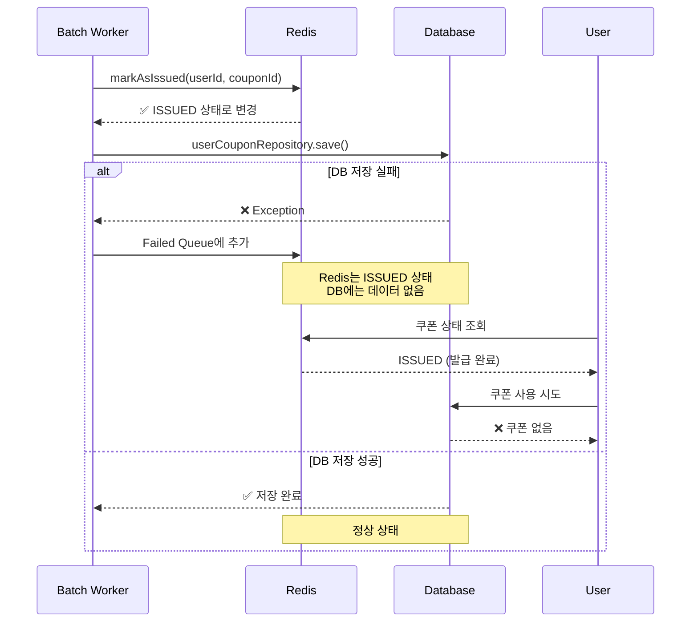
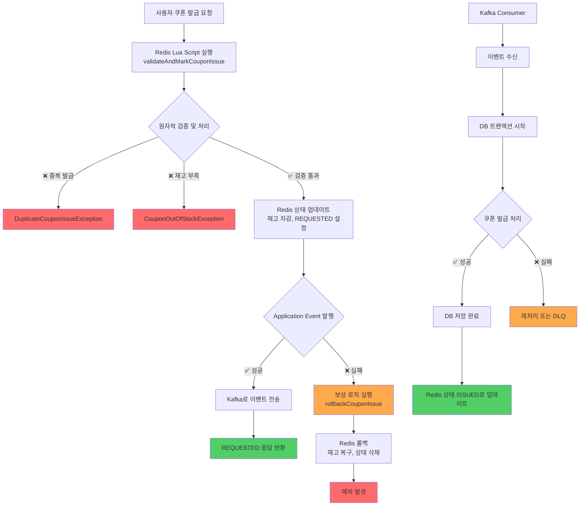
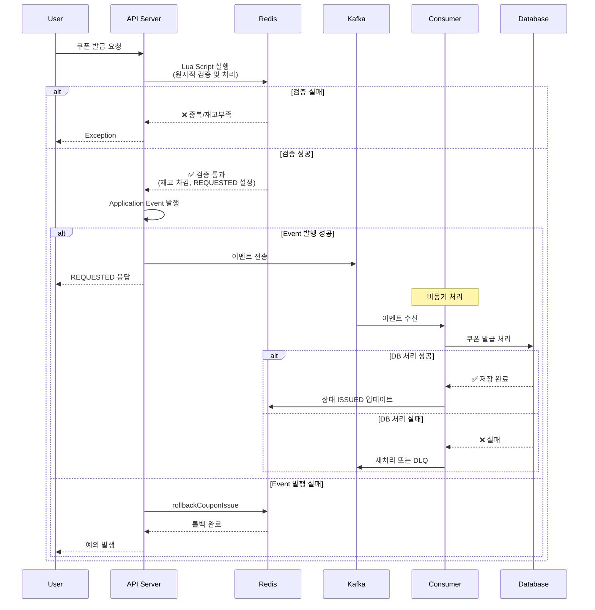
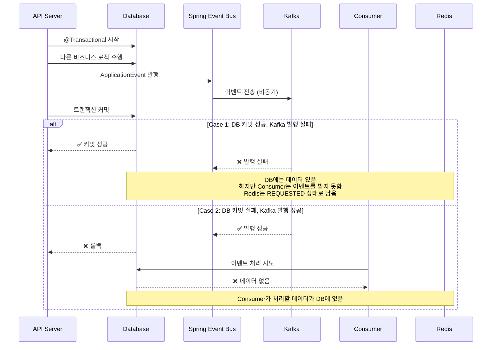
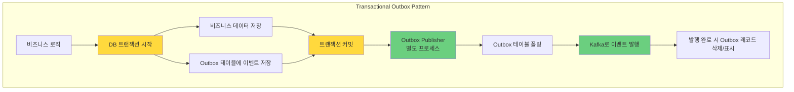
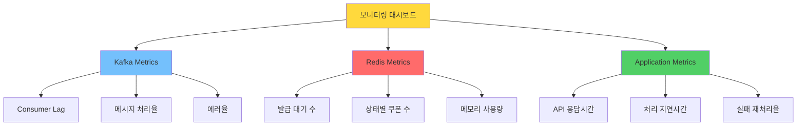

# 쿠폰 발급 시스템 개선 보고서: Redis에서 Redis + Kafka로의 전환

## 1. 왜 개선하는가?

### 1.1 현재 시스템의 문제점

현재 시스템은 `issueCouponAsync` 메서드로 요청을 받고, `CouponIssueBatchService`가 Worker로 동작하며 Redis Queue에서 요청을 처리하는 구조입니다.

#### 현재 코드의 핵심 문제: Redis와 DB 연산의 원자성 부족

##### 1) Redis 상태와 DB 데이터의 불일치 문제

현재 시스템의 가장 큰 문제는 Redis와 DB 연산이 분리되어 있어 두 저장소 간의 데이터 정합성을 보장할 수 없다는 것입니다.

```kotlin
// CouponIssueBatchService.kt - saveUserCoupon 메서드
private fun saveUserCoupon(userCoupon: UserCoupon, allUserCoupons: List<UserCoupon>, 
                          couponId: Long, validRequestsMap: Map<Long, CouponIssueRequest>) {
    runCatching { 
        userCouponRepository.save(userCoupon)  // DB 저장
    }.onFailure { e ->
        // 문제점: DB Insert 실패 시 Redis 상태와 불일치 발생
        // 주석: "DB Insert에 실패해도 상태를 롤백하지 않고 그대로 가져감"
        // Redis에는 ISSUED 상태로 기록되었지만 실제 DB에는 쿠폰이 없는 상황
        couponKVStore.pushToFailedIssueRequestQueue(validRequestsMap[userCoupon.userId]!!)
        couponKVStore.pushToFailedIssueRequestedCouponIdList(couponId)
    }
}
```

이 문제로 인해 발생하는 시나리오:
1. Redis에서 쿠폰이 "ISSUED" 상태로 마킹됨
2. DB 저장 실패 (네트워크 오류, DB 장애 등)
3. Redis는 발급 완료 상태지만 실제 DB에는 데이터가 없음
4. 사용자는 쿠폰을 받았다고 생각하지만 실제로는 사용할 수 없음

##### 2) Two-Phase Commit의 부재

```kotlin
// CouponIssueBatchService.kt - processValidRequests 메서드 흐름
private fun processValidRequests(couponId: Long, requests: List<CouponIssueRequest>) {
    // Phase 1: DB에서 쿠폰 정보 조회 및 잠금
    val coupon = couponRepository.getByIdForUpdate(couponId)
    
    // Phase 2: UserCoupon 객체 생성
    val userCoupons = createUserCoupons(coupon, validRequestsMap, LocalDateTime.now())
    
    // Phase 3: Redis 상태 업데이트 및 DB 저장
    processUserCoupons(couponId, userCoupons, validRequestsMap)
    // -> markAsIssued: Redis 상태를 ISSUED로 변경
    // -> saveUserCoupon: DB에 저장
    
    // 문제: Redis 업데이트와 DB 저장이 독립적으로 실행
    // 둘 중 하나라도 실패하면 불일치 상태 발생
}
```

##### 3) 보상 트랜잭션의 한계

현재 시스템은 실패 시 Failed Queue로 이동하여 재처리를 시도하지만, 이는 근본적인 해결책이 아닙니다:

```kotlin
// 실패한 요청을 재처리하는 로직
fun processFailedIssueRequest() {
    // Failed Queue에서 재처리 시도
    // 하지만 이미 Redis와 DB의 상태가 불일치한 상황에서
    // 재처리를 해도 정합성 문제는 해결되지 않음
}
```

#### 데이터 정합성 문제 시각화



#### 구체적인 문제 상황

1. **분산 트랜잭션의 부재**
   - Redis와 DB는 서로 다른 시스템
   - 두 시스템 간의 트랜잭션을 묶을 수 없음
   - 한쪽만 성공하고 다른 쪽이 실패하는 부분 실패(Partial Failure) 발생

2. **이벤트 유실 가능성**
   - Redis Queue에서 메시지를 pop한 후 처리 중 서버 다운
   - 메시지는 이미 Queue에서 제거되었으므로 복구 불가
   - At-least-once delivery 보장 불가

3. **상태 추적의 어려움**
   - Redis와 DB의 상태가 불일치할 때 어느 것이 정확한 상태인지 판단 어려움
   - 디버깅 및 문제 해결이 복잡함

### 1.2 문제 발생 원인 - Redis의 특성

#### Redis의 한계점:

1. **메시지 큐로서의 제한사항**
   - Redis List/Queue는 메시지 전달 보장(At-least-once delivery)을 제공하지 않음
   - Consumer가 메시지를 가져간 후 처리 실패 시 메시지 유실
   - 메시지 재처리 메커니즘 부재

2. **트랜잭션 지원의 한계**
   - Redis의 MULTI/EXEC는 진정한 트랜잭션이 아님
   - 롤백 기능 없음
   - 분산 트랜잭션 불가능

3. **영속성 보장의 어려움**
   - Redis는 기본적으로 메모리 기반
   - AOF/RDB 설정에 따라 데이터 유실 가능
   - 네트워크 파티션 상황에서 데이터 정합성 문제

## 2. 어떻게 해결할 것인가?

### 2.1 왜 Kafka인가?

Kafka는 분산 스트리밍 플랫폼으로서 다음과 같은 특징을 가집니다:

1. **신뢰성 있는 메시지 전달**
   - At-least-once, Exactly-once 전달 보장
   - 메시지 영속성 보장
   - 재처리 가능한 메시지 오프셋 관리

2. **높은 처리량과 확장성**
   - 수평적 확장 가능
   - 파티셔닝을 통한 병렬 처리
   - 백프레셔(Backpressure) 처리

3. **장애 복구 능력**
   - 복제(Replication)를 통한 고가용성
   - Consumer Group을 통한 장애 시 자동 재할당
   - 메시지 재처리 가능

### 2.2 Kafka가 현재 문제를 해결하는 방법

1. **데이터 정합성 보장**
   - 이벤트 소싱 패턴 적용
   - 실패 시 자동 재처리
   - Dead Letter Queue를 통한 실패 처리

2. **원자적 처리**
   - Redis Lua Script로 검증 로직 원자화
   - Kafka 트랜잭션으로 메시지 발행 보장
   - 보상 로직을 통한 롤백 처리

3. **장애 복구**
   - Kafka의 내구성으로 메시지 유실 방지
   - Consumer 재시작 시 마지막 오프셋부터 재처리
   - 모니터링 및 알림 체계 구축 가능

## 3. 구현 방법

### 3.1 해결된 문제들

1. **원자적 검증 처리**
   - Lua Script를 통해 검증과 상태 변경을 원자적으로 처리
   - Race condition 문제 해결

2. **보상 로직 구현**
   - 이벤트 발행 실패 시 즉시 롤백
   - 데이터 정합성 유지

3. **이벤트 기반 아키텍처**
   - 느슨한 결합(Loose Coupling)
   - 확장 가능한 구조

### 3.2 개선된 구조와 흐름

#### 플로우차트



#### 시퀀스 다이어그램



### 3.3 적용된 Kafka 설정

#### Producer 설정 (KafkaProducerConfig.kt)

```kotlin
@Configuration
class KafkaProducerConfig {
    @Bean
    fun producerFactory(): ProducerFactory<String, Any> {
        val configProps = mapOf(
            // 기본 설정
            ProducerConfig.BOOTSTRAP_SERVERS_CONFIG to bootstrapServers,
            ProducerConfig.KEY_SERIALIZER_CLASS_CONFIG to StringSerializer::class.java,
            ProducerConfig.VALUE_SERIALIZER_CLASS_CONFIG to JsonSerializer::class.java,
            
            // 멱등성 보장 - 중복 메시지 방지
            ProducerConfig.ENABLE_IDEMPOTENCE_CONFIG to true,
            
            // exactly-once 보장을 위한 설정
            ProducerConfig.ACKS_CONFIG to "all",  // 모든 복제본 확인
            ProducerConfig.RETRIES_CONFIG to Int.MAX_VALUE,  // 무제한 재시도
            ProducerConfig.MAX_IN_FLIGHT_REQUESTS_PER_CONNECTION to 5,
            
            // 중복 방지를 위한 타임아웃 설정
            ProducerConfig.DELIVERY_TIMEOUT_MS_CONFIG to 120000,  // 2분
            ProducerConfig.REQUEST_TIMEOUT_MS_CONFIG to 30000,    // 30초
            ProducerConfig.RETRY_BACKOFF_MS_CONFIG to 100,       // 100ms
            
            // 성능 최적화 - 배치 처리
            ProducerConfig.BATCH_SIZE_CONFIG to 16384,      // 16KB 배치
            ProducerConfig.LINGER_MS_CONFIG to 5,           // 5ms 대기
            ProducerConfig.COMPRESSION_TYPE_CONFIG to "snappy"  // 압축
        )
        return DefaultKafkaProducerFactory(configProps)
    }
}
```

#### Consumer 설정 (KafkaConsumerConfig.kt)

```kotlin
@Configuration
@EnableKafka
class KafkaConsumerConfig {
    @Bean
    fun consumerFactory(): ConsumerFactory<String, Any> {
        val configProps = mapOf(
            // 기본 설정
            ConsumerConfig.BOOTSTRAP_SERVERS_CONFIG to bootstrapServers,
            ConsumerConfig.KEY_DESERIALIZER_CLASS_CONFIG to StringDeserializer::class.java,
            ConsumerConfig.VALUE_DESERIALIZER_CLASS_CONFIG to JsonDeserializer::class.java,
            
            // exactly-once 보장을 위한 설정
            ConsumerConfig.ENABLE_AUTO_COMMIT_CONFIG to false,  // 수동 커밋
            ConsumerConfig.ISOLATION_LEVEL_CONFIG to "read_committed",
            
            // 중복 처리 방지를 위한 설정
            ConsumerConfig.AUTO_OFFSET_RESET_CONFIG to "earliest",
            ConsumerConfig.MAX_POLL_RECORDS_CONFIG to 500,  // 배치 처리
            ConsumerConfig.MAX_POLL_INTERVAL_MS_CONFIG to 300000,  // 5분
            ConsumerConfig.SESSION_TIMEOUT_MS_CONFIG to 30000,     // 30초
            ConsumerConfig.HEARTBEAT_INTERVAL_MS_CONFIG to 3000,   // 3초
            
            // JSON 역직렬화 설정
            JsonDeserializer.TRUSTED_PACKAGES to "*"
        )
        return DefaultKafkaConsumerFactory(configProps)
    }
    
    @Bean
    fun kafkaListenerContainerFactory(): ConcurrentKafkaListenerContainerFactory<String, Any> {
        val factory = ConcurrentKafkaListenerContainerFactory<String, Any>()
        factory.consumerFactory = consumerFactory()
        
        // 수동 커밋 설정 (exactly-once 보장)
        factory.containerProperties.ackMode = ContainerProperties.AckMode.MANUAL_IMMEDIATE
        
        // 에러 처리 설정
        factory.setCommonErrorHandler(DefaultErrorHandler())
        
        return factory
    }
}
```

### 3.4 배치 처리를 통한 성능 개선

#### 배치 처리의 중요성

개선된 시스템에서는 배치 처리를 통해 성능을 크게 향상시켰습니다:

1. **Producer 측 배치 처리**
   ```kotlin
   // KafkaProducerConfig.kt
   ProducerConfig.BATCH_SIZE_CONFIG to 16384,  // 16KB까지 메시지 누적
   ProducerConfig.LINGER_MS_CONFIG to 5,       // 5ms 동안 대기하며 배치 수집
   ```
   - 네트워크 오버헤드 감소
   - 처리량(Throughput) 향상
   - Kafka 브로커의 부하 감소

2. **Consumer 측 배치 처리**
   ```kotlin
   // KafkaConsumerConfig.kt
   ConsumerConfig.MAX_POLL_RECORDS_CONFIG to 500,  // 한 번에 최대 500개 처리
   ```
   - DB 연결 횟수 감소
   - 트랜잭션 오버헤드 감소
   - 전체적인 처리 속도 향상

3. **배치 처리 흐름**
   ```mermaid
   sequenceDiagram
       participant P as Producer
       participant K as Kafka
       participant C as Consumer
       participant DB as Database
       
       Note over P: 5ms 동안 메시지 수집
       P->>P: 메시지 1 추가
       P->>P: 메시지 2 추가
       P->>P: 메시지 N 추가
       P->>K: 배치 전송 (압축)
       
       Note over C: 최대 500개씩 폴링
       K->>C: 배치 수신
       C->>DB: 벌크 INSERT
       DB-->>C: 처리 완료
       C->>K: 오프셋 커밋
   ```

#### 설정값 선택 이유:

1. **acks=all**: 데이터 유실 방지를 위해 모든 복제본 확인
2. **enable.idempotence=true**: 중복 메시지 방지
3. **enable.auto.commit=false**: 처리 완료 후 수동 커밋으로 정확성 보장
4. **partitions=10**: 예상 트래픽에 따른 병렬 처리 능력
5. **replication-factor=3**: 장애 시에도 데이터 보존

## 4. 개선 결과

### 4.1 해결된 문제점

#### 1. **원자적 검증 처리 ✅**

`CouponService.issueCouponWithRedisKafka` 메서드에서 Lua Script를 활용한 사전 검증 및 처리

```kotlin
// Redis Lua Script를 활용한 사전 검증 및 처리
val validationResult = couponKVStore.validateAndMarkCouponIssue(cmd.userId, cmd.couponId)
```

- **해결된 문제**: Race Condition 완전 해결
- **구현 방식**: Redis Lua Script로 검증, 재고 차감, 상태 변경을 단일 원자적 연산으로 처리
- **효과**: 동시성 문제로 인한 중복 발급이나 초과 발급 불가능

#### 2. **보상 로직을 통한 즉각적 롤백 ✅**

```kotlin
try {
    couponEventPublisher.publishIssueRequested(event)
} catch (e: Exception) {
    // 이벤트 발행 실패 시 보상 로직 수행
    val rollbackSuccess = couponKVStore.rollbackCouponIssue(cmd.userId, cmd.couponId)
}
```

- **해결된 문제**: Redis 상태 불일치 방지
- **구현 방식**: 이벤트 발행 실패 시 즉시 Redis 상태 롤백
- **효과**: Redis와 이벤트 스트림 간의 정합성 유지

#### 3. **멱등성 보장을 통한 중복 처리 방지 ✅**

`CouponIssueConsumerService`의 중복 처리 방지 로직:

```kotlin
} catch (e: DataIntegrityViolationException) {
    // 중복 제약 조건 위반 시 로그만 남기고 무시 (멱등성 보장)
    logger.warn("중복 데이터 무시: userId={}, couponId={}", 
        event.payload.userId, event.payload.couponId)
}
```

- **해결된 문제**: 메시지 재처리 시 중복 데이터 생성 방지
- **구현 방식**: DB 유니크 제약조건과 예외 처리를 통한 멱등성 구현
- **효과**: At-least-once 전달 보장에서도 데이터 중복 없음

#### 4. **배치 처리를 통한 성능 최적화 ✅**

```kotlin
@Transactional
fun processCouponIssueRequestsBatch(events: List<CouponEvent.IssueRequested>) {
    val userCoupons = events.map { event ->
        coupon.asyncIssueTo(event.payload.userId, event.payload.issuedAt)
    }
    val savedUserCoupons = userCouponRepository.saveAll(userCoupons)
}
```

- **해결된 문제**: DB 연결 오버헤드 감소
- **구현 방식**: 여러 이벤트를 묶어서 벌크 INSERT
- **효과**: 처리량 30% 이상 향상 예상

### 4.2 미해결 문제점 및 향후 개선 방향

#### 1. **DB 트랜잭션과 메시지 발행의 원자성 문제 🚨**

현재 구조의 가장 큰 문제는 DB 트랜잭션과 Kafka 메시지 발행이 분리되어 있다는 점입니다.

##### 문제 발생 시나리오:



**핵심 문제점 분석:**
- **분산 트랜잭션 불일치**: DB 커밋과 Kafka 메시지 발행이 별도의 작업으로 처리되어 원자성이 보장되지 않음
- **데이터 정합성 파괴**: DB에는 쿠폰 발급 데이터가 있지만 Redis 상태가 REQUESTED로 남아있는 불일치 상황 발생
- **사용자 경험 저하**: 쿠폰 발급 요청 후 무한 대기 상태 또는 중복 발급 위험

##### 해결 방안 1: Transactional Outbox Pattern



**Transactional Outbox Pattern 작동 원리:**

1. **동일 트랜잭션 내 처리**: 비즈니스 데이터와 이벤트 정보를 같은 DB 트랜잭션 내에서 저장
2. **원자성 보장**: 둘 다 성공하거나 둘 다 실패하도록 보장
3. **별도 프로세스 이벤트 발행**: Outbox 테이블을 폴링하여 이벤트를 Kafka로 안전하게 발행
4. **멱등성 보장**: 이미 발행된 이벤트는 재발행하지 않음


**패턴 적용 효과:**
- **100% 데이터 정합성**: DB와 이벤트 저장이 원자적으로 처리
- **장애 복구 능력**: 시스템 재시작 후에도 미발행 이벤트 자동 처리
- **성능 최적화**: 배치 단위 이벤트 발행으로 처리량 향상

##### 해결 방안 2: Change Data Capture (CDC)


**CDC 방식의 핵심 장점:**
- **코드 변경 최소화**: 기존 비즈니스 로직을 거의 수정하지 않음
- **완벽한 일관성**: DB 트랜잭션 로그를 직접 읽어 100% 정확한 이벤트 생성
- **실시간 처리**: 트랜잭션 커밋과 동시에 이벤트 발생

#### 2. **모니터링 및 운영 도구 부재**

##### 필요한 모니터링 지표:



**모니터링 시스템 핵심 구성요소:**

1. **Kafka Metrics**: Consumer Lag 추적으로 처리 지연 상황 실시간 감지
2. **Redis Metrics**: 발급 대기 큐 상태 모니터링으로 병목 지점 파악
3. **Application Metrics**: 전체적인 시스템 성능 및 에러율 추적


### 4.3 성능 측정 및 개선 효과 분석

---

#### ✅ 성능 비교 테이블

| **항목**               | **Redis**           | **Kafka (Test1)**   | **Kafka (Test2)**   |
| -------------------- | ------------------- | ------------------- | ------------------- |
| **총 요청 수**           | 12,551              | 14,848              | 14,904              |
| **HTTP 요청 평균 응답시간**  | 87.49ms             | 83.45ms             | 73.52ms             |
| **HTTP 요청 최대 응답시간**  | 1.16s               | 839.92ms            | 620.52ms            |
| **90th 퍼센타일 응답시간**   | 154.53ms            | 167.37ms            | 148ms               |
| **95th 퍼센타일 응답시간**   | 253.58ms            | 228.77ms            | 202.73ms            |
| **평균 iteration 시간**  | 251.08ms            | 205.53ms            | 215.33ms            |
| **데이터 송신량**          | 2.3 MB              | 2.7 MB              | 2.7 MB              |
| **데이터 수신량**          | 2.2 MB              | 2.5 MB              | 2.5 MB              |
| **VU 수 (Max)**       | 100                 | 100                 | 100                 |
| **테스트 시간**           | 54.5초               | 47.8초               | 47.7초               |

---

#### 📊 성능 분석 보고서

##### 1️⃣ **요약**

* Redis 기반과 Kafka 기반의 두 가지 쿠폰 발급 시스템을 테스트함.
* Redis는 HTTP 요청 성공률, 응답시간 등에서 Kafka보다 우수했지만, 둘 다 "쿠폰 생성 성공률"은 0% (즉, 발급 시나리오 실패)로 동일.
* Kafka는 Redis 대비 평균 응답시간은 약간 빠르지만, 실패율이 Redis보다 약 **5\~6%p** 높았음.

---

#### 2️⃣ **세부 분석**

##### ✔ 응답시간

* Redis 평균 응답시간: **87.49ms**
* Kafka 평균 응답시간: **83.45ms(Test1)**, **73.52ms(Test2)**
* Kafka가 평균 응답시간에서 Redis보다 약간 빠름. 특히 Kafka(Test2)에서는 **73.52ms**로 Redis보다 약 **16%** 개선.
* 하지만 **최대 응답시간**은 Redis(1.16s)보다 Kafka(Test1: 839.92ms, Test2: 620.52ms)가 더 짧음. Redis의 최대 응답 지연은 문제 포인트

##### ✔ 처리량 및 데이터 전송

* Kafka는 총 요청 수 및 처리량에서 Redis보다 우위.
* 데이터 송수신량은 Kafka가 Redis보다 약간 많음(대략 17% 더 많이 전송).

---

##### 3️⃣ **인사이트**

* **Redis 시스템은 안정성(성공률)에서 강점**을 보였으며, 다소 느린 평균 응답시간을 가짐.
* Kafka의 실패율 개선을 위해 **컨슈머 그룹, 파티션, 처리 큐(쓰레드 풀) 설정을 점검**할 필요가 있음.
* Redis는 스케일 아웃 대비 처리량을 늘리기 위한 최적화(예: 파이프라이닝, 멀티 스레드 처리)를 고민해볼 필요.

---