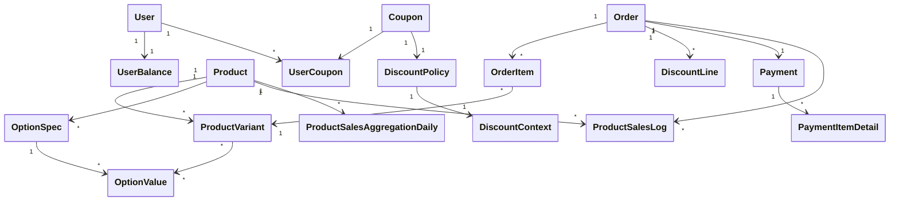
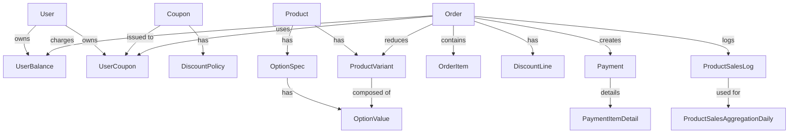

# ✅ 도메인 모델링

> 본 문서는 이커머스 주문 시스템의 설계를 위한 도메인 모델을 도출하고, 각 도메인 모델의 책임과 경계를 설정한다. 도메인 모델의 구체적인 형태와 유스케이스에 따른 도메인 모델의 책임/협력을 알아보기 쉽게 작성하였다.

# 목차

- [1️⃣ 도메인 도출](#1️⃣-도메인-도출)
- [2️⃣ 책임 및 경계 설정](#2️⃣-책임-및-경계-설정)
- [3️⃣ 도메인 간 관계 다이어그램](#3️⃣-도메인-간-관계-다이어그램)
- [4️⃣ 도메인 간 협력관계 다이어그램](#4️⃣-도메인-간-협력관계-다이어그램)
- [5️⃣ 도메인 명세](#5️⃣-도메인-명세)
    - [도메인 명세: `UserBalance`](#도메인-명세-userbalance)
    - [도메인 명세: `Product`](#도메인-명세-product)
    - [도메인 명세: `ProductVariant`](#도메인-명세-productvariant)
    - [도메인 명세: `OptionSpec`, `OptionValue`](#도메인-명세-optionspec-optionvalue)
    - [도메인 명세: `Coupon`](#도메인-명세-coupon)
    - [도메인 명세: `UserCoupon`](#도메인-명세-usercoupon)
    - [도메인 명세: `DiscountPolicy`](#도메인-명세-discountpolicy)
    - [도메인 명세: `Order`](#도메인-명세-order)
    - [도메인 명세: `OrderItem`](#도메인-명세-orderitem)
    - [도메인 명세: `DiscountLine`](#도메인-명세-discountline)
    - [도메인 명세: `Payment`](#도메인-명세-payment)
    - [도메인 명세: `PaymentItemDetail`](#도메인-명세-paymentitemdetail)
    - [도메인 명세: `PaymentMethod`](#도메인-명세-paymentmethod)
    - [도메인 명세: `ProductSalesLog`](#도메인-명세-productsaleslog)
    - [도메인 명세: `ProductSalesAggregationDaily`](#도메인-명세-productsalesaggregationdaily)
    - [도메인 명세: `ProductSalesAggregationCheckPoint`](#도메인-명세-productsalesaggregationcheckpoint)
- [5️⃣ 기능 ↔ 도메인 매핑](#5️⃣-기능--도메인-매핑)
    - [잔액 충전](#잔액-충전)
    - [잔액 조회](#잔액-조회)
    - [상품 조회](#상품-조회)
    - [쿠폰 발급](#쿠폰-발급)
    - [쿠폰 목록 조회](#쿠폰-목록-조회)
    - [주문 생성 / 결제 처리](#주문-생성--결제-처리)
    - [인기 상품 조회](#인기-상품-조회)

## 1️⃣ 도메인 도출

| 도메인                                 | 설명                          |
| ----------------------------------- | --------------------------- |
| `UserBalance`                       | 사용자 잔액을 관리하는 도메인            |
| `Product`                           | 판매되는 상품 도메인 (옵션 포함)         |
| `ProductVariant`                    | 옵션 조합으로 구성된 실제 구매 단위        |
| `OptionSpec`, `OptionValue`         | 상품 옵션 사양 정의용 도메인            |
| `Coupon`                            | 발급 가능한 할인 쿠폰                |
| `DiscountPolicy`                    | 할인 정책을 책임지는 도메인             |
| `DiscountContext`                   | 할인을 적용할 때 사용되는 컨텍스트에 대한 도메인 |
| `UserCoupon`                        | 특정 사용자에게 발급된 쿠폰             |
| `Order`                             | 주문 루트 도메인                   |
| `OrderItem`                         | 주문 내 상품 단위 아이템              |
| `DiscountLine`                      | 쿠폰 등 할인 정보 저장               |
| `Payment`                           | 결제 정보 도메인                   |
| `PaymentItemDetail`                 | 결제에 포함된 항목별 세부정보            |
| `PaymentMethod`                     | 결제 수단별 결제 금액                |
| `ProductSalesLog`                   | 개별 상품 판매 기록                 |
| `ProductSalesAggregationDaily`      | 집계된 상품 판매 데이터               |
| `ProductSalesAggregationCheckPoint` | 배치 집계 시 기준 시점               |

---

## 2️⃣ 책임 및 경계 설정

| Aggregate Root                 | 포함 객체 / 값                                     | 책임                  |
| ------------------------------ | --------------------------------------------- | ------------------- |
| `UserBalance`                  | `balance`                                     | 잔액 충전/차감            |
| `Product`                      | `ProductVariant`, `OptionSpec`, `OptionValue` | 옵션별 재고 관리, 가격 계산    |
| `Coupon`                       | `discountPolicy`, `remainingQuantity`         | 발급 가능 여부, 할인 계산     |
| `UserCoupon`                   | `status`, `expiredAt`, `usedAt`, `coupon`     | 상태 전이, 쿠폰 적용        |
| `Order`                        | `OrderItem`, `DiscountLine`                   | 주문 생성, 할인 적용, 상태 전이 |
| `Payment`                      | `PaymentItemDetail`                           | 결제 상태 관리, 환불 가능성    |
| `ProductSalesLog`              | -                                             | 이력 보존용 로그           |
| `ProductSalesAggregationDaily` | -                                             | 집계된 판매 수량 보관        |

---

## 3️⃣ 도메인 간 관계 다이어그램

## 4️⃣ 도메인 간 협력관계 다이어그램

## 5️⃣ 도메인 명세

### 도메인 명세: `UserBalance`

#### 개요
- 설명: 사용자별 보유 금액을 관리하는 도메인
- 책임:
  - 사용자의 잔액 충전 (`charge(amount)`)
  - 사용자의 잔액 차감 (`use(amount)`)
  - 잔액 부족 여부 확인 (`balance`)

#### 주요 속성

| 필드명     | 타입   | 설명          | 필수  | Nullable |
| ------- | ---- | ----------- | --- | -------- |
| userId  | Long | 사용자 ID (PK) | ✅   | ❌        |
| balance | Int  | 현재 잔액       | ✅   | ❌        |

#### 연관 관계
- `User`와 1:1

#### 상태 전이
- 없음 (값 변경만 존재)

#### 관련 유즈케이스
- 잔액 충전
- 잔액 조회
- 주문 시 결제 처리

---

### 도메인 명세: `Product`

> [!NOTE]
> - Product(상품)은 여러 개의 옵션을 가질 수 있다 ➡️ `OptionSpec`
> - 옵션은 여러 개의 값을 가질 수 있다 ➡️ `OptionValue`
> - 옵션의 조합에 대한 가격과 재고를 분리 ➡️ `ProductVariant`

#### 개요
- 설명: 판매되는 상품 도메인
- 책임:
  - 주문 아이템 포함
  - 할인 적용 (쿠폰)
  - 총액 계산
  - 상태 변경
  - 판매 로그 기록 트리거

#### 주요 속성

| 필드명         | 타입                   | 설명           | 필수  | Nullable |
| ----------- | -------------------- | ------------ | --- | -------- |
| id          | Long                 | 상품 ID (PK)   | ✅   | ❌        |
| name        | String               | 상품명          | ✅   | ❌        |
| basePrice   | Int                  | 기본 가격        | ✅   | ❌        |
| optionSpecs | List<OptionSpec>     | 상품 옵션 정의     | ✅   | ❌        |
| variants    | List<ProductVariant> | 구매 가능한 조합 목록 | ✅   | ❌        |
| status      | ProductStatus        | 상품 상태        |     |          |

#### 연관 관계
- `ProductVariant`: 1:N
- `OptionSpec`: 1:N

#### 책임 메서드

| 메서드                                              | 설명                          |
| ------------------------------------------------ | --------------------------- |
| `findVariant(values)`                            | 옵션 조합으로 Variant 조회          |
| `checkHasEnoughStock(variantId: Long, qty: Int)` | 재고 검증(`ProductVariant`에 위임) |
| `reduceStock(variantId: Long, qty: Int)`         | 재고 차감(`ProductVariant`에 위임) |

#### 상태 전이
- 없음 (구성 요소 변경만 존재)

#### 관련 유즈케이스
- 상품 조회
- 주문 생성 (옵션 조합 매칭)
- 인기 상품 조회 (참조)

---

### 도메인 명세: `ProductVariant`

#### 개요
- 설명: 옵션 조합별 구매 단위
- 책임: 재고 관리, 가격 계산

#### 주요 속성
>[!NOTE]
>- `optionValueIds`는 옵션 조합키의 역할
>- 명시적인 옵션 조합과 조합의 순서를 ID 리스트로 관리

| 필드명             | 타입                   | 설명       | 필수  | Nullable |
| --------------- | -------------------- | -------- | --- | -------- |
| id              | Long                 | 옵션 조합 ID | ✅   | ❌        |
| productId       | Long                 | 상위 상품 ID | ✅   | ❌        |
| optionValueIds  | `List<Long>`         | 선택된 옵션값  | ✅   | ❌        |
| additionalPrice | Int                  | 추가 금액    | ✅   | ❌        |
| stock           | Int                  | 재고 수량    | ✅   | ❌        |
| status          | ProductVariantStatus |          |     |          |

#### 연관 관계
- `Product`와 N:1
- `OptionValue`와 M:N

>[!NOTE] ❌ OptionValue 리스트를 String 형태로 컨버팅해서 저장하는 방식의 단점
>- 정규화 위반(DB 설계상 좋지 않음)
>- 검색 어려움(특정 옵션값이 포함된 variant를 찾기 어려움)
>- 쿼리 조작 불편(SQL이나 JPA로 `optionValuesIds`안에 특정 ID가 포함되어 있는지 판단하기 어렵고 느림)
>- 데이터 정합성 약함(옵션값이 삭제되거나 변경되어도 추적 어려움. 참조 무결성 없음.
>- 인덱스 불가능(MySQL 인덱스에서는 문자열 일부 검색엔 한계 있음)

#### 책임 메서드

| 메서드                        | 설명          |
| -------------------------- | ----------- |
| `checkHasEnoughStock(qty)` | 재고 검증       |
| `reduceStock(qty)`         | 재고 차감       |
| `getPrice(basePrice)`      | 최종 가격 계산    |
| `matches(optionValues)`    | 옵션 매칭 여부 확인 |

#### 상태 전이
- 없음 (수량만 변함)

#### 관련 유즈케이스
- 상품 조회
- 주문 생성 (재고 차감)
- 주문 취소 시 재고 복구 (선택)

---

### 도메인 명세: `OptionSpec`, `OptionValue`

#### 개요
- 설명: 옵션의 분류와 값
- 책임: 사용자 선택 가능 옵션 정의

#### 주요 속성

##### OptionSpec

| 필드명          | 타입     | 설명            | 필수  | Nullable |
| ------------ | ------ | ------------- | --- | -------- |
| id           | Long   | 옵션 ID         | ✅   | ❌        |
| productId    | Long   | 상위 상품 ID      | ✅   | ❌        |
| name         | String | 옵션 이름 (예: 색상) | ✅   | ❌        |
| displayOrder | Int    | 옵션 노출 순서      | ✅   | ❌        |

##### OptionValue

| 필드명 | 타입 | 설명 | 필수 | Nullable |
|--------|------|------|------|----------|
| id | Long | 옵션값 ID | ✅ | ❌ |
| specId | Long | 옵션 분류 ID | ✅ | ❌ |
| value | String | 값 (예: 검정, 흰색) | ✅ | ❌ |

#### 연관 관계
- `Product` 1 — N `OptionSpec`
- `OptionSpec` 1 — N `OptionValue`

#### 책임 메서드
- 없음 (설정/표시 목적)

#### 관련 유즈케이스
- 상품 옵션 조회
- 주문 시 옵션 선택

---

### 도메인 명세: `Coupon`

> 할인 정책에 대한 확장성을 고려 ➡️ `DiscountPolicy`를 별도의 모델로 분리
> `DiscountPolicy`에선 `DiscountContext`를 사용하여 할인을 계산

#### 개요
- 설명: 시스템이 정의한 발급 가능한 쿠폰
- 책임: 할인 금액 계산, 잔여 수량 차감, 발급 여부 판단

#### 주요 속성

| 필드명               | 타입             | 설명            | 필수  | Nullable |
| ----------------- | -------------- | ------------- | --- | -------- |
| id                | Long           | 쿠폰 ID         | ✅   | ❌        |
| name              | String         | 쿠폰명           | ✅   | ❌        |
| discountPolicy    | DiscountPolicy | 할인 정책 (정액/정율) | ✅   | ❌        |
| remainingQuantity | Int            | 발급 가능 수량      | ✅   | ❌        |

#### 연관 관계
- `UserCoupon` 1:N

#### 책임 메서드

| 메서드          | 설명                |
| --------------- | ------------------- |
| `canIssue()`    | 발급 가능 여부 판단 |
| `issueTo(user)` | `UserCoupon` 생성   |

#### 관련 유즈케이스
- 쿠폰 발급
- 할인 적용

---

### 도메인 명세: `UserCoupon`

#### 개요
- 설명: 특정 사용자가 보유한 쿠폰
- 책임: 상태 관리, 만료 확인, 할인 적용

#### 주요 속성

| 필드명       | 타입             | 설명                               | 필수  | Nullable |
| --------- | -------------- | -------------------------------- | --- | -------- |
| id        | Long           | 사용자 쿠폰 ID                        | ✅   | ❌        |
| coupon    | Coupon         | 참조 쿠폰 객체                         | ✅   | ❌        |
| status    | CouponStatus   | 상태 (`UNUSED`, `USED`, `EXPIRED`) | ✅   | ❌        |
| issued_at | LocalDateTime  | 발급 시각                            | ✅   | ❌        |
| expiredAt | LocalDateTime? | 만료 시각                            | ❌   | ✅        |
| usedAt    | LocalDateTime? | 사용 시각                            | ❌   | ✅        |

#### 연관 관계
- `User`, `Coupon` 참조
- `Order`에 할인 적용 시 연결됨

#### 책임 메서드

| 메서드                                  | 설명         |
| ------------------------------------ | ---------- |
| `applyTo(order)`                     | 할인 적용 시 호출 |
| `markAsUsed()`                       | 사용 상태로 변경  |
| `markAsExpired()`                    | 만료 처리      |
| `calculateDiscount(discountContext)` | 할인 금액 계산   |

### 관련 유즈케이스
- 쿠폰 발급
- 주문 생성 시 적용
- 만료 처리 (스케줄러 or 상태 전이)

---

### 도메인 명세: `DiscountPolicy`

#### 개요
- 설명: 할인 정책을 정의하는 도메인 모델
- 책임: 할인 정책, 할인 금액 계산

#### 주요 속성

| 필드명    | 타입     | 설명   | 필수  | Nullable |
| ------ | ------ | ---- | --- | -------- |
| rate   | Double | 할인율  | ❌   | ✅        |
| amount | Int    | 할인금액 | ❌   | ✅        |

#### 연관 관계
- `Coupon` 1:1

#### 책임 메서드

| 메서드                               | 설명           |
| ------------------------------------ | -------------- |
| `calculateDiscount(discountContext)` | 할인 금액 계산 |

#### 관련 유즈케이스
- 쿠폰 발급
- 할인 적용

---

### 도메인 명세: `Order`

#### 개요
- 설명: 사용자의 상품 구매 요청 전체
- 책임: 주문 아이템 구성, 할인 적용, 총액 계산, 상태 관리

#### 주요 속성

| 필드명              | 타입                   | 설명        | 필수  | Nullable |
| ---------------- | -------------------- | --------- | --- | -------- |
| id               | Long                 | 주문 ID     | ✅   | ❌        |
| items            | `List<OrderItem>`    | 주문 항목     | ✅   | ❌        |
| discountLines    | `List<DiscountLine>` | 적용된 할인 내역 | ✅   | ❌        |
| status           | OrderStatus          | 주문 상태     | ✅   | ❌        |
| createdAt        | LocalDateTime        | 주문 생성 시각  | ✅   | ❌        |
| originalTotal    | Int                  | 총계        | ✅   | ❌        |
| discountedAmount | Int                  | 할인금액      | ✅   | ❌        |

#### 연관 관계
- 포함: `OrderItem`, `DiscountLine`
- 연관: `UserCoupon`, `Payment`, `ProductSalesLog`

#### 책임 메서드

| 메서드                 | 설명          |
| ------------------- | ----------- |
| `applyCoupon()`     | 쿠폰 적용       |
| `calculateTotal()`  | 결제 총액 계산    |
| `completeOrder()`   | 결제 완료 처리    |
| `calculateStatus()` | 현재 주문 상태 계산 |

#### 관련 유즈케이스
- 주문 생성
- 쿠폰 할인 적용
- 결제 처리
- 주문 취소/환불

---

### 도메인 명세: `OrderItem`

#### 개요
- 설명: 주문 내 개별 상품 항목
- 책임: 단일 상품 수량, 금액 구성

#### 주요 속성

| 필드명       | 타입              | 설명                              | 필수  | Nullable |
| --------- | --------------- | ------------------------------- | --- | -------- |
| id        | Long            | 항목 ID                           | ✅   | ❌        |
| orderId   | Long            | 상위 주문 ID                        | ✅   | ❌        |
| productId | Long            | 상품 ID                           | ✅   | ❌        |
| variantId | Long            | 옵션 ID                           | ✅   | ❌        |
| quantity  | Int             | 수량                              | ✅   | ❌        |
| unitPrice | Int             | 개당 가격                           | ✅   | ❌        |
| subTotal  | Int             | 소계                              | ✅   | ❌        |
| status    | OrderItemStatus | 상태 (`ORDERED`, `CANCELED`, ...) | ✅   | ❌        |

#### 책임 메서드

| 메서드       | 설명      |
| ------------ | --------- |
| `subTotal()` | 소계 계산 |

#### 관련 유즈케이스
- 주문 생성
- 부분 취소
- 환불 처리

---

### 도메인 명세: `DiscountLine`

#### 개요
- 설명: 주문에 적용된 할인 정보 (쿠폰, 프로모션 등)
- 책임: 할인 이력 보관

#### 주요 속성
>[!NOTE]
>현재는 쿠폰으로만 할인 적용이 가능함.
>하지만 추후 할인 수단이 추가되는 상황을 고려하여 `type`을 두고, 할인출처 ID를 `sourceId`와 같이 쿠폰이 종속되지 않는 네이밍으로 선정함.

| 필드명         | 타입           | 설명                 | 필수  | Nullable |
| ----------- | ------------ | ------------------ | --- | -------- |
| id          | Long         | 할인 라인 ID           | ✅   | ❌        |
| orderId     | Long         | 주문 ID              | ✅   | ❌        |
| type        | DiscountType | 할인 종류 (COUPON 등)   | ✅   | ❌        |
| sourceId    | Long?        | 할인 출처 ID (쿠폰 ID 등) | ❌   | ✅        |
| amount      | Int          | 할인 금액              | ✅   | ❌        |
| description | String       | 설명/출처              | ✅   | ❌        |

#### 책임 메서드
- `fromCoupon(...)`: 쿠폰 정보로 할인 내역 생성

#### 관련 유즈케이스
- 주문 생성
- 쿠폰 할인 적용

---

### 도메인 명세: `Payment`

#### 개요
- 설명: 주문에 대한 실제 결제 정보
- 책임: 결제 상태 관리, 환불/부분 환불 처리

#### 주요 속성
>[!NOTE] `originalTotal`, `finalTotal`, `nonCashAmount`, `paidAmount`
>- 정합성과 감사(Audit)의 목적에서
   >	- `PaymentDetail`에서 계산 가능하지만 변경 가능성이 있는 하위구조(`PaymentDetail`)에 의존해선 안됨.
>- 성능 최적화를 위해
   >	- `PaymentDetail`의 합계로 계산하려면 비용이 비쌈.
>- 부분 환불/정산 시 포인트 정합성 확보(`nonCashAmount`)
>
>💡 핵심 요약 필드는 상위 엔티티에 저장해두는 게 좋다.

| 필드명            | 타입                        | 설명                              | 필수  | Nullable |
| -------------- | ------------------------- | ------------------------------- | --- | -------- |
| id             | Long                      | 결제 ID (PK)                      | ✅   | ❌        |
| orderId        | Long                      | 관련 주문 ID                        | ✅   | ❌        |
| originalTotal  | Int                       | 기존 총 금액                         | ✅   | ❌        |
| finalTotal     | Int                       | 할인 적용 후 총 금액                    | ✅   | ❌        |
| nonCashAmount  | Int                       | 비현금성 결제 수단으로 결제한 금액             | ✅   | ❌        |
| paidAmount     | Int                       | 현금성 결제 수단으로 결제한 금액              | ✅   | ❌        |
| refundedAmount | Int                       | 누적 환불 금액                        | ✅   | ❌        |
| status         | PaymentStatus             | 결제 상태 (`PAID`, `REFUNDED`, ...) | ✅   | ❌        |
| details        | `List<PaymentItemDetail>` | 항목별 결제 상세                       | ✅   | ❌        |
| methods        | `List<PaymentMethod>`     | 결제 수단 목록                        | ✅   | ❌        |
| timestamp      | LocalDateTime             | 결제 완료 시각                        | ✅   | ❌        |

#### 연관 관계
- `Order` 1:1
- 포함: `PaymentItemDetail`

#### 책임 메서드

| 메서드        | 설명                           |
|---------------|--------------------------------|
| `refund(amount)` | 환불 처리 및 상태 업데이트   |
| `status`      | 현재 결제 상태                 |

#### 관련 유즈케이스
- 주문 결제 처리
- 주문 환불 처리
- 결제 실패/재시도 처리

---

### 도메인 명세: `PaymentMethod`

#### 개요
- 설명:
  - 결제에 사용된 결제 수단과 상세 정보를 관리
  - 한 결제에 여러 결제수단이 사용될 수 있음을 의미 (현금성 결제수단 + 비현금성 결제수단)
- 책임: 결제에 사용된 결제 수단 추적

#### 주요 속성
| 필드명       | 타입                | 설명               | 필수  | Nullable |
| --------- | ----------------- | ---------------- | --- | -------- |
| id        | Long              | 수단별 결제내역 ID (PK) | ✅   | ❌        |
| paymentId | Long              | 관련 결제 ID         | ✅   | ❌        |
| type      | PaymentMethodType | 결제 수단            | ✅   | ❌        |
| amount    | Int               | 해당 결제수단으로 결제된 금액 | ✅   | ❌        |
#### 책임 메서드
- 없음(데이터 저장 목적)

#### 관련 유즈케이스
- 결제 상세조회
- 주문 결제 처리

---

### 도메인 명세: `PaymentItemDetail`

#### 개요
- 설명:
  - 주문 항목별 결제 금액 및 환불 여부 추적
  - 부분 환불 지원 / 상품 단위 정산 / 상품별 회계처리 등의 기능 추가를 고려
- 책임: 항목 단위 결제 내역 관리

#### 주요 속성
>[!NOTE] PaymentItemDetail에 discoutedPrice, nonCashAmount가 필요한 이유?
>- discountedPrice ➡️ 상품별 회계처리에 필요, 할인된 금액은 회계처리에서 제외
>- nonCashAmount ➡️ 부분 환불 시 포인트 환불 비율 결정 / 상품별 정산 시 포인트 비율 반영
>

| 필드명             | 타입      | 설명                 | 필수  | Nullable |
| --------------- | ------- | ------------------ | --- | -------- |
| id              | Long    | 상세 ID (PK)         | ✅   | ❌        |
| paymentId       | Long    | 상위 결제 ID           | ✅   | ❌        |
| orderItemId     | Long    | 해당 주문 항목 ID        | ✅   | ❌        |
| originalPrice   | Long    | 기존 가격              | ✅   | ❌        |
| discountedPrice | Long    | 할인된 가격             | ✅   | ❌        |
| nonCashAmount   | Long    | 포인트/예치금 등으로 결제한 금액 | ✅   | ❌        |
| paidAmount      | Int     | 현금/카드 등으로 결제한 금액   | ✅   | ❌        |
| refunded        | Boolean | 환불 여부              | ✅   | ❌        |

#### 책임 메서드
- 없음 (데이터 저장 목적)

#### 관련 유즈케이스
- 부분 환불 처리
- 결제 상세 조회

---

### 도메인 명세: `ProductSalesLog`

#### 개요
- 설명: 상품 판매 기록 (정적 집계 전 저장되는 이력)
- 책임: 일 단위 판매량 집계의 기초 데이터 제공

#### 주요 속성

| 필드명       | 타입            | 설명    | 필수  | Nullable |
| --------- | ------------- | ----- | --- | -------- |
| id        | Long          | 로그 ID | ✅   | ❌        |
| orderId   | Long          | 주문 ID | ✅   | ❌        |
| productId | Long          | 상품 ID | ✅   | ❌        |
| quantity  | Int           | 판매 수량 | ✅   | ❌        |
| createdAt | LocalDateTime | 판매 일시 | ✅   | ❌        |

#### 연관 관계
- `Order`, `Product` 참조

#### 관련 유즈케이스
- 인기 상품 조회 (3일 기준)
- 환불 시 이력 제외 고려

---

### 도메인 명세: `ProductSalesAggregationDaily`

#### 개요
- 설명: 상품별 일 단위 판매량 집계 결과 저장
- 책임: 인기 상품 계산의 기준 데이터 제공

#### 주요 속성

| 필드명        | 타입       | 설명                  | 필수 | Nullable |
|---------------|------------|-----------------------|------|----------|
| productId     | Long       | 상품 ID               | ✅   | ❌       |
| salesDay      | LocalDate  | 집계 대상 일자        | ✅   | ❌       |
| totalQuantity | Int        | 일 단위 판매 총합     | ✅   | ❌       |

#### 책임 메서드

| 메서드     | 설명                 |
|------------|----------------------|
| `add(qty)` | 집계 수량 누적 추가 |

#### 관련 유즈케이스
- 인기 상품 조회 (최근 3일 기준)

---

### 도메인 명세: `ProductSalesAggregationCheckPoint`

#### 개요
- 설명: 배치 집계 시점 기록용 도메인
- 책임: 중복 집계 방지를 위한 기준 시각 관리

#### 주요 속성

| 필드명              | 타입            | 설명           | 필수  | Nullable |
| ---------------- | ------------- | ------------ | --- | -------- |
| id               | Long          | 체크포인트 ID     | ✅   | ❌        |
| lastAggregatedAt | LocalDateTime | 마지막 집계 완료 시점 | ✅   | ❌        |

#### 관련 유즈케이스
- 집계 배치 시점 추적
- 인기 상품 통계 최신화 시 기준점 제공

## 5️⃣ 기능 ↔ 도메인 매핑

### 잔액 충전

#### 설명
사용자가 금액을 충전하여 자신의 `UserBalance`에 반영한다.

#### 관련 도메인

| 도메인           | 역할               |
| ------------- | ---------------- |
| `UserBalance` | 충전 로직, 유효성 검증 수행 |

#### 흐름 요약
1. 사용자 ID와 금액 입력
2. `UserBalance.charge(amount)` 호출
3. 내부적으로 유효성 검사 후 잔액 증가

---

### 잔액 조회

#### 설명
사용자가 자신의 현재 잔액을 조회한다.

#### 관련 도메인

| 도메인           | 역할        |
| ------------- | --------- |
| `UserBalance` | 잔액 보유, 반환 |

#### 흐름 요약
1. 사용자 ID로 `UserBalance` 조회
2. 현재 `balance` 값 반환

---

### 상품 조회

#### 설명
사용자가 상품 목록과 옵션별 재고/가격을 조회한다.

#### 관련 도메인

| 도메인              | 역할              |
| ---------------- | --------------- |
| `Product`        | 상품 기본 정보 제공     |
| `OptionSpec`     | 옵션 항목 정보 제공     |
| `OptionValue`    | 옵션 선택지 제공       |
| `ProductVariant` | 옵션 조합별 가격/재고 관리 |

#### 흐름 요약
1. `Product` 조회
2. 각 상품의 `optionSpecs`, `variants` 포함 응답
3. 옵션 조합 시 `ProductVariant.getPrice()`, `stock` 사용

---

### 쿠폰 발급

#### 설명
사용자가 특정 쿠폰을 발급받는다 (선착순 제한).

#### 관련 도메인

| 도메인          | 역할                    |
| ------------ | --------------------- |
| `Coupon`     | 발급 가능 여부 판단, 잔여 수량 차감 |
| `UserCoupon` | 사용자에게 발급되는 쿠폰 생성      |

#### 흐름 요약
1. `Coupon.canIssue()` 검사
2. `Coupon.issueTo(user)` → `UserCoupon` 생성
3. `remainingQuantity` 차감

---

### 쿠폰 목록 조회

#### 설명
사용자가 보유한 쿠폰 목록을 조회한다.

#### 관련 도메인

| 도메인       | 역할               |
|--------------|--------------------|
| `UserCoupon` | 상태/만료 정보 제공 |
| `Coupon`     | 할인정책 및 이름 제공|

#### 흐름 요약
1. 사용자 ID로 `UserCoupon` 조회
2. 각각 `Coupon` 참조 포함하여 정보 반환

---

### 주문 생성 / 결제 처리

#### 설명
사용자가 상품을 담아 주문하고, 쿠폰/잔액을 사용해 결제까지 수행한다.

#### 관련 도메인

| 도메인               | 역할                |
| ----------------- | ----------------- |
| `Order`           | 주문 생성 및 상태 전이     |
| `OrderItem`       | 상품 단위 주문 구성       |
| `ProductVariant`  | 재고 확인 및 차감        |
| `UserCoupon`      | 쿠폰 유효성 검사 및 사용 처리 |
| `Coupon`          | 할인 금액 계산          |
| `UserBalance`     | 잔액 차감             |
| `DiscountLine`    | 할인 내역 저장          |
| `Payment`         | 결제 정보 기록 및 상태 전이  |
| `ProductSalesLog` | 판매 기록 저장 (for 집계) |

#### 흐름 요약
1. 사용자 입력으로 주문 생성 (`Order`)
2. 옵션 조합으로 `ProductVariant` 확인 → 재고 차감
3. 쿠폰 있으면 `UserCoupon.applyTo(order)`
4. `UserBalance.use(amount)` → 잔액 차감
5. `Payment` 객체 생성 및 상태 변경
6. `ProductSalesLog` 기록

---

### 인기 상품 조회

#### 설명
최근 3일간의 판매량을 기준으로 인기 상품 TOP5 조회

#### 관련 도메인

| 도메인                            | 역할              |
| ------------------------------ | --------------- |
| `ProductSalesAggregationDaily` | 일별 집계 데이터 기반 조회 |
| `Product`                      | 상품명, 가격 등 표시 정보 |

#### 흐름 요약
1. 3일 이내 집계 데이터 조회
2. 판매량 기준 정렬 후 TOP 5 추출
3. 상품 정보 포함 응답 구성
