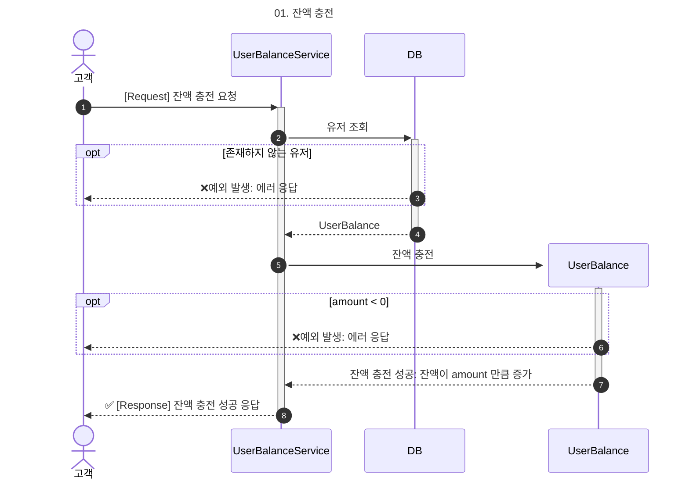
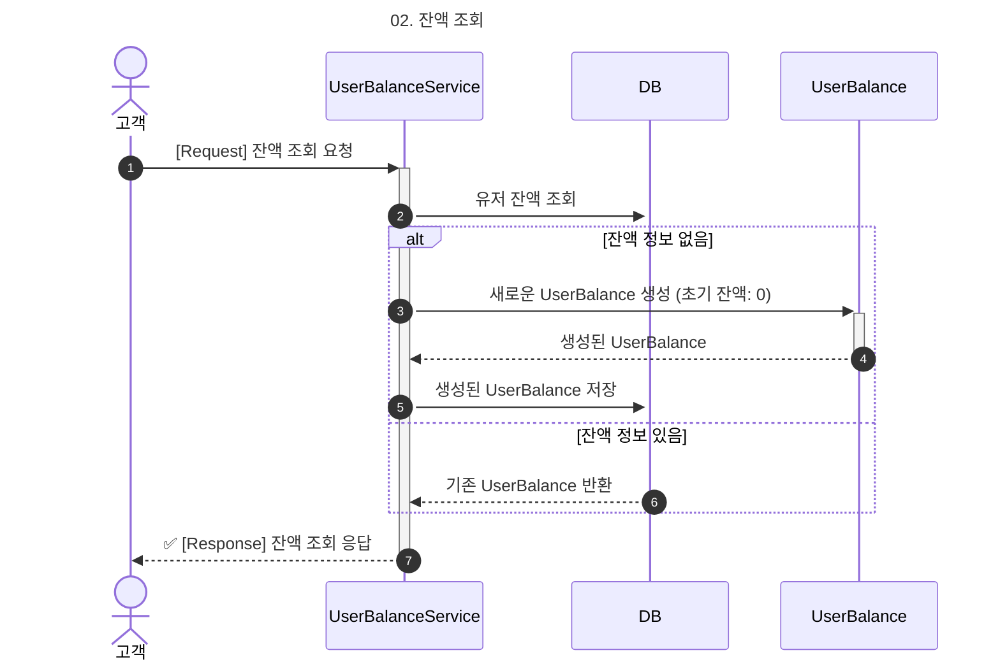
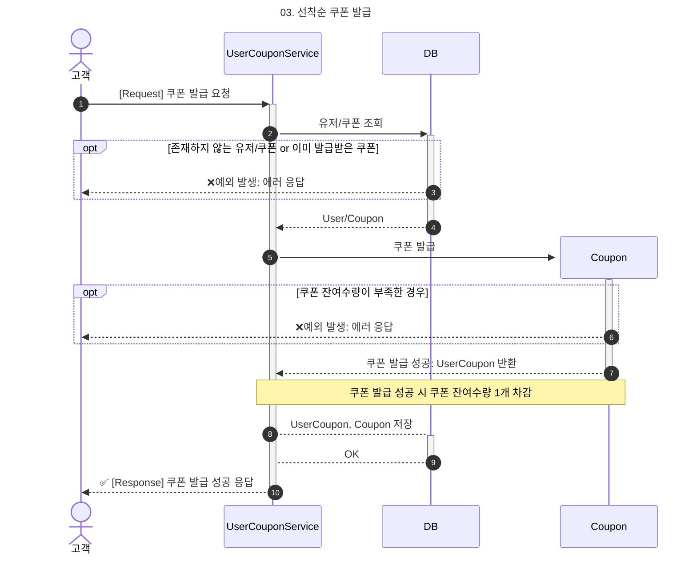
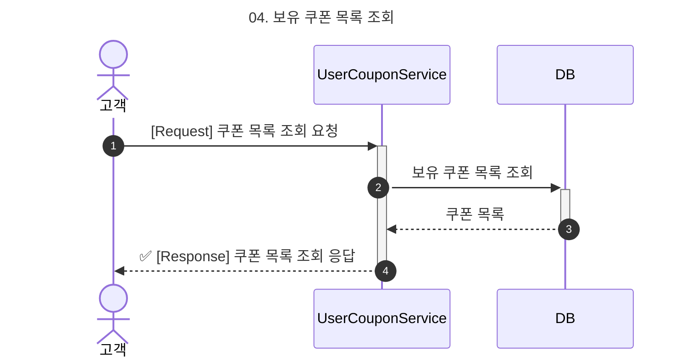
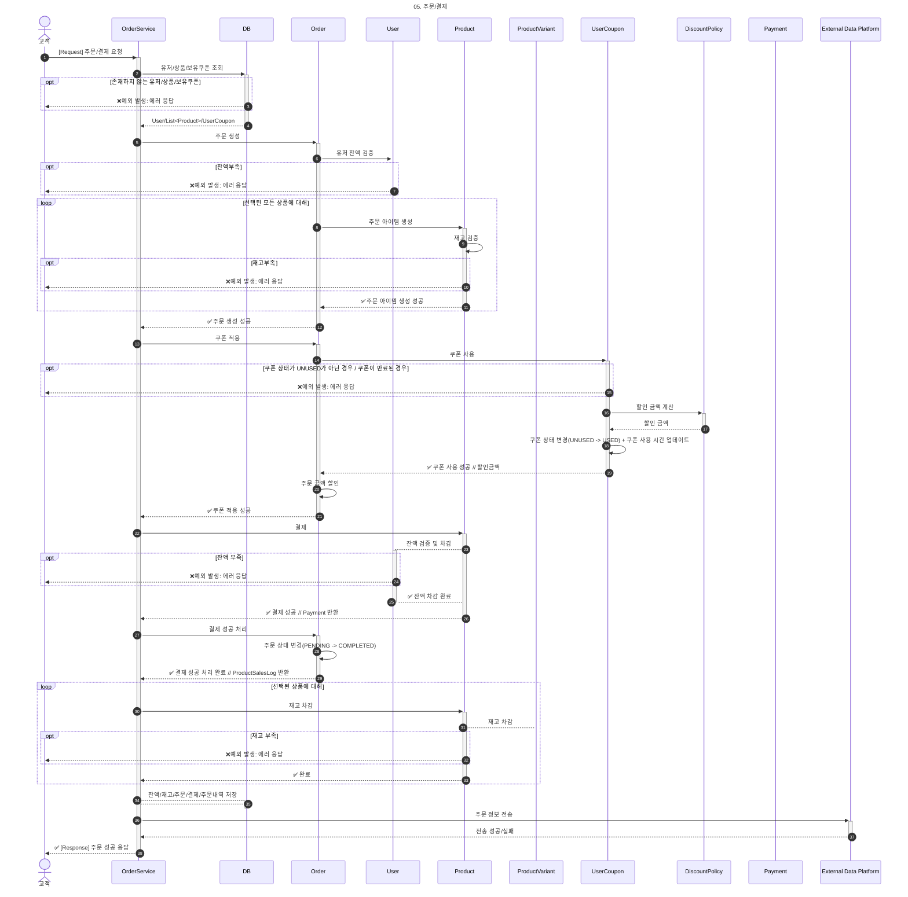
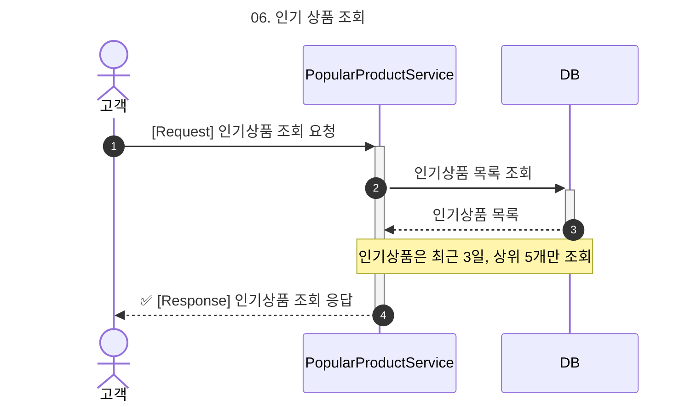
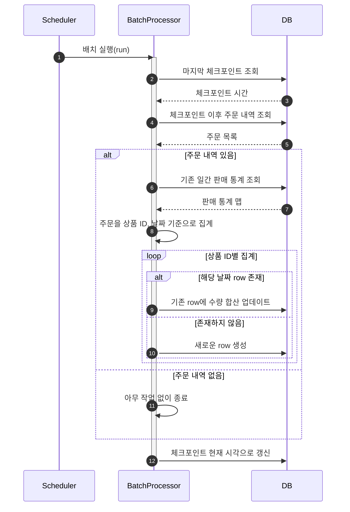

# ✅ 시퀀스 다이어그램

> 본 문서는 핵심 비즈니스 로직의 흐름과 도메인 객체 간 상호작용을 파악하기 쉽게 하기 위해 시퀀스 다이어그램과 흐름에 대한 설명을 제공하기 위한 문서이다.

# 목차

- [1. 잔액 충전](#1-잔액-충전)
- [2. 잔액 조회](#2-잔액-조회)
- [3. 쿠폰 발급](#3-쿠폰-발급)
- [4. 보유 쿠폰 목록 조회](#4-보유-쿠폰-목록-조회)
- [5. 주문 / 결제](#5-주문--결제)
- [6. 인기 상품 조회](#6-인기-상품-조회)
- [7. 판매량 집계 배치 프로세스](#7-판매량-집계-배치-프로세스)

## 1. 잔액 충전
---

- (1) 고객이 UserBalanceService에게 잔액 충전 요청을 보낸다.  
- (2) 서비스는 DB에 유저 정보를 조회한다.
- (3) 유저가 존재하지 않는 경우, DB는 에러를 발생시키고 고객에게 예외 응답을 반환한다.
- (4) 유저가 존재하는 경우, DB는 해당 유저의 UserBalance 정보를 서비스에 반환한다.
- (5) UserBalanceService는 UserBalance 객체를 활성화하고 충전 요청을 보낸다.
- (6) 충전 금액(amount)이 0 이하인 경우, 예외가 발생하고 고객에게 에러 응답이 반환된다.
- (7) 충전이 정상적으로 수행되면, amount만큼 잔액이 증가하고 결과가 서비스로 반환된다.
- (8) 서비스는 고객에게 잔액 충전 성공 응답을 반환한다.

## 2. 잔액 조회
---

- (1) 고객이`UserBalanceService`에 잔액 조회 요청을 보낸다.  
- (2) 서비스는 DB에 해당 유저의 잔액 정보를 조회한다.
- (3) 잔액 정보(UserBalance)가 존재하지 않는 경우,
- (4) 서비스는 새로운`UserBalance`를 생성하여
- (5) DB에 저장한다. 초기 잔액은 0이다.
- (6) 유저가 존재하고(또는 새로 생성된 경우) `UserBalance`로 응답을 생성한다.
- (7) 서비스는 고객에게 잔액 조회 성공 응답을 반환한다.

## 3. 쿠폰 발급
---

- (1) 고객이`UserCouponService`에 쿠폰 발급 요청을 보낸다.  
- (2) 서비스는 DB에서 해당 유저와 요청한 쿠폰 정보를 조회한다.
- (3) 유저나 쿠폰이 존재하지 않거나, 이미 해당 쿠폰을 발급받은 이력이 있는 경우 예외가 발생하고 에러 응답이 반환된다.
- (4) 유저와 쿠폰 정보가 유효하면, DB는 서비스에`User`와`Coupon`정보를 반환한다.
- (5)`Coupon`객체가 생성되며, 서비스는 이 객체에 쿠폰 발급 요청을 보낸다.
- (6) 쿠폰의 잔여 수량이 부족한 경우, 예외가 발생하고 고객에게 에러 응답이 반환된다.
- (7) 쿠폰 발급이 성공하면,`UserCoupon`객체가 반환된다. `Coupon`의 잔여 수량은 1 감소한다.
- (8) 서비스는 발급된`UserCoupon`및 잔여 수량이 갱신된`Coupon`객체를 DB에 저장한다.
- (9) DB는 저장 결과를 서비스에 반환한다.
- (10) 서비스는 고객에게 쿠폰 발급 성공 응답을 반환한다.

## 4. 보유 쿠폰 목록 조회
---

- (1) 고객이`UserCouponService`에 보유 쿠폰 목록 조회 요청을 보낸다.  
- (2) 서비스는 DB에 해당 유저의 보유 쿠폰 목록을 조회한다.  
- (3) DB는 해당 유저가 보유한`UserCoupon`목록을 반환한다.  
- (4) 서비스는 쿠폰 목록 정보를 고객에게 성공 응답으로 반환한다.

## 5. 주문 / 결제
---

### 주문 생성 단계

- (1) 고객(C)이 OrderService(S)에게 주문/결제 요청을 보낸다.  
- (2) OrderService는 DB에서 사용자, 상품, 보유 쿠폰 정보를 조회한다.  
- (3) 유저, 상품, 쿠폰 중 하나라도 존재하지 않으면 예외 발생 후 에러 응답을 반환한다.  
- (4) DB로부터 사용자, 상품 리스트, 사용자 보유 쿠폰 정보를 받아온다.
- (5) 주문 생성을 시작한다. OrderService는 Order 객체에 주문 생성을 요청한다.  
- (6) Order는 User에게 잔액이 충분한지 검증을 요청한다.  
- (7) 잔액이 부족한 경우 에러 응답이 반환된다.
- (8) 선택된 상품들에 대해 루프를 돌며 Order가 각 Product에 주문 아이템 생성을 요청한다.  
- (9) Product는 재고를 검증한다.  
- (10) 재고가 부족하면 예외가 발생하고 에러 응답이 반환된다.  
- (11) 주문 아이템 생성이 성공하면 Product는 Order에 응답을 반환한다.  
- (12) 모든 주문 아이템이 정상 생성되면 주문 생성이 완료된다.

---

### 쿠폰 적용 단계

- (13) 쿠폰이 있는 경우 쿠폰 적용 로직으로 넘어간다. OrderService는 Order에 쿠폰 적용을 요청한다.  
- (14) Order는 UserCoupon에 쿠폰 사용 요청을 보낸다.  
- (15) 쿠폰이`UNUSED`상태가 아니거나 만료되었으면 예외 발생 후 에러 응답이 반환된다.  
- (16) 유효한 쿠폰인 경우, UserCoupon은 DiscountPolicy에 할인 금액 계산 요청을 보낸다.  
- (17) 할인 금액이 계산되어 UserCoupon으로 반환된다.  
- (18) 쿠폰 상태를`USED`로 변경하고 사용 시각을 기록한다.  
- (19) 쿠폰 적용이 완료되면 Order에 결과를 반환한다.  
- (20) 주문 금액에 할인 금액을 반영한다.  
- (21) 쿠폰 적용이 완료되었음을 OrderService에 알린다.

---

### 결제 단계

- (22) 결제 처리를 시작한다. OrderService는 Payment에 결제를 요청한다.  
- (23) Payment는 User에게 잔액 검증 및 차감을 요청한다.  
- (24) 잔액이 부족하면 예외 발생 후 에러 응답이 반환된다.  
- (25) 잔액 차감이 성공하면 Payment는 결제 정보를 OrderService에 반환한다.  
- (26) 결제가 완료되면 OrderService는 Order에 결제 성공 처리를 요청한다.  
- (27) Order는 주문 상태를`PENDING`에서`COMPLETED`로 변경한다.  
- (28) 상태 변경 완료를 OrderService에 알린다.
- (29) 상품별 재고 차감 단계로 진입한다. 선택된 상품들에 대해 루프를 돌며 OrderService가 Product에 재고 차감을 요청한다.  
- (30) Product는 ProductVariant에 재고 차감을 요청한다.  
- (31) 재고가 부족하면 예외가 발생하고 에러 응답이 반환된다.  
- (32) 재고 차감이 성공적으로 완료되면 Product가 OrderService에 응답을 반환한다.

---

### 저장 및 응답 단계

- (33) 주문 관련 정보 저장 단계. OrderService는 DB에 잔액, 재고, 주문, 결제, 주문 내역 정보를 저장한다.  
- (34) 외부 연동 단계. OrderService는 외부 플랫폼(EXT)에 주문 정보를 전송하고 응답을 받는다. 성공 또는 실패 여부에 관계없이 처리는 계속된다.  
- (35) 모든 처리가 완료되면, OrderService는 고객에게 최종 주문 성공 응답을 반환한다.

## 6. 인기 상품 조회
---

- (1) 고객이`PopularProductService`에 인기 상품 목록 조회 요청을 보낸다.  
- (2) 서비스는 DB에 인기 상품 목록 조회를 요청한다.  
- (3) DB는 최근 3일간의 주문 데이터를 기반으로 상위 5개 인기 상품 목록을 반환한다.
- (4) 서비스는 인기 상품 목록을 고객에게 응답으로 반환한다.

## 7. 판매량 집계 배치 프로세스

- (1) 스케줄러(Scheduler)가 일정 주기(1시간)에 따라 배치 프로세서(BatchProcessor)를 실행시킨다.
- (2) 배치 프로세서는 DB에서 마지막으로 실행된 체크포인트 시간을 조회한다.
- (3) 조회한 체크포인트 이후의 주문 내역을 DB에서 가져온다.
- (4) 주문 내역이 있는지 확인한다.
- (5) 주문 내역이**있는 경우**:
- (6) 기존 판매량 일일 통계 데이터를 DB에서 조회한다.
- (7) 주문 데이터를 상품 ID와 날짜별로 그룹화하여 수량을 집계한다.
- (8) 집계된 항목들을 순회하며 다음과 같이 처리한다:
- (9) 해당 날짜의 통계 row가 이미 존재하면 수량을 합산하여 업데이트한다.
- (10) 해당 날짜의 통계 row가 존재하지 않으면 새로운 row를 생성한다  주문 내역이 **없는 경우**:
- (11) 통계 작업은 생략하고 체크포인트만 현재 시각으로 갱신한다.
- (12) 모든 처리가 완료되면 체크포인트를 현재 시각으로 갱신하여 다음 배치 기준을 저장한다.
