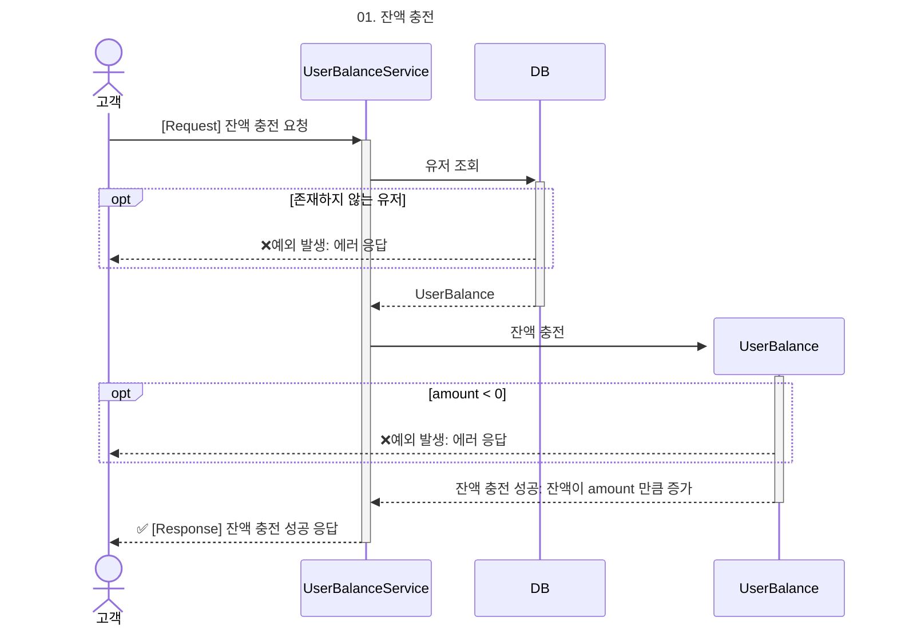
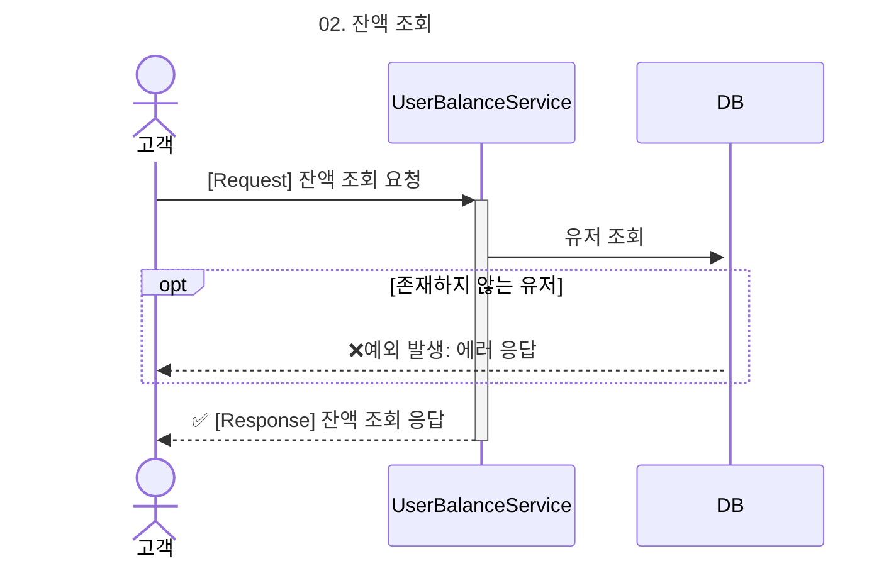
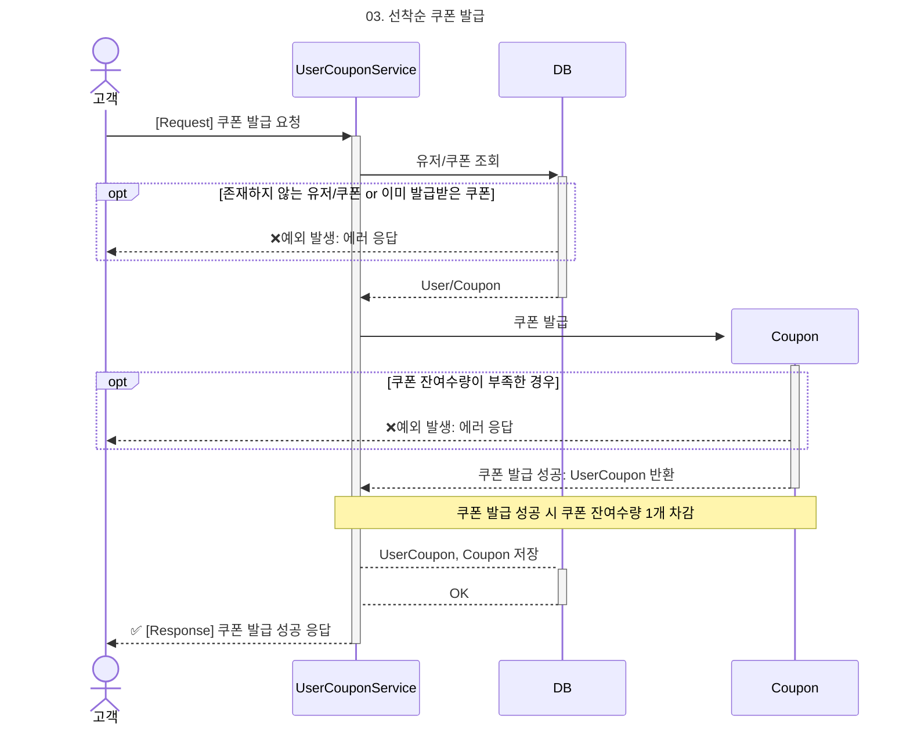
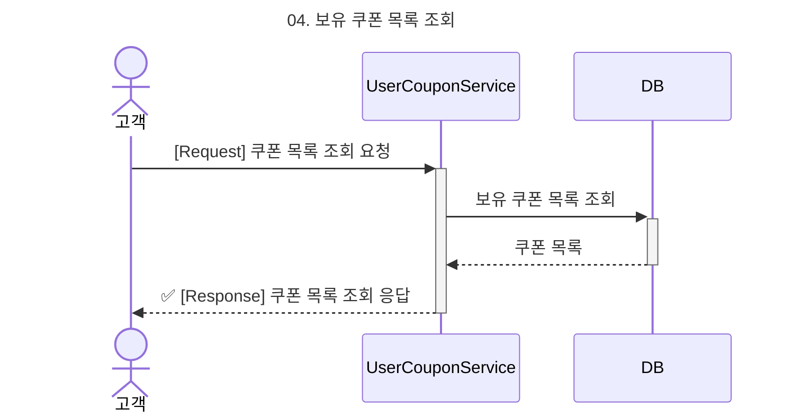
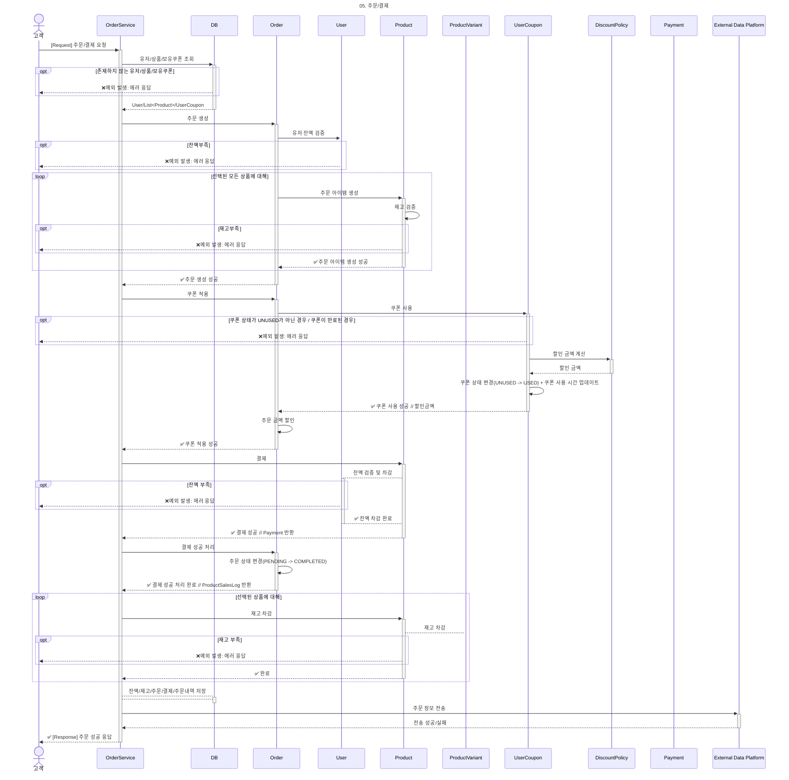
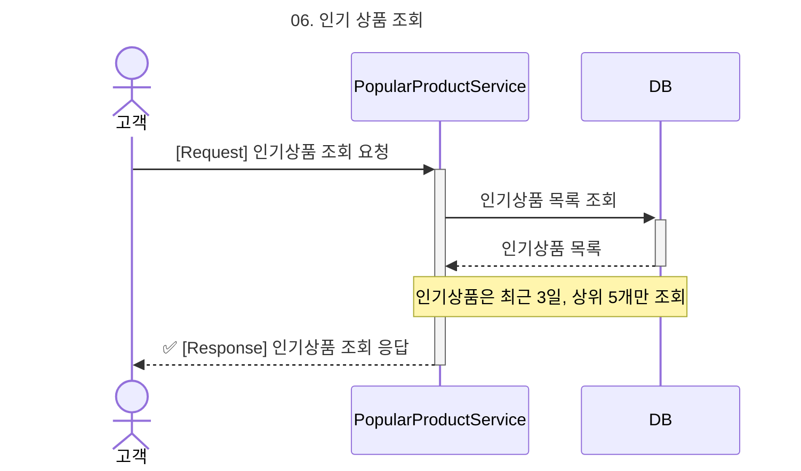

# ✅ 시퀀스 다이어그램

> 본 문서는 핵심 비즈니스 로직의 흐름과 도메인 객체 간 상호작용을 파악하기 쉽게 하기 위해 시퀀스 다이어그램과 흐름에 대한 설명을 제공하기 위한 문서이다.

# 목차

- [1. 잔액 충전](#1-잔액-충전)
- [2. 잔액 조회](#2-잔액-조회)
- [3. 쿠폰 발급](#3-쿠폰-발급)
- [4. 보유 쿠폰 목록 조회](#4-보유-쿠폰-목록-조회)
- [5. 주문 / 결제](#5-주문--결제)
- [6. 인기 상품 조회](#6-인기-상품-조회)

## 1. 잔액 충전
---

### 흐름 요약
사용자가 금액을 입력해 자신의 잔액을 충전하는 프로세스.  
유효하지 않은 유저나 충전 금액에 대한 예외 처리도 포함됨.

### 흐름 설명
1. `UserBalanceService`에 충전 요청을 보냄.
2. 서비스는 DB에서 해당 유저의 잔액 정보를 조회함.
3. 존재하지 않는 유저인 경우 예외 응답.
4. `UserBalance` 도메인에서 충전 로직 실행.
    - 음수 금액일 경우 예외 발생.
5. 잔액이 정상적으로 증가하면 충전 성공 응답 반환.

## 2. 잔액 조회
---

### 흐름 요약
사용자가 자신의 현재 잔액을 조회하는 단순 조회 요청.

### 흐름 설명
1. `UserBalanceService`에 잔액 조회 요청.
2. 서비스는 DB에서 유저 잔액 정보 조회.
3. 유저가 없을 경우 예외 응답.
4. 잔액 정보를 포함한 응답을 사용자에게 반환.

## 3. 쿠폰 발급
---

### 흐름 요약
사용자가 특정 쿠폰을 발급 요청할 때의 프로세스.  
쿠폰의 잔여 수량과 유저 존재 여부 등 제약을 포함함.

### 흐름 설명
1. 고객이 `UserCouponService`에 쿠폰 발급 요청.
2. DB에서 유저, 쿠폰 존재 여부 확인.
3. 존재하지 않는 유저/쿠폰이거나 이미 발급받은 쿠폰인 경우 예외 발생.
4. `Coupon` 도메인에서 발급 가능 여부 검사.
    - 잔여 수량 부족 시 예외 발생.
5. 성공 시 `UserCoupon`이 생성되고, 쿠폰 수량이 1 감소함.
6. 발급 완료 응답 반환.

## 4. 보유 쿠폰 목록 조회
---

### 흐름 요약
사용자가 자신이 보유한 쿠폰 목록을 조회하는 과정.

### 흐름 설명
1. 고객이 `UserCouponService`에 조회 요청.
2. DB에서 해당 사용자의 `UserCoupon` 목록을 조회.
3. 쿠폰 목록을 응답으로 반환.

## 5. 주문 / 결제
---

### 흐름 요약
복합적 로직이 포함된 **주문 처리의 전체 시나리오**.  
상품 선택 → 쿠폰 적용 → 결제 → 잔액/재고 차감 → 외부 전송 까지 포함.

### 흐름 설명

#### 1. 사전 데이터 조회
- 고객이 `OrderService`에 주문 요청
- 서비스는 유저, 상품, 쿠폰 정보를 DB에서 조회
- 존재하지 않는 경우 예외 처리

#### 2. 주문 생성
- `Order` 도메인에서 주문을 생성하고,
- 유저 잔액이 충분한지 검증
- 상품에 대해 재고 검증 및 주문 항목 생성
    - 재고 부족 시 예외 발생

#### 3. 쿠폰 적용
- `UserCoupon` 상태 검증 (UNUSED인지, 유효기간 내인지)
- `DiscountPolicy`를 통해 할인 금액 계산
- 쿠폰 상태 → USED로 변경, 사용 시간 기록
- 주문에 할인 금액 적용

#### 4. 결제 처리
- 결제 시도
- 결제 실패 시 예외 발생
- 결제 성공
    - 주문 상태 → `PAID`로 전이
    - 유저 잔액 차감, 상품 재고 차감
- 결제 내역 생성

#### 5. 결과 저장
- `UserBalance`, `Product`, `Payment`, `Order`, `ProductSalesLog` 를 DB에 저장

#### 6. 외부 시스템 전송
- 외부 데이터 플랫폼으로 주문 데이터 전송
    - 실패해도 주문은 성공으로 간주

#### ✅ 결과
- 전체 트랜잭션은 **원자적으로 처리되어야 함**
- 잔액 부족 / 쿠폰 만료 / 재고 부족 / 결제 실패 중 하나라도 발생하면 롤백 필요

## 6. 인기 상품 조회
---

### 흐름 요약
최근 3일간의 판매 데이터를 기반으로 인기 상품 TOP5를 조회.

### 흐름 설명

1. 고객이 `PopularProductService`에 인기 상품 조회 요청
2. DB에서 최근 3일 간의 집계 테이블을 조회
3. 판매량 상위 5개 상품을 선정
4. 응답으로 인기 상품 목록 반환
