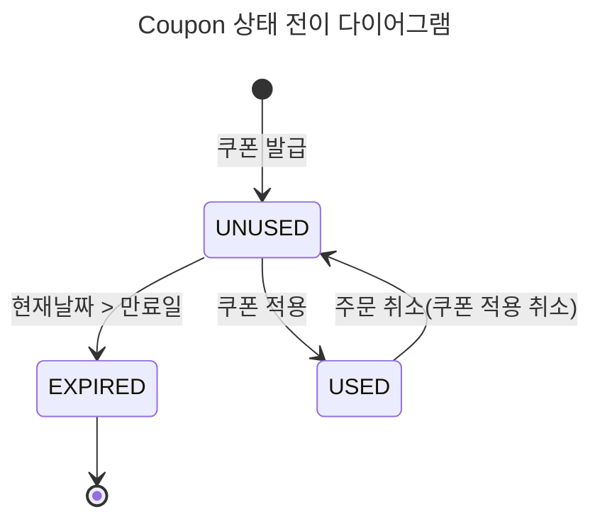
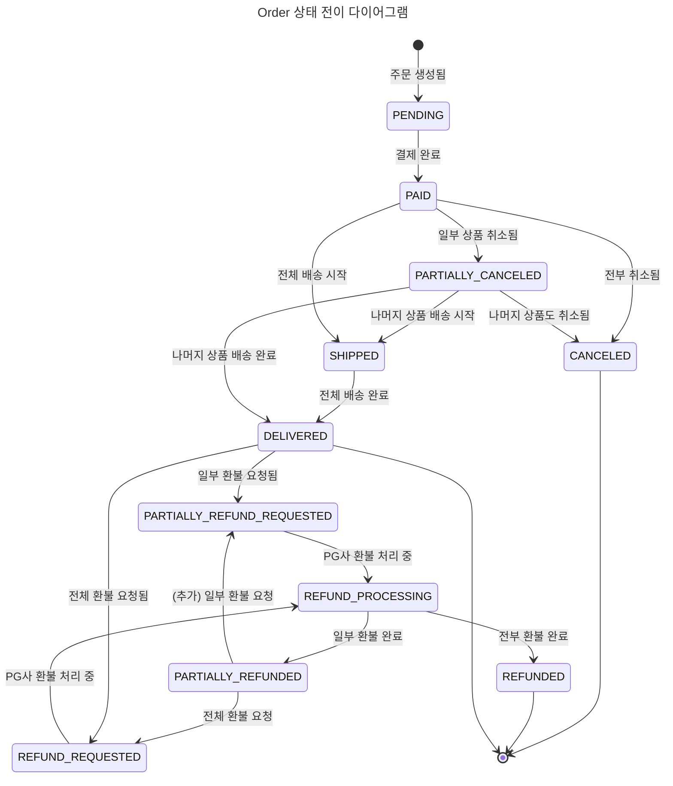
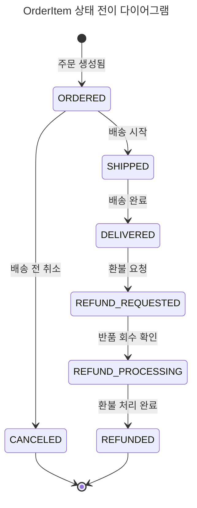
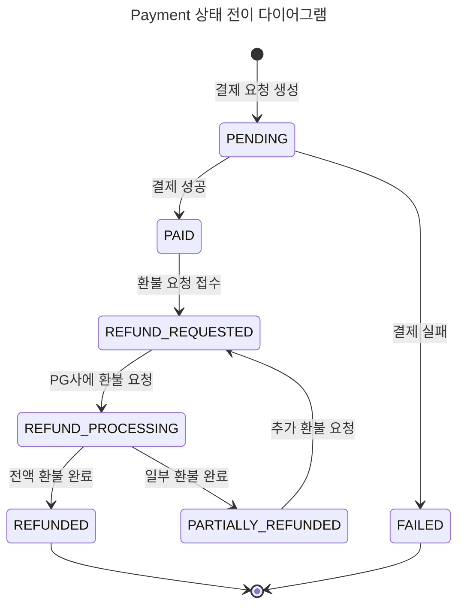
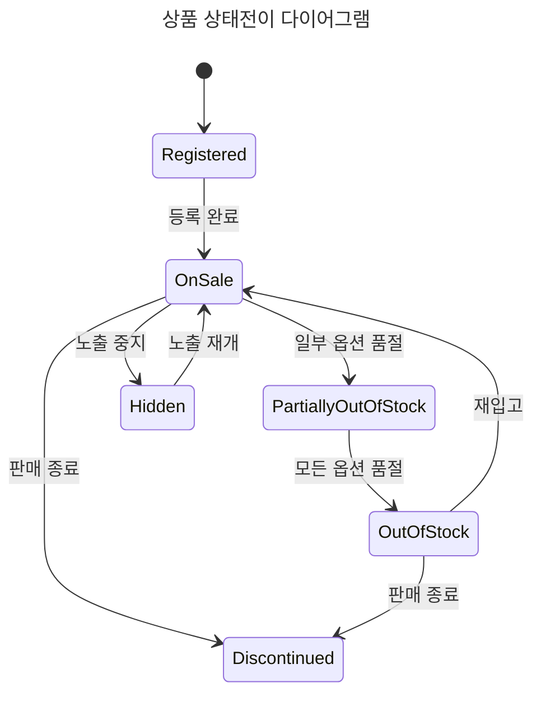
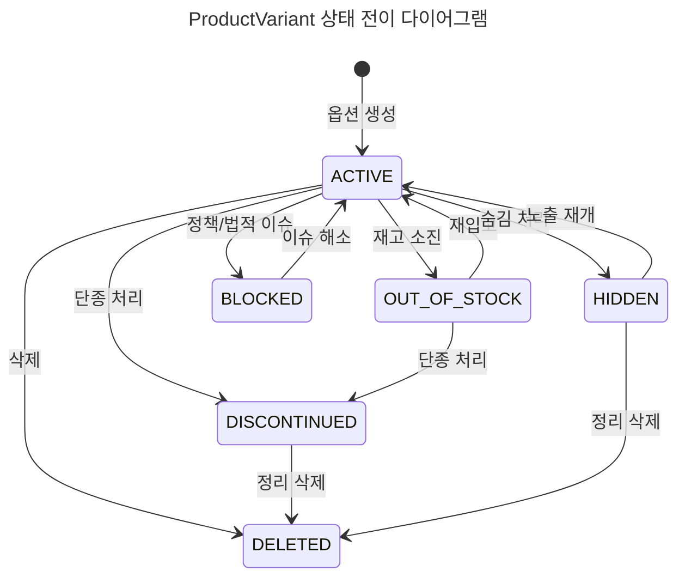

# ✅ 상태 다이어그램 명세 문서

> 본 문서는 도메인의 상태를 정의하고, 상태 전이가 어떤 조건에서 발생하는 지 설명한다. 상태 전이 흐름을 쉽게 파악하기 위한 상태 다이어그램을 제공한다.

## 목차

- [1. Coupon 상태 다이어그램](#1-coupon-상태-다이어그램)
- [2. Order 상태 다이어그램](#2-order-상태-다이어그램)
- [3. OrderItem 상태 다이어그램](#3-orderitem-상태-다이어그램)
- [4. Payment 상태 다이어그램](#4-payment-상태-다이어그램)
- [5. Product 상태 다이어그램](#5-product-상태-다이어그램)
- [6. ProductVariant 상태 다이어그램](#6-productvariant-상태-전이-다이어그램)

## 1. Coupon 상태 다이어그램

### 상태 정의

| 상태        | 설명               |
| --------- | ---------------- |
| `UNUSED`  | 발급된 후 사용되지 않은 상태 |
| `USED`    | 주문에 사용된 상태       |
| `EXPIRED` | 유효기간이 지나 만료된 상태  |

### 상태 전이

| From | To | 트리거 / 조건 |
|------|----|----------------|
| `[*]` | `UNUSED` | 쿠폰 발급 시 |
| `UNUSED` | `USED` | 주문에 쿠폰이 사용된 경우 |
| `UNUSED` | `EXPIRED` | 현재 날짜 > 만료일 |
| `USED` | `UNUSED` | 주문 취소로 인해 쿠폰이 반환됨 |
| `EXPIRED` | `[*]` | 종료 상태 |

---

## 2. Order 상태 다이어그램

### 상태 정의

| 상태 | 설명 |
|------|------|
| `PENDING` | 주문 생성됨 (결제 대기 중) |
| `PAID` | 결제 완료 |
| `PARTIALLY_CANCELED` | 일부 상품 취소됨 |
| `SHIPPED` | 전체 or 나머지 상품 배송 시작됨 |
| `DELIVERED` | 전체 상품 배송 완료 |
| `CANCELED` | 전체 주문 취소됨 |
| `REFUND_REQUESTED` | 전액 환불 요청됨 |
| `PARTIALLY_REFUND_REQUESTED` | 일부 환불 요청됨 |
| `REFUND_PROCESSING` | PG사 환불 처리 중 |
| `PARTIALLY_REFUNDED` | 일부 환불 완료 |
| `REFUNDED` | 전체 환불 완료 |

### 주요 전이 흐름

#### 일반 흐름

| From                 | To                   | 트리거         |
| -------------------- | -------------------- | ----------- |
| `[*]`                | `PENDING`            | 주문 생성됨      |
| `PENDING`            | `PAID`               | 결제 완료       |
| `PAID`               | `SHIPPED`            | 전체 상품 발송 시작 |
| `PAID`               | `PARTIALLY_CANCELED` | 일부 상품 취소    |
| `PARTIALLY_CANCELED` | `SHIPPED`            | 나머지 상품 발송   |
| `SHIPPED`            | `DELIVERED`          | 전체 배송 완료    |

#### 취소 / 환불

| From                         | To                           | 트리거       |
| ---------------------------- | ---------------------------- | --------- |
| `PAID`                       | `CANCELED`                   | 전부 취소     |
| `PARTIALLY_CANCELED`         | `CANCELED`                   | 남은 것도 취소  |
| `DELIVERED`                  | `REFUND_REQUESTED`           | 전체 환불 요청  |
| `DELIVERED`                  | `PARTIALLY_REFUND_REQUESTED` | 부분 환불 요청  |
| `PARTIALLY_REFUND_REQUESTED` | `REFUND_PROCESSING`          | PG사 환불 요청 |
| `REFUND_PROCESSING`          | `PARTIALLY_REFUNDED`         | 일부 환불 완료  |
| `REFUND_PROCESSING`          | `REFUNDED`                   | 전액 환불 완료  |
| `PARTIALLY_REFUNDED`         | `REFUND_REQUESTED`           | 나머지 환불 요청 |
| `PARTIALLY_REFUNDED`         | `REFUND_PROCESSING`          | 추가 환불 진행  |

---

## 3. OrderItem 상태 다이어그램

### 상태 정의

| 상태 | 설명 |
|------|------|
| `ORDERED` | 주문 생성됨 |
| `CANCELED` | 주문 항목 단위 취소 |
| `SHIPPED` | 배송 시작 |
| `DELIVERED` | 배송 완료 |
| `REFUND_REQUESTED` | 환불 요청됨 |
| `REFUND_PROCESSING` | 반품 회수 or PG사 환불 처리 중 |
| `REFUNDED` | 환불 완료 |

### 상태 전이

| From                   | To                  | 트리거         |
| ---------------------- | ------------------- | ----------- |
| `[*]`                  | `ORDERED`           | 주문 생성    |
| `ORDERED`              | `CANCELED`          | 배송 전 취소  |
| `ORDERED`              | `SHIPPED`           | 배송 시작    |
| `SHIPPED`              | `DELIVERED`         | 배송 완료    |
| `DELIVERED`            | `REFUND_REQUESTED`  | 환불 요청    |
| `REFUND_REQUESTED`     | `REFUND_PROCESSING` | 반품 접수    |
| `REFUND_PROCESSING`    | `REFUNDED`          | 환불 완료    |
| `CANCELED`, `REFUNDED` | `[*]`               | 종료 상태    |

---

## 4. Payment 상태 다이어그램

### 상태 정의

| 상태 | 설명 |
|------|------|
| `PENDING` | 결제 요청 상태 |
| `PAID` | 결제 성공 |
| `FAILED` | 결제 실패 |
| `REFUND_REQUESTED` | 환불 요청됨 |
| `REFUND_PROCESSING` | PG사에 환불 요청됨 |
| `PARTIALLY_REFUNDED` | 일부 환불 완료 |
| `REFUNDED` | 전액 환불 완료 |

### 상태 전이

| From                 | To                  | 트릐거          |
| -------------------- | -------------------- | ------------ |
| `[*]`                | `PENDING`            | 결제 요청 생성  |
| `PENDING`            | `PAID`               | 결제 성공        |
| `PENDING`            | `FAILED`             | 결제 실패        |
| `PAID`               | `REFUND_REQUESTED`   | 환불 요청        |
| `REFUND_REQUESTED`   | `REFUND_PROCESSING`  | PG사 환불 요청    |
| `REFUND_PROCESSING`  | `PARTIALLY_REFUNDED` | 일부 환불 완료     |
| `REFUND_PROCESSING`  | `REFUNDED`           | 전액 환불 완료     |
| `PARTIALLY_REFUNDED` | `REFUND_REQUESTED`   | 추가 환불 요청     |
| `REFUNDED`, `FAILED` | `[*]`                | 종료 상태        |

---

## 5. Product 상태 다이어그램

### 상태 정의
| 상태                       | 설명                   |
| ------------------------ | -------------------- |
| `REGISTERED`             | 시스템에 상품이 등록된 상태      |
| `ON_SALE`                | 하나 이상의 옵션이 판매 가능한 상태 |
| `PARTIALLY_OUT_OF_STOCK` | 일부 옵션만 품절된 상태        |
| `OUT_OF_STOCK`           | 모든 옵션이 품절된 상태        |
| `DISCONTINUED`           | 판매가 완전히 종료된 상태       |
| `HIDDEN`                 | 사용자에게는 노출되지 않음       |

### 상품 상태 전이
|From|To|트리거|
|---|---|---|
|`[*]`|`REGISTERED`|상품 등록|
|`REGISTERED`|`ON_SALE`|판매 시작|
|`ON_SALE`|`PARTIALLY_OUT_OF_STOCK`|일부 옵션 품절|
|`PARTIALLY_OUT_OF_STOCK`|`OUT_OF_STOCK`|모든 옵션 품절|
|`OUT_OF_STOCK`|`ON_SALE`|재입고|
|`ON_SALE`|`DISCONTINUED`|판매 종료|
|`OUT_OF_STOCK`|`DISCONTINUED`|판매 종료|
|`ON_SALE`|`HIDDEN`|노출 중지|
|`HIDDEN`|`ON_SALE`|노출 재개|

---

### 6. ProductVariant 상태 전이 다이어그램

### 상태 정의

| 상태             | 설명                          |
| -------------- | --------------------------- |
| `ACTIVE`       | 정상적으로 판매 가능한 상태             |
| `OUT_OF_STOCK` | 재고가 0으로 일시적으로 품절된 상태        |
| `HIDDEN`       | 사용자에게 노출되지 않는 상태 (일시 숨김 등)  |
| `DISCONTINUED` | 단종된 상태. 재입고 없이 판매 종료됨       |
| `BLOCKED`      | 정책, 법적, 품질 등의 이유로 판매 금지된 상태 |
| `DELETED`      | 삭제된 상태 (논리 삭제, 복구 가능)       |

---

### 상태 전이

|From|To|트리거 설명|
|---|---|---|
|`[*]`|`ACTIVE`|옵션 생성|
|`ACTIVE`|`OUT_OF_STOCK`|재고가 0이 됨|
|`OUT_OF_STOCK`|`ACTIVE`|재입고|
|`ACTIVE`|`DISCONTINUED`|옵션 단종|
|`OUT_OF_STOCK`|`DISCONTINUED`|재입고 없이 단종 처리|
|`ACTIVE`|`HIDDEN`|관리자에 의한 숨김 처리|
|`HIDDEN`|`ACTIVE`|노출 재개|
|`ACTIVE`|`BLOCKED`|정책/법적 이슈로 판매 금지|
|`BLOCKED`|`ACTIVE`|이슈 해소|
|`ACTIVE`|`DELETED`|삭제 처리|
|`DISCONTINUED`|`DELETED`|정리용 삭제|
|`HIDDEN`|`DELETED`|정리용 삭제|

