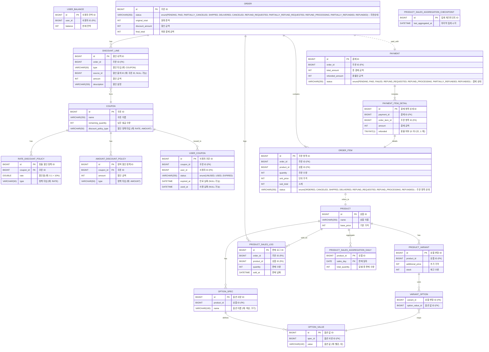

# ✅ ERD 설계 문서

> 이 문서는 이커머스 시스템의 데이터베이스 구조를 정의한다.
> 각 테이블은 도메인을 기반으로 설계되었으며, 식별자, 관계, 제약조건 등을 포함한다.

# 목차

- [ER 다이어그램](#er-다이어그램)
- [테이블 정의](#테이블-정의)
    - [`USER_BALANCE`](#user_balance)
    - [`PRODUCT`](#product)
    - [`OPTION_SPEC`](#option_spec)
    - [`OPTION_VALUE`](#option_value)
    - [`PRODUCT_VARIANT`](#product_variant)
    - [`VARIANT_OPTION`](#variant_option)
    - [`COUPON`](#coupon)
    - [`RATE_DISCOUNT_POLICY`](#rate_discount_policy)
    - [`AMOUNT_DISCOUNT_POLICY`](#amount_discount_policy)
    - [`USER_COUPON`](#user_coupon)
    - [`ORDER`](#order)
    - [`ORDER_ITEM`](#order_item)
    - [`DISCOUNT_LINE`](#discount_line)
    - [`PRODUCT_SALES_LOG`](#product_sales_log)
    - [`PRODUCT_SALES_AGGREGATION_DAILY`](#product_sales_aggregation_daily)
    - [`PRODUCT_SALES_AGGREGATION_CHECKPOINT`](#product_sales_aggregation_checkpoint)
    - [`PAYMENT`](#payment)
    - [`PAYMENT_ITEM_DETAIL`](#payment_item_detail)

## ER 다이어그램

## 테이블 정의
---

### `USER_BALANCE`

>사용자의 보유 잔액을 관리하는 테이블.  
`User`와 1:1 관계로 매핑된다.

| 컬럼명     | 타입      | 설명           | 제약조건   |
|------------|-----------|----------------|------------|
| id         | BIGINT    | 기본키 (User 참조) | PK, FK → `USER(id)` |
| user_id    | BIGINT    | 사용자 ID      | UNIQUE     |
| balance    | INT       | 잔액           | NOT NULL   |

### `PRODUCT`

>판매되는 상품의 기본 정보.  
옵션 사양(`OPTION_SPEC`)과 옵션 조합(`PRODUCT_VARIANT`)을 통해 다양한 옵션을 가질 수 있다.

| 컬럼명        | 타입     | 설명    | 제약조건     |
| ---------- | ------ | ----- | -------- |
| id         | BIGINT | 상품 ID | PK       |
| name       | STRING | 상품 이름 | NOT NULL |
| base_price | INT    | 기본 가격 | NOT NULL |

### `OPTION_SPEC`

>`PRODUCT`에 속한 옵션의 분류(색상, 사이즈 등) 및 각 선택 가능한 값 정의 (검정, 흰색 등).  
`OPTION_SPEC`1:N`OPTION_VALUE`

| 컬럼명     | 타입      | 설명          | 제약조건      |
|------------|-----------|---------------|---------------|
| id         | BIGINT    | 옵션 사양 ID  | PK            |
| product_id | BIGINT    | 상품 ID       | FK → PRODUCT  |
| name       | STRING    | 옵션 이름     | NOT NULL      |

### `OPTION_VALUE`

| 컬럼명     | 타입     | 설명       | 제약조건             |
| ------- | ------ | -------- | ---------------- |
| id      | BIGINT | 옵션 값 ID  | PK               |
| spec_id | BIGINT | 옵션 사양 ID | FK → OPTION_SPEC |
| value   | STRING | 옵션 값     | NOT NULL         |

### `PRODUCT_VARIANT`

>실제 구매 가능한 상품 단위.  
여러`OPTION_VALUE`의 조합으로 구성되며, 별도의 추가 가격과 재고를 가진다.
`PRODUCT_VARIANT` → `PRODUCT`: 비식별

| 컬럼명          | 타입   | 설명           | 제약조건         |
|------------------|--------|----------------|------------------|
| id               | BIGINT | 변형 상품 ID   | PK               |
| product_id       | BIGINT | 상품 ID        | FK → PRODUCT     |
| additional_price | INT    | 추가 금액      | NOT NULL         |
| stock            | INT    | 재고           | NOT NULL         |

### `VARIANT_OPTION`

>`PRODUCT_VARIANT`와`OPTION_VALUE`의 다대다 관계를 나타내는 조합 테이블.  
하나의 구매 상품 단위는 여러 옵션 값으로 구성될 수 있음.
`VARIANT_OPTION` → `OPTION_VALUE`: 비식별 M:N

| 컬럼명           | 타입   | 설명               | 제약조건                        |
|------------------|--------|--------------------|---------------------------------|
| variant_id       | BIGINT | 변형 상품 ID       | FK → PRODUCT_VARIANT, 복합 PK  |
| option_value_id  | BIGINT | 옵션 값 ID         | FK → OPTION_VALUE, 복합 PK     |

### `COUPON`

>발급 가능한 쿠폰. 쿠폰에 대한 템플릿 역할을 함.
잔여 수량이 존재할 경우 발급 가능.

| 컬럼명                | 타입     | 설명    | 제약조건     |
| ------------------ | ------ | ----- | -------- |
| id                 | BIGINT | 쿠폰 ID | PK       |
| name               | STRING | 쿠폰명   | NOT NULL |
| remaining_quantity | INT    | 잔여 수량 | NOT NULL |

### `RATE_DISCOUNT_POLICY`

> 할인율에 따른 할인 정책을 위한 테이블.
> 할인율과 할인 정책 타입으로 구성된다.
> `RATE_DISCOUNT_POLICY` 1:1 `COUPON`

| 컬럼명       | 타입     | 설명       | 제약조건     |
| --------- | ------ | -------- | -------- |
| id        | BIGINT | 할인정책 ID  | PK       |
| coupon_id | BIGINT | 쿠폰 ID    | FK       |
| rate      | DOUBLE | 할인율      | NOT NULL |
| type      | STRING | 할인 정책 타입 | NOT NULL |

### `AMOUNT_DISCOUNT_POLICY`

> 금액할인 기반의 할인 정책을 위한 테이블.
> 할인금액과 할인 정책 타입으로 구성된다.
> `AMOUNT_DISCOUNT_POLICY` 1:1 `COUPON`

| 컬럼명       | 타입     | 설명       | 제약조건     |
| --------- | ------ | -------- | -------- |
| id        | BIGINT | 할인정책 ID  | PK       |
| coupon_id | BIGINT | 쿠폰 ID    | FK       |
| amount    | INT    | 할인금액     | NOT NULL |
| type      | STRING | 할인 정책 타입 | NOT NULL |

### `USER_COUPON`

>사용자가 발급받은 쿠폰에 대한 테이블.  
`COUPON`과 연결되며, 상태, 만료일 등을 포함한다.
`USER_COUPON` → `COUPON`, `USER`: 식별관계

| 컬럼명        | 타입     | 설명        | 제약조건        |
| ---------- | ------ | --------- | ----------- |
| id         | BIGINT | 사용자 쿠폰 ID | PK          |
| coupon_id  | BIGINT | 쿠폰 참조     | FK → COUPON |
| user_id    | BIGINT | 사용자 ID    | FK → USER   |
| status     | STRING | 쿠폰 상태     | NOT NULL    |
| expired_at | DATE   | 만료일       | NOT NULL    |
| used_at    | DATE   | 사용일       | NULLABLE    |
|            |        |           |             |

### `ORDER`

>주문의 루트 테이블.  
주문 상태, 총 결제 금액 등을 보관하며, 주문아이템과 할인 내역, 결제, 판매 기록 등과 연결된다.

| 컬럼명           | 타입   | 설명              | 제약조건 |
|------------------|--------|-------------------|----------|
| id               | BIGINT | 주문 ID           | PK       |
| status           | STRING | 주문 상태         | NOT NULL |
| original_total   | INT    | 원가              | NOT NULL |
| discount_amount  | INT    | 할인 금액         | NOT NULL |
| final_total      | INT    | 결제 금액         | NOT NULL |

### `ORDER_ITEM`

>한 주문에 여러 개의 상품이 있을 수 있다. 구매한 상품별 수량, 개별 가격, 소계, 상태를 포함한다.

| 컬럼명     | 타입   | 설명          | 제약조건                |
|------------|--------|---------------|--------------------------|
| id         | BIGINT | 주문 항목 ID  | PK                       |
| order_id   | BIGINT | 주문 ID       | FK → ORDER               |
| product_id | BIGINT | 상품 ID       | FK → PRODUCT             |
| quantity   | INT    | 수량          | NOT NULL                 |
| unit_price | INT    | 개당 가격     | NOT NULL                 |
| sub_total  | INT    | 소계          | NOT NULL                 |
| status     | STRING | 상태          | NOT NULL                 |

### `DISCOUNT_LINE`

>주문에 적용된 쿠폰을 기록.
>추후 다양한 할인수단으로 확장할 수 있도록 `source_id`는 쿠폰에 종속되지 않도록 설계함.
할인 금액, 설명, 할인 출처 등을 통해 트래킹 가능하게 설계함.

| 컬럼명     | 타입   | 설명               | 제약조건            |
|------------|--------|--------------------|----------------------|
| id         | BIGINT | 할인 라인 ID       | PK                   |
| order_id   | BIGINT | 주문 ID            | FK → ORDER           |
| type       | STRING | 할인 종류          | NOT NULL             |
| source_id  | BIGINT | 출처 (쿠폰 등)     | NULLABLE             |
| amount     | INT    | 할인 금액          | NOT NULL             |
| description| STRING | 설명               | NOT NULL             |

### `PRODUCT_SALES_LOG`

>주문 시점의 판매 이력을 기록하는 테이블.  
집계를 위해 개별 상품별 판매 내역을 유지하며, 환불 시 제외할 수 있도록 사용됨.

| 컬럼명     | 타입   | 설명         | 제약조건                  |
|------------|--------|--------------|----------------------------|
| id         | BIGINT | 로그 ID      | PK                         |
| order_id   | BIGINT | 주문 ID      | FK → ORDER                 |
| product_id | BIGINT | 상품 ID      | FK → PRODUCT               |
| quantity   | INT    | 수량         | NOT NULL                   |
| sold_at    | DATE   | 판매 일자    | NOT NULL                   |

### `PRODUCT_SALES_AGGREGATION_DAILY`

>하루 단위로 집계된 상품별 판매 수량.  
인기 상품 조회 등 통계 기반 기능에 사용되며,`sales_day`+`product_id`로 복합 PK 구성.

| 컬럼명        | 타입      | 설명        | 제약조건                  |
|---------------|-----------|-------------|----------------------------|
| product_id    | BIGINT    | 상품 ID     | PK, FK → PRODUCT           |
| sales_day     | DATE      | 집계 일자   | PK                         |
| total_quantity| INT       | 총 수량     | NOT NULL                   |

### `PRODUCT_SALES_AGGREGATION_CHECKPOINT`

>마지막 집계 완료 시점을 기록하는 테이블.  
집계 배치에서 중복 계산을 방지하기 위한 기준 시각 관리.

| 컬럼명           | 타입         | 설명              | 제약조건 |
|------------------|--------------|-------------------|----------|
| id               | BIGINT       | PK                | PK       |
| last_aggregated_at | DATE       | 마지막 집계 시점  | NOT NULL |

### `PAYMENT`

>결제 정보 관리 테이블.  
주문에 대한 총 결제 금액, 환불 누적 금액, 결제 상태를 포함한다.

| 컬럼명             | 타입     | 설명       | 제약조건       |
| --------------- | ------ | -------- | ---------- |
| id              | BIGINT | 결제 ID    | PK         |
| order_id        | BIGINT | 주문 ID    | FK → ORDER |
| total_amount    | INT    | 결제 총액    | NOT NULL   |
| refunded_amount | INT    | 환불 누적 금액 | DEFAULT 0  |
| status          | STRING | 결제 상태    | NOT NULL   |

### `PAYMENT_ITEM_DETAIL`

>주문 항목별 결제 내역 상세 추적 테이블.  
부분 취소 및 환불 처리를 지원하며,`refunded`여부로 상태 관리.

| 컬럼명        | 타입    | 설명             | 제약조건                     |
|---------------|---------|------------------|-------------------------------|
| id            | BIGINT  | 상세 ID          | PK                            |
| payment_id    | BIGINT  | 결제 ID          | FK → PAYMENT                  |
| order_item_id | BIGINT  | 주문 항목 ID     | FK → ORDER_ITEM               |
| amount        | INT     | 결제 금액        | NOT NULL                      |
| refunded      | BOOLEAN | 환불 여부        | DEFAULT false                 |

