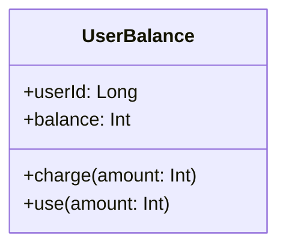
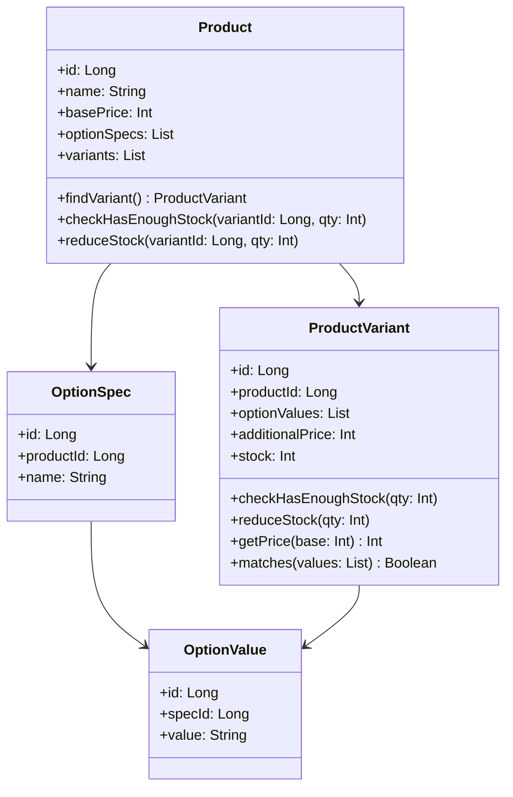
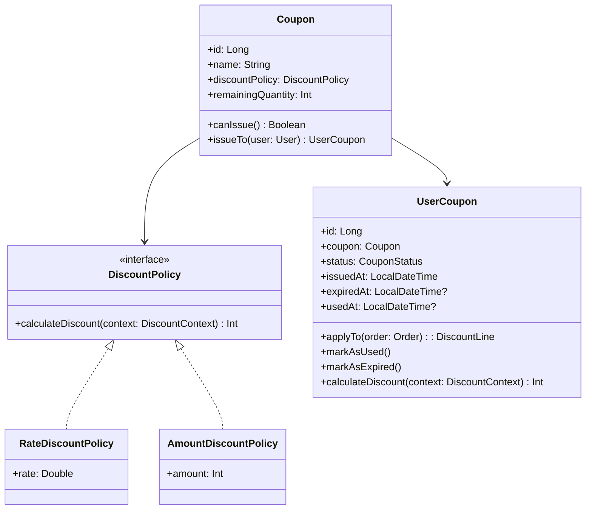
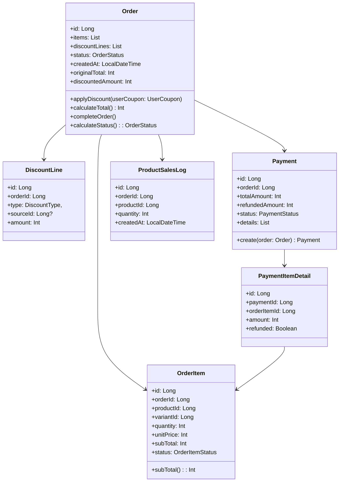
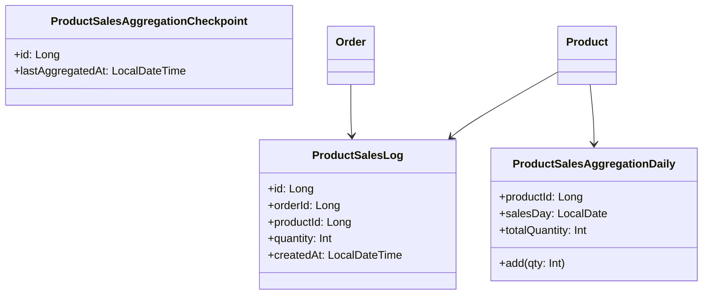

# ✅ 클래스 다이어그램

> 본 문서에서는 도메인 객체의 프로퍼티 및 메서드를 구체화하고 도메인 간의 관계를 시각화하기 위해 클래스 다이어그램을 제공한다.
>

## ✅ 클래스 다이어그램 목차

### 📌 전체 다이어그램
- [전체 클래스 다이어그램](#전체-클래스-다이어그램)

### 주요 도메인 클래스
- [UserBalance](#userbalance)
- [Product](#product)
- [ProductVariant](#productvariant)
- [Coupon](#coupon)
- [DiscountPolicy 및 구현체](#discountpolicy--구현체)
- [UserCoupon](#usercoupon)
- [Order](#order)
- [OrderItem](#orderitem)
- [DiscountLine](#discountline)
- [Payment](#payment)
- [PaymentItemDetail](#paymentitemdetail)
- [PaymentMethod](#paymentmethod)
- [ProductSalesLog](#productsaleslog)
- [ProductSalesAggregationDaily](#productsalesaggregationdaily)
- [ProductSalesAggregationCheckpoint](#productsalesaggregationcheckpoint)

## 전체 클래스 다이어그램

```mermaid
classDiagram

%% ===== ENUMS =====
class CouponStatus {
  <<enum>>
  UNUSED
  USED
  EXPIRED
}

class OrderStatus {
  <<enum>>
  PENDING
  PAID
  PARTIALLY_CANCELED
  SHIPPED
  DELIVERED
  CANCELED
  REFUND_REQUESTED
  PARTIALLY_REFUND_REQUESTED
  REFUND_PROCESSING
  PARTIALLY_REFUNDED
  REFUNDED
}

class OrderItemStatus {
  <<enum>>
  ORDERED
  CANCELED
  SHIPPED
  DELIVERED
  REFUND_REQUESTED
  REFUND_PROCESSING
  REFUNDED
}

class PaymentStatus {
  <<enum>>
  PENDING
  PAID
  FAILED
  REFUND_REQUESTED
  REFUND_PROCESSING
  PARTIALLY_REFUNDED
  REFUNDED
}

%% ===== DOMAIN CLASSES =====

class UserBalance {
  +userId: Long
  +balance: Int
  +charge(amount: Int)
  +use(amount: Int)
}

class Product {
  +id: Long
  +name: String
  +basePrice: Int
  +optionSpecs: List<OptionSpec>
  +variants: List<ProductVariant>
  +findVariant() ProductVariant
  +checkHasEnoughStock(variantId: Long, qty: Int)
  +reduceStock(variantId: Long, qty: Int)
}

class OptionSpec {
  +id: Long
  +productId: Long
  +name: String
}

class OptionValue {
  +id: Long
  +specId: Long
  +value: String
}

class ProductVariant {
  +id: Long
  +productId: Long
  +optionValueIds: List<OptionValue>
  +additionalPrice: Int
  +stock: Int
  +checkHasEnoughStock(qty: Int)
  +reduceStock(qty: Int)
  +getPrice(base: Int) Int
  +matches(values: List<OptionValue>) Boolean
}

class Coupon {
  +id: Long
  +name: String
  +discountPolicy: DiscountPolicy
  +remainingQuantity: Int
  +canIssue() Boolean
  +issueTo(user: User) UserCoupon
}

class DiscountPolicy {
  <<interface>>
  +calculateDiscount(context: DiscountContext) Int
}

class RateDiscountPolicy {
  +rate: Double
}

class AmountDiscountPolicy {
  +amount: Int
}

DiscountPolicy <|.. RateDiscountPolicy
DiscountPolicy <|.. AmountDiscountPolicy
Coupon --> DiscountPolicy

class UserCoupon {
  +id: Long
  +coupon: Coupon
  +status: CouponStatus
  +issuedAt: LocalDateTime
  +expiredAt: LocalDateTime?
  +usedAt: LocalDateTime?
  +applyTo(order: Order): DiscountLine
  +markAsUsed()
  +markAsExpired()
  +calculateDiscount(context: DiscountContext) Int
}

class Order {
  +id: Long
  +items: List<OrderItem>
  +discountLines: List<DiscountLine>
  +status: OrderStatus
  +createdAt: LocalDateTime
  +originalTotal: Int
  +discountedAmount: Int
  +applyDiscount(userCoupon: UserCoupon)
  +calculateTotal() Int
  +completeOrder()
  +calculateStatus(): OrderStatus
}

class OrderItem {
  +id: Long
  +orderId: Long
  +productId: Long
  +variantId: Long
  +quantity: Int
  +unitPrice: Int
  +subTotal: Int
  +status: OrderItemStatus
  +subTotal(): Int
}

class DiscountLine {
  +id: Long
  +orderId: Long
  +type: DiscountType,
  +sourceId: Long?
  +amount: Int
}

class Payment {
  +id: Long
  +orderId: Long
  +originalTotal: Int
  +finalTotal: Int
  +nonCashAmount: Int
  +paidAmount: Int
  +refundedAmount: Int
  +status: PaymentStatus
  +details: List<PaymentItemDetail>
  +methods: List<PaymentMethod>
  +create(order: Order) Payment
}

class PaymentItemDetail {
  +id: Long
  +paymentId: Long
  +orderItemId: Long
  +originalPrice: Int
  +discountedPrice: Int
  +nonCashAmount: Int
  +paidAmount: Int
  +refunded: Boolean
}

class PaymentMethod {
	+id: Long
	+paymentId: Long
	+type: PaymentMethodType
	+amount: Int
}

class ProductSalesLog {
  +id: Long
  +orderId: Long
  +productId: Long
  +quantity: Int
  +createdAt: LocalDateTime
}

class ProductSalesAggregationDaily {
  +productId: Long
  +salesDay: LocalDate
  +totalQuantity: Int
  +add(qty: Int)
}

class ProductSalesAggregationCheckpoint {
  +id: Long
  +lastAggregatedAt: LocalDateTime
}

%% ===== RELATIONSHIPS =====
Product --> OptionSpec
OptionSpec --> OptionValue
Product --> ProductVariant
ProductVariant --> OptionValue
Coupon --> UserCoupon
Order --> OrderItem
Order --> DiscountLine
Order --> Payment
Payment --> PaymentItemDetail
PaymentItemDetail --> OrderItem
Payment --> PaymentMethod
Order --> ProductSalesLog
Product --> ProductSalesLog
Product --> ProductSalesAggregationDaily

```

---

## 클래스

## `UserBalance`

### 필드

| 필드명       | 타입     | 설명                    |
| --------- | ------ | --------------------- |
| `userId`  | `Long` | 사용자 ID (User와 1:1 관계) |
| `balance` | `Int`  | 사용자의 현재 잔액            |

### 메서드

| 메서드                   | 설명        |
| --------------------- | --------- |
| `charge(amount: Int)` | 유저 잔액을 충전 |
| `use(amount; Int)`    | 유저 잔액을 사용 |

---

## `Product`

### 필드

| 필드명           | 타입                     | 설명               |
| ------------- | ---------------------- | ---------------- |
| `id`          | `Long`                 | 상품 ID            |
| `name`        | `String`               | 상품명              |
| `basePrice`   | `Int`                  | 기본 가격 (옵션 제외 가격) |
| `optionSpecs` | `List<OptionSpec>`     | 선택 가능한 옵션 사양 리스트 |
| `variants`    | `List<ProductVariant>` | 실제 구매 가능한 옵션 조합  |

### 메서드

| 메서드                                   | 설명                                      |
| ------------------------------------- | --------------------------------------- |
| `findVariant()`                       | 옵션 값 리스트를 입력받아 해당하는 `ProductVariant` 반환 |
| `checkHasEnoughStock(variantId, qty)` | 해당 상품 옵션의 재고 충분 여부 검증                   |
| `reduceStock(variantId, qty)`         | 재고 차감 처리                                |

---

## `ProductVariant`

###  필드

| 필드명 | 타입 | 설명 |
|--------|------|------|
| `id` | `Long` | 옵션 조합 ID |
| `productId` | `Long` | 상위 상품 ID |
| `optionValues` | `List<OptionValue>` | 선택된 옵션값 조합 |
| `additionalPrice` | `Int` | 추가 금액 |
| `stock` | `Int` | 현재 재고 수량 |

### 메서드

| 메서드 | 설명 |
|--------|------|
| `checkHasEnoughStock(qty)` | 수량이 재고보다 많은지 여부 체크 |
| `reduceStock(qty)` | 재고 차감 |
| `getPrice(base)` | basePrice + 추가금액 계산 |
| `matches(values)` | 주어진 옵션 조합과 일치하는지 판단 |

---

## `Coupon`

### 필드

| 필드명                 | 타입               | 설명       |
| ------------------- | ---------------- | -------- |
| `id`                | `Long`           | 쿠폰 ID    |
| `name`              | `String`         | 쿠폰 이름    |
| `discountPolicy`    | `DiscountPolicy` | 할인 정책    |
| `remainingQuantity` | `Int`            | 남은 발급 수량 |

### 메서드

| 메서드 | 설명 |
|--------|------|
| `canIssue()` | 쿠폰 발급 가능 여부 판단 (수량 등) |
| `issueTo(user)` | `UserCoupon` 발급 객체 생성 |

---

## `DiscountPolicy` + 구현체

### 공통 메서드 (`interface`)

| 메서드 | 설명 |
|--------|------|
| `calculateDiscount(context)` | 할인 금액 계산 전략 실행 |

### `RateDiscountPolicy`
- 필드: `rate: Double`
- 설명: 10% → `rate = 0.1` 형태로 계산

### `AmountDiscountPolicy`
- 필드: `amount: Int`
- 설명: 정액 할인 (예: 3000원)

---

## `UserCoupon`

### 필드

| 필드명 | 타입 | 설명 |
|--------|------|------|
| `id` | `Long` | ID |
| `coupon` | `Coupon` | 참조 쿠폰 객체 |
| `status` | `CouponStatus` | 상태 (UNUSED, USED 등) |
| `issuedAt` | `LocalDateTime` | 발급 시각 |
| `expiredAt` | `LocalDateTime?` | 만료일 |
| `usedAt` | `LocalDateTime?` | 사용일 |

### 메서드

| 메서드                               | 설명                           |
| --------------------------------- | ---------------------------- |
| `applyTo(order): DiscountLine`    | 할인 적용 → `DiscountLine` 생성 반환 |
| `markAsUsed()`                    | 상태 변경: USED                  |
| `markAsExpired()`                 | 상태 변경: EXPIRED               |
| `calculateDiscount(context): Int` | 할인 정책 실행 후 할인 금액 반환          |

---

## `Order`

### 필드

| 필드명 | 타입 | 설명 |
|--------|------|------|
| `id` | `Long` | 주문 ID |
| `items` | `List<OrderItem>` | 주문 항목 목록 |
| `discountLines` | `List<DiscountLine>` | 적용된 할인 정보 |
| `status` | `OrderStatus` | 주문 상태 |
| `createdAt` | `LocalDateTime` | 생성일 |
| `originalTotal` | `Int` | 할인 전 총액 |
| `discountedAmount` | `Int` | 총 할인 금액 |

### 메서드

| 메서드                                      | 설명                  |
| ---------------------------------------- | ------------------- |
| `applyDiscount(userCoupon)`              | 쿠폰 적용 처리            |
| `calculateTotal()`                       | 최종 결제 금액 계산         |
| `completeOrder(): List<ProductSalesLog>` | 결제 완료 상태 전환         |
| `calculateStatus()`                      | 현재 주문 상태 계산 (동기화 등) |

---

## `OrderItem`

### 필드

| 필드명 | 타입 | 설명 |
|--------|------|------|
| `id` | `Long` | 항목 ID |
| `orderId` | `Long` | 상위 주문 ID |
| `productId` | `Long` | 상품 ID |
| `variantId` | `Long` | 변형 ID |
| `quantity` | `Int` | 수량 |
| `unitPrice` | `Int` | 단가 |
| `subTotal` | `Int` | 소계 |
| `status` | `OrderItemStatus` | 상태 (SHIPPED, REFUNDED 등) |

### 메서드

| 메서드 | 설명 |
|--------|------|
| `subTotal()` | 수량 * 단가 계산 |

---

## `DiscountLine`

### 필드

| 필드명 | 타입 | 설명 |
|--------|------|------|
| `id` | `Long` | ID |
| `orderId` | `Long` | 주문 ID |
| `type` | `DiscountType` | 할인 타입 (쿠폰, 포인트 등) |
| `sourceId` | `Long?` | 출처 ID (쿠폰 ID 등) |
| `amount` | `Int` | 할인 금액 |

---

## `Payment`

### 필드

| 필드명 | 타입 | 설명 |
|--------|------|------|
| `id` | `Long` | 결제 ID |
| `orderId` | `Long` | 주문 ID |
| `totalAmount` | `Int` | 결제 금액 |
| `refundedAmount` | `Int` | 누적 환불 금액 |
| `status` | `PaymentStatus` | 결제 상태 |
| `details` | `List<PaymentItemDetail>` | 항목별 상세 내역 |

### 메서드

| 메서드                      | 설명              |
| ------------------------ | --------------- |
| `create(order): Payment` | 결제 객체 생성        |
| `refund(amount)`         | 환불 처리 및 상태 업데이트 |

---

## `PaymentItemDetail`

### 필드

| 필드명 | 타입 | 설명 |
|--------|------|------|
| `id` | `Long` | ID |
| `paymentId` | `Long` | 상위 결제 ID |
| `orderItemId` | `Long` | 주문 항목 ID |
| `amount` | `Int` | 결제 금액 |
| `refunded` | `Boolean` | 환불 여부 |

---

## `PaymentMethod`

### 필드

| 컬럼명           | 타입                  | 설명       |
| ------------- | ------------------- | -------- |
| `id`          | `Long`              | 상세 ID    |
| `paymentId`   | `Long`              | 결제 ID    |
| `orderItemId` | `Long`              | 주문 항목 ID |
| `type`        | `PaymentMethodType` | 결제 수단    |
| `amount`      | `Int`               | 결제 금액    |

---

## `ProductSalesLog`, `AggregationDaily`, `Checkpoint`

### `ProductSalesLog`
- **필드**: 주문 ID, 상품 ID, 수량, 생성 시각
- **목적**: 판매 기록 이력 보존

### `ProductSalesAggregationDaily`
- **필드**: 상품 ID, 날짜, 판매 수량
- **메서드**: `add(qty)` - 집계 수량 추가

### `Checkpoint`
- **필드**: 마지막 집계 일시
- **목적**: 배치 중복 방지 기준점

---

