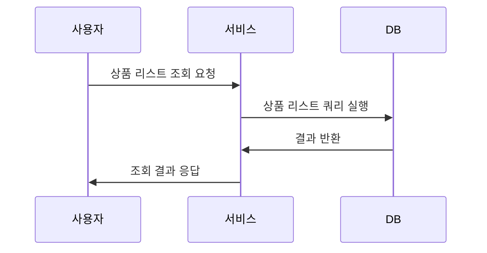
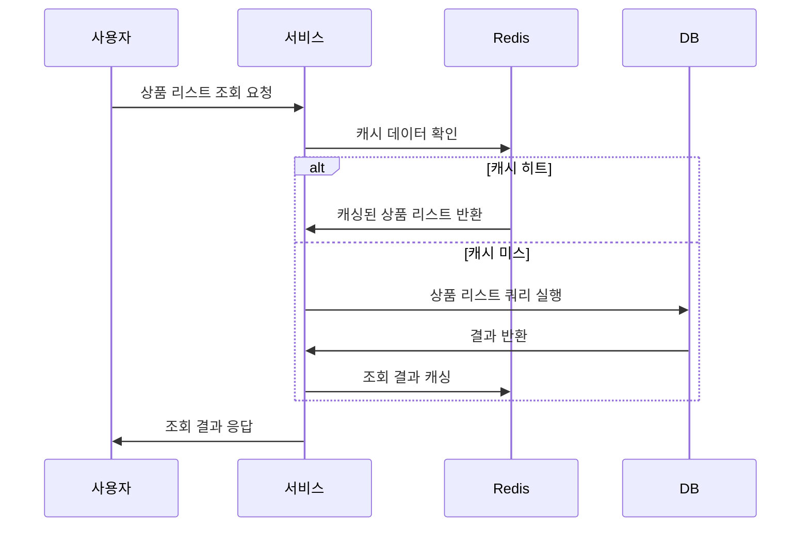
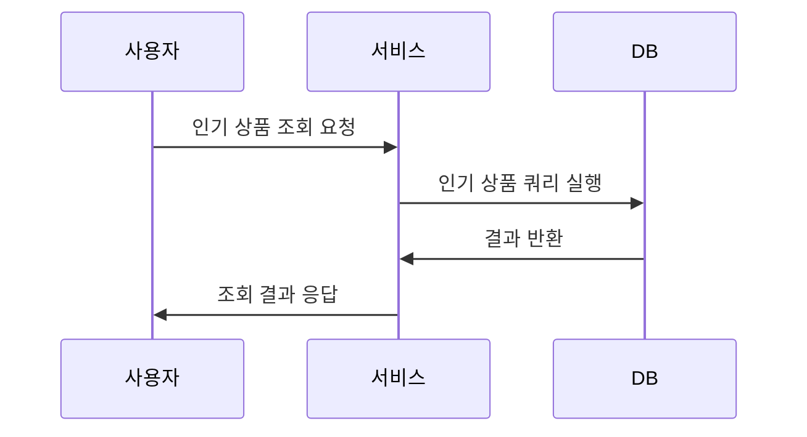
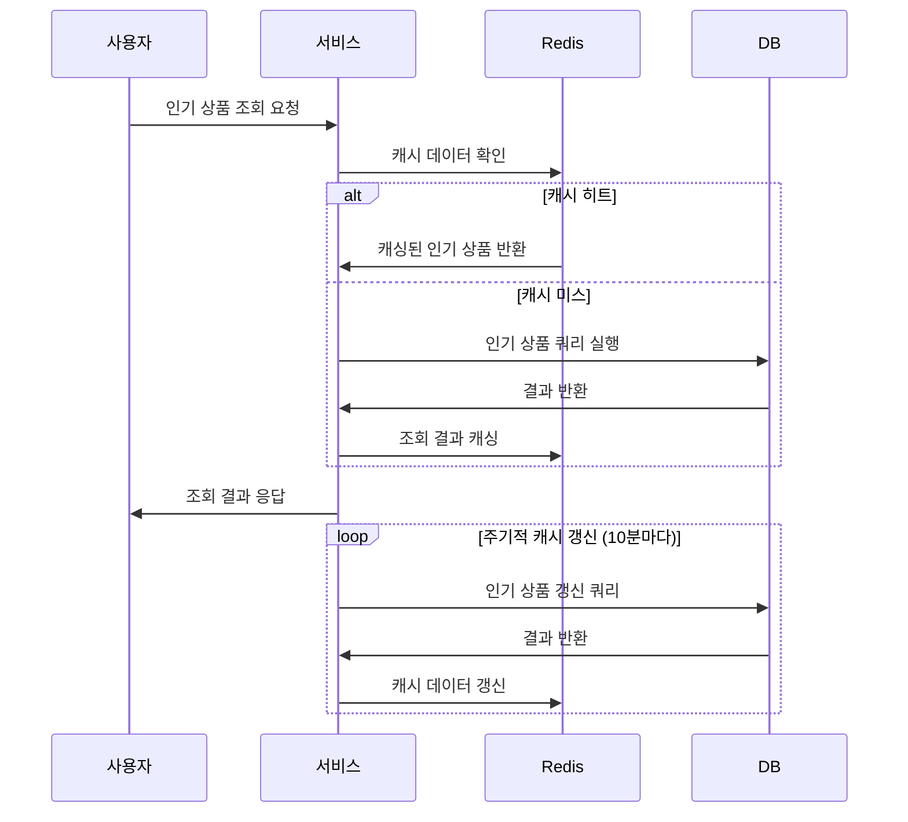

# \[ADR-001] 상품 리스트 및 인기 상품 조회 캐싱 전략 결정

## 상태

Accepted

## 컨텍스트

이커머스 서비스의 성능 최적화를 위해 Redis 기반 캐싱을 도입하려고 한다. 대상 기능은 크게 두 가지로 나눌 수 있다.

* **상품 리스트 조회**: 사용자가 매우 자주 접근하며 데이터가 상대적으로 자주 변경됨. 가용성을 높이고 DB의 부하를 줄이는 것이 목표이다.
* **인기 상품 조회**: 데이터가 10분 주기로만 갱신되며 주기 내에는 항상 정적인 데이터를 반환함. 데이터의 일관성을 유지하면서 응답 속도를 최적화하는 것이 목표이다.

## Query 분석 및 캐싱 가능한 구간 분석

전체 시스템에서 고려된 기능은 다음과 같다:

* 쿠폰 발급
* 쿠폰 사용
* 쿠폰 조회
* 유저 포인트 사용
* 유저 포인트 충전
* 재고 차감
* 인기 상품 조회
* 상품 리스트 조회

이 중 **인기 상품 조회**와 **상품 리스트 조회**를 캐싱 대상으로 선택하였다. 선택 근거는 다음과 같다:

### 쿼리 분석 및 이해도

* 각 기능별 API에서 실행되는 SQL 쿼리를 검토하고, 조회 패턴과 테이블 접근 경로를 분석하였다.
* 특히 인기 상품 조회는 특정 날짜 기준으로 정렬된 집계 데이터를 조회하며, 상품 리스트 조회는 검색어/필터 조건 기반으로 페이징된 목록을 조회한다.
* 나머지 기능들은 대부분 변경을 수반하거나 정합성을 요구하는 작업이기에 캐싱보다 즉시성과 일관성이 우선시된다.

### 캐시 가능한 구간 분석

* 인기 상품 조회는 **10분 주기로 고정된 데이터**를 반환하므로 해당 쿼리 결과를 주기적으로 갱신하며 캐시에 저장해두는 것이 적합하다.
* 상품 리스트 조회는 다양한 파라미터(키워드, 페이지, 정렬 등)에 따라 조회 결과가 달라지지만, **자주 요청되는 조합**에 대해 응답 결과를 캐싱하면 Redis 적중률을 높일 수 있다.
* 두 기능 모두 응답 시점에는 데이터가 자주 변경되지 않기 때문에 일시적인 캐시 허용 범위 내에서 **정합성보다는 가용성과 성능**을 우선시할 수 있다.

### 대량 트래픽 시 조회 쿼리의 병목 분석

* 인기 상품 조회는 단순한 정렬 및 집계 조회지만, **트래픽이 몰릴 경우 같은 쿼리가 동시다발적으로 실행될 가능성**이 높다. 캐시 미스가 한꺼번에 발생하면 Cache Stampede가 우려됨.
* 상품 리스트 조회는 조건이 다양하여 **DB 인덱스 적중률에 따라 성능이 크게 달라질 수 있으며**, 특히 캐시가 없을 경우 매 요청마다 비슷한 쿼리가 반복되어 **DB에 부하를 줄 수 있음**.

이에 따라 두 기능에 대해서는 각각 다음과 같은 대응 전략을 수립하였다:

* **인기 상품 조회**: 주기적 캐시 갱신(Eager Refresh) + Cache-Aside 패턴을 조합
* **상품 리스트 조회**: 캐시 키 다양화 + Cache-Aside 기반 lazy 캐싱 적용

이를 통해 시스템은 고부하 상황에서도 일관된 응답성과 안정적인 DB 자원 사용을 유지할 수 있도록 설계되었다.

## 결정

### 상품 리스트 조회

* 단순 캐싱(Bulk 캐싱)을 적용한다.

### 인기 상품 조회

* 단순 캐싱(Bulk 캐싱)을 적용하며, 주기적으로 데이터를 갱신하는 전략을 병행한다.

### 플로우 다이어그램

#### 상품 리스트 조회

* 캐싱 적용 전:

* 캐싱 적용 후:

#### 인기 상품 조회

* 캐싱 적용 전:

* 캐싱 적용 후:

## 근거

### Cache-Aside 패턴의 상세 설명 및 채택 이유

Redis 기반 캐싱 전략으로 **Cache-Aside (Lazy Loading)** 패턴을 채택하였다. 이 패턴은 다음과 같은 방식으로 동작한다:

* 클라이언트 요청 시 먼저 Redis 캐시에 데이터가 존재하는지 확인한다.
* 캐시에 없을 경우 DB에서 조회한 뒤, 해당 데이터를 캐시에 저장하고 응답한다.
* 이후 동일 요청에 대해서는 Redis에서 빠르게 조회되며, TTL(Time-to-Live) 또는 명시적 갱신 시까지 재사용된다.

이 패턴을 채택한 주요 이유는 다음과 같다:

* 구현이 단순하며 기존 비즈니스 로직에 쉽게 통합할 수 있다.
* **데이터 정합성보다는 응답 속도와 가용성이 중요한 조회 API에 적합**하다.
* 핫 데이터 중심으로 자연스럽게 캐시가 형성되어 **메모리 효율성이 뛰어나다.**
* 예외 상황 발생 시에도 DB로 fallback이 가능하여 안정성이 높다.

**특히 인기 상품 조회의 경우**, Cache-Aside 패턴 위에 **주기적인 캐시 갱신 로직(Eager Cache Refresh)** 을 추가하여, Cache Stampede 방지와 캐시 적중률을 동시에 확보할 수 있도록 설계하였다.

### 상품 리스트 조회

여러 가지 캐싱 전략을 고려했다:

* ID 리스트 캐싱 + 개별 상품 캐싱 후 조립
* 단순 캐싱(Bulk 캐싱)

**단순 캐싱(Bulk 캐싱)을 선택한 이유**:

* ID 리스트 캐싱과 개별 상품 캐싱은 개별 항목에 대한 역직렬화 비용이 크며, Redis 네트워크 라운드트립 횟수가 많아져 전체 응답 속도가 오히려 느려질 수 있다.
* Bulk 캐싱 방식은 전체 데이터를 한 번에 직렬화 및 역직렬화하여 Redis 호출 횟수를 최소화하여 성능 저하를 방지할 수 있다.
* 상품 리스트의 경우 일부 데이터가 변경되더라도 전체 캐시를 갱신하는 부담이 있지만, 가용성을 중요하게 생각하기 때문에 이러한 단점보다 성능 개선 효과가 더 크다고 판단했다.

### 인기 상품 조회

단순 캐싱(Bulk 캐싱)을 선택한 이유:

* 인기 상품 조회 데이터는 주기적으로만 갱신되며, 갱신 주기 내 데이터가 항상 정적이다.
* Bulk 캐싱 방식을 통해 주기적으로만 데이터를 갱신하면 DB 조회 빈도를 크게 낮추고 응답 속도를 빠르게 유지할 수 있다.
* 갱신 주기 동안 데이터 변경이 없기 때문에, 일관성을 유지하면서 성능 최적화를 달성할 수 있다.

## 결과 및 테스트

### 상품 리스트 조회

| 지표            | 캐싱 적용 전 | 캐싱 적용 후 |
| ------------- | ------- | ------- |
| 평균 응답 시간(ms)  | 12.72   | 12.16   |
| 최대 응답 시간(ms)  | 365.37  | 294.14  |
| 처리량 (요청 횟수/s) | 61.56   | 61.79   |
| 요청 성공률        | 100%    | 100%    |

**분석**: 상품 리스트 조회의 경우 캐싱 적용 후 평균 응답 시간이 소폭 감소하였고, 최대 응답 시간이 약 20% 감소하여 전반적인 응답 안정성이 개선되었다. 처리량 또한 근소하게 증가하였다.

### 인기 상품 조회

| 지표            | 캐싱 적용 전 | 캐싱 적용 후 |
| ------------- | ------- | ------- |
| 평균 응답 시간(ms)  | 15.8    | 5.05    |
| 최대 응답 시간(ms)  | 455.96  | 81.9    |
| 처리량 (요청 횟수/s) | 107.83  | 107.97  |
| 요청 성공률        | 100%    | 100%    |

**분석**: 인기 상품 조회의 경우 캐싱 적용 후 평균 응답 시간이 약 68%로 크게 감소하였고, 최대 응답 시간 역시 약 82%나 감소하여 성능 개선 효과가 매우 명확하게 나타났다.

## 추후 고려사항 / 한계점

* Cache Stampede로 인한 일시적 DB 부하 폭증을 방지하기 위해 사전 갱신, staggered expiration, 분산락 등의 전략 추가 필요.
* 향후 상품 리스트 조회의 데이터 갱신 빈도가 높아질 경우 Bulk 캐싱 전략이 비효율적일 수 있어 세분화된 캐싱 방식으로의 전환 고려.
* 캐싱된 데이터의 크기가 증가할 경우 Redis 메모리 사용량과 네트워크 트래픽에 대한 지속적인 모니터링 필요.

## 결론

상품 리스트와 인기 상품 조회 모두 단순 bulk 캐싱을 선택하여 빠른 응답 성능과 DB 부하 경감을 목표로 한다. 테스트 결과 캐싱 적용으로 인해 응답 시간이 단축되었으며, 특히 인기 상품 조회의 성능 개선 효과가 두드러졌다. 추가적인 성능 모니터링 및 최적화를 지속적으로 수행할 예정이다.
