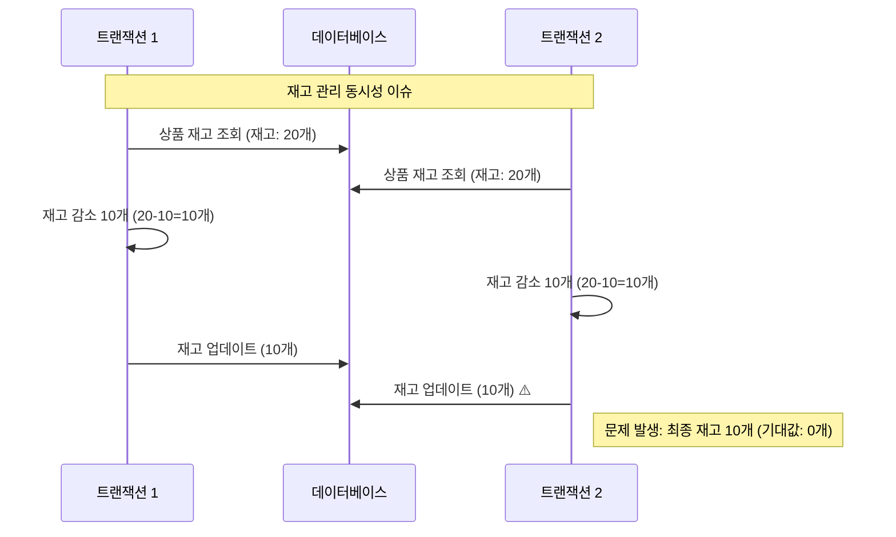
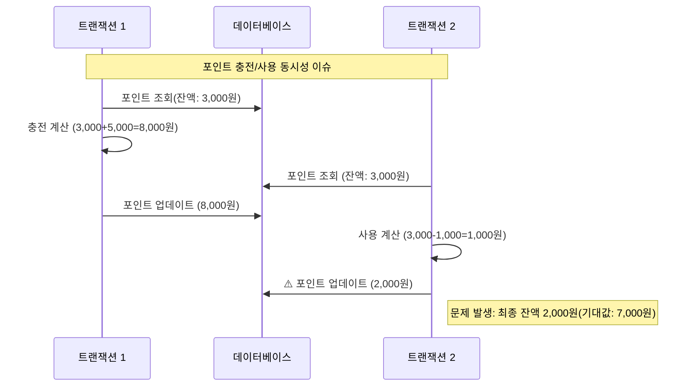
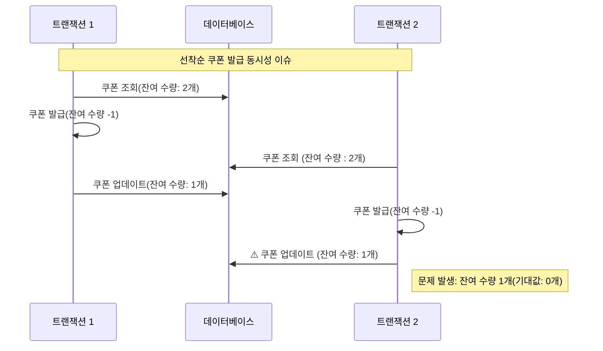
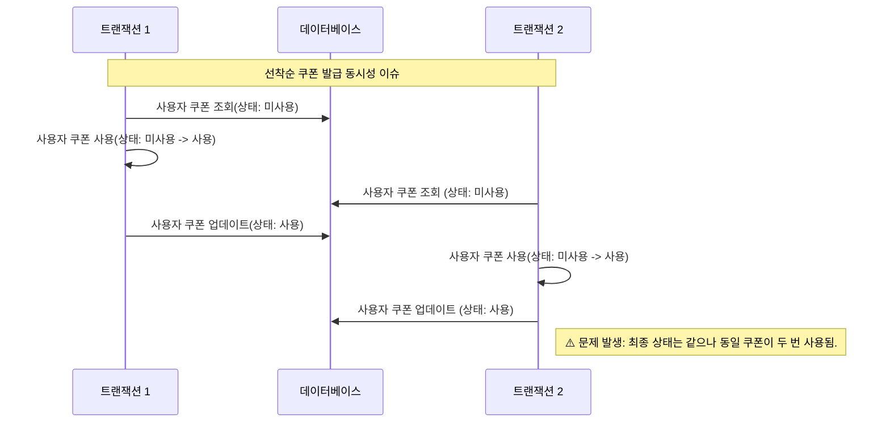
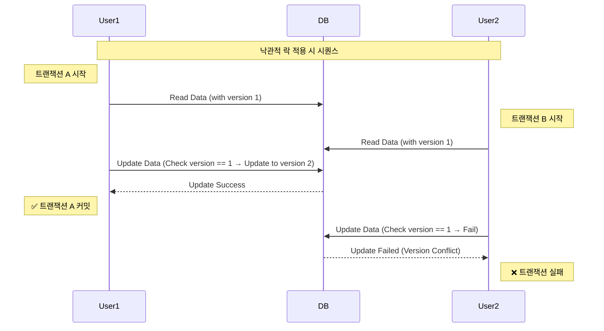
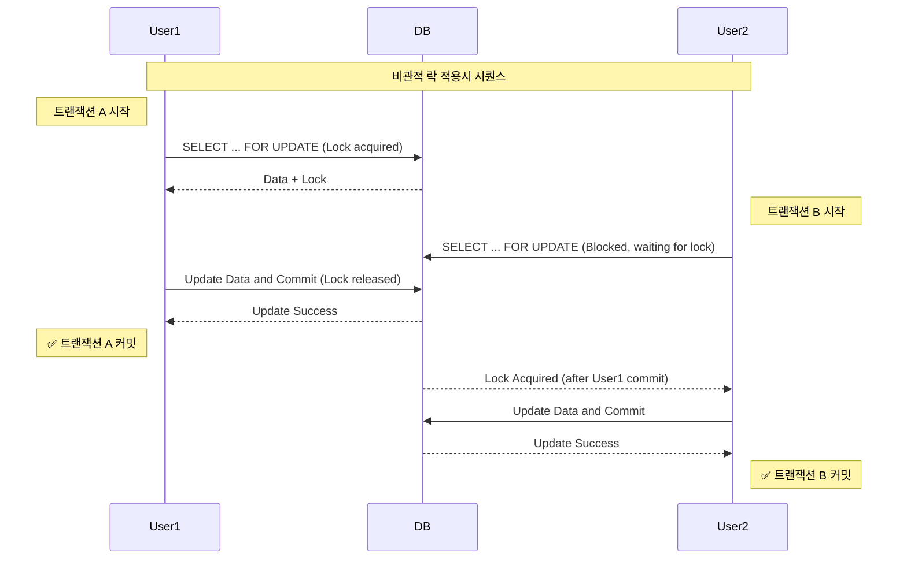
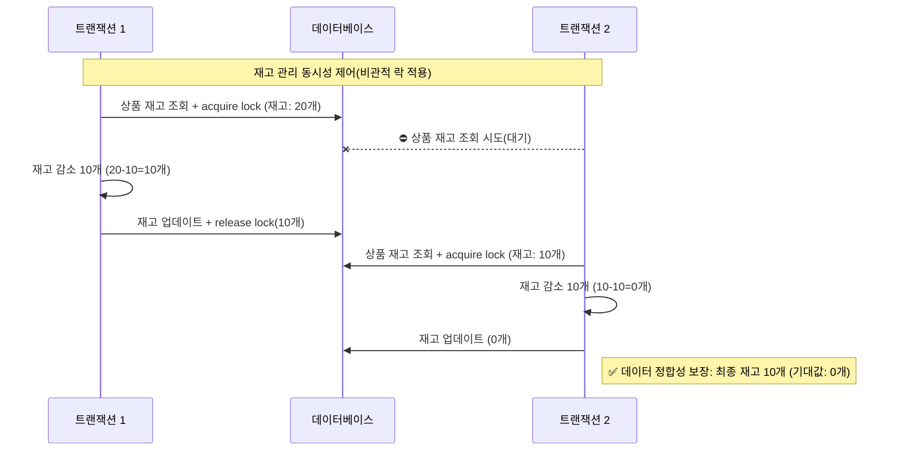
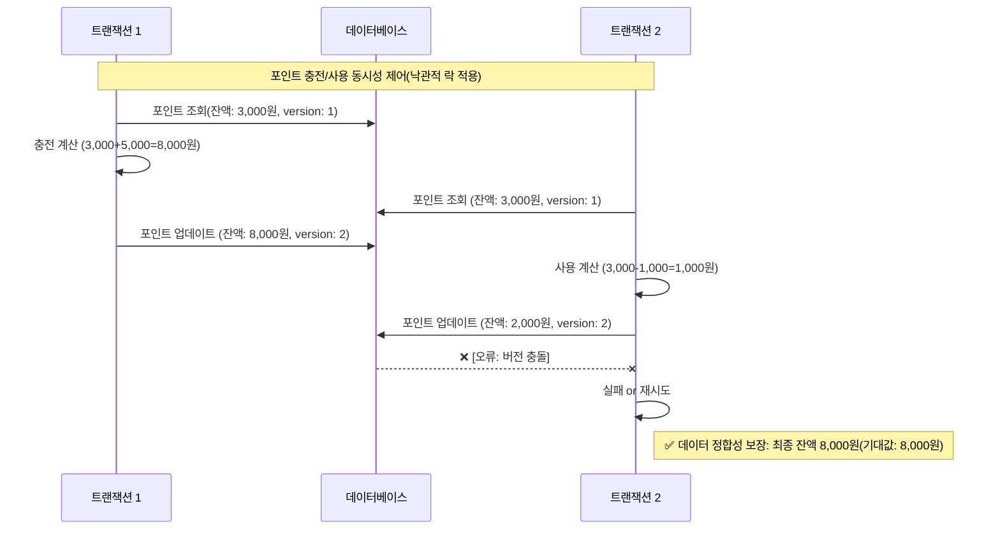
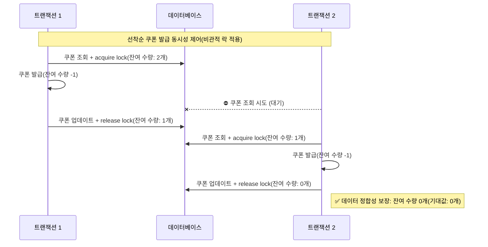
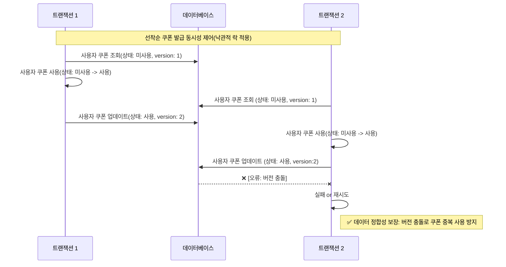

# 1. 개요


본 문서는 이커머스 백엔드 애플리케이션에서 동시성 이슈가 발생할 수 있는 부분과 그에 대한 해결 방안을 분석하여 제시합니다. 동시성 이슈가 발생할 수 있는 부분은 다음과 같습니다.
- 상품 재고 차감
- 포인트 사용/충전
- 선착순 쿠폰 발급
- 쿠폰 사용
- 주문


# 2. 동시성 이슈 분석 (As-is)


## 2.1. 상품 재고 차감 (ProductService)




**🚨 동시성 이슈**:

- 여러 사용자가 동시에 같은 상품을 구매하려고 할 때, 재고 차감 과정에서 경쟁 상태(Race Condition)가 발생할 수 있습니다.

- 예를 들어, 재고가 10개인 상품을 두 사용자가 동시에 10개씩 구매하려고 할 경우, 각각의 트랜잭션이 재고를 확인하고 차감하는 사이에 동시성 문제가 발생할 수 있습니다.

## 2.2. 포인트 충전 및 사용 (UserPointService)




**🚨 동시성 이슈**:

- 사용자가 포인트를 충전하는 동시에 같은 계정의 포인트를 사용하려고 할 때 경쟁 상태가 발생할 수 있습니다.

- 사용자가 같은 계정의 포인트를 동시에 사용하거나 충전하려고 할 때 경쟁 상태가 발생할 수 있습니다.

- 포인트 잔액 조회와 갱신 사이의 시간 간격으로 인해 충전 금액이 정확히 반영되지 않거나, 잔액보다 많은 금액이 사용될 위험이 있습니다.

## 2.3. 쿠폰 발급 (CouponService)




**🚨 동시성 이슈**:

- 수량 제한이 있는 쿠폰의 경우, 여러 사용자가 동시에 쿠폰을 발급받으려고 할 때 초과 발급될 수 있습니다.


## 2.4 쿠폰 사용 (CouponService)




**🚨 동시성 이슈:**

- 같은 쿠폰을 여러 주문에서 동시에 사용하려고 할 때, 중복 사용 방지 로직이 제대로 작동하지 않을 수 있습니다.


## 2.4. 주문 처리 (OrderFacade)

**동시성 이슈**:

- 주문 과정에서 여러 서비스(상품, 쿠폰, 결제, 포인트)를 조합하여 작업하므로 각 서비스의 동시성 이슈가 복합적으로 발생할 수 있습니다.


# 3. 동시성 이슈 해결 방안


"낙관적 락(Optimistic Lock)"과 "비관적 락(Pessimistic Lock)"은 동시에 여러 사용자가 데이터에 접근하거나 수정하려고 할 때 발생할 수 있는 충돌을 방지하기 위한 **동시성 제어 기법**입니다. 각각의 방식은 접근 방식과 철학이 다르며, 사용하는 상황에 따라 장단점과 주의사항도 달라집니다.

## 3.1 **낙관적 락 (Optimistic Lock)**





### 🔎 **개념**

- 데이터를 읽을 때는 락을 걸지 않고, **업데이트할 때 충돌 검사를 수행**합니다.
- 일반적으로 데이터에 **버전 번호(version)나 타임스탬프(timestamp)** 를 붙여서 충돌 여부를 판단합니다.

### ✅ **장점**

1. **성능이 좋다**
    - 락을 걸지 않기 때문에 병목 현상이 적고, 대부분의 읽기/쓰기 연산이 빠르다.
2. **동시성이 높은 환경에 적합**
    - 충돌이 거의 발생하지 않는 경우 유리하다.
3. **데드락(Deadlock) 발생 위험 없음**
4. **별도의 락을 명시적으로 획득할 필요가 없어 구현이 간단하다.**

### ❌ **단점**

1. **충돌이 자주 발생하면 오히려 비효율적**
    - 업데이트 시 실패하고 재시도해야 하므로 리소스를 낭비할 수 있음.
2. **업데이트 시 버전 체크 로직이 필요**
    - 구현 복잡도가 다소 높음 (예: ORM에서 버전 칼럼 관리 등)
3. 요청의 순서가 보장되지 않는다 (재시도 로직 사용 시)

### ⚠️ **사용 시 주의사항**

- 충돌 가능성이 낮은 환경에서 사용해야 효율적이다.
- 애플리케이션 레벨에서 충돌 발생 시의 재시도 전략(retry policy)을 설계해야 함.
- 데이터 무결성을 철저히 확인해야 함.

### **적용 방법**

```kotlin
@Entity  
@Table(name = "user_coupons")  
class UserCoupon(  
  
    @Id  
    @GeneratedValue(strategy = GenerationType.IDENTITY)  
    val id: Long? = null,  
  
    @Column(nullable = false)  
    val userId: Long,  

	...
  
    @Version  
    var version: Long? = null  
)
```

- `@Version` 이 붙은 필드는 JPA에서 자동으로 관리해줍니다.
- `UPDATE` 시 이 필드를 조건에 넣어서, 버전이 다르면 예외가 발생합니다.
- 충돌이 발생하면 `OptimisticLockingFailureException`이 발생하며 이를 통해 재시도 로직 등의 예외 처리가 가능합니다.


## 3.2 **비관적 락 (Pessimistic Lock)**



### 🔎 **개념**

- 데이터를 읽거나 수정할 때 **락을 먼저 걸어 다른 트랜잭션의 접근을 차단**합니다.
- `SELECT ... FOR UPDATE` 같은 쿼리로 락을 명시적으로 거는 방식.

### ✅ **장점**

1. **데이터 무결성을 강하게 보장**
    - 수정 중인 데이터를 다른 트랜잭션이 건드리지 못하게 막음.
2. **충돌 방지에 탁월**
    - 동시 수정으로 인한 충돌이 발생하지 않음. (충돌 발생을 원천적으로 차단)

### ❌ **단점**

1. **성능 저하 가능성**
    - 락 대기로 인해 트랜잭션 지연 발생 가능.
2. **데드락 위험**
    - 여러 트랜잭션이 서로 락을 기다리다가 교착 상태에 빠질 수 있음.
3. **리소스 점유 시간이 길어질 수 있음**

### ⚠️ **사용 시 주의사항**

- 데이터 충돌 가능성이 높은 경우에만 사용하는 것이 좋음.
- 데드락 방지를 위한 락 순서 및 타임아웃 설계가 필요.
- 트랜잭션을 가능한 한 짧게 유지해야 함 (오래 유지하면 성능에 악영향).

### **적용 방법**

```kotlin
interface ProductRepository : JpaRepository<Product, Long> {

    @Lock(LockModeType.PESSIMISTIC_WRITE)
    @Query("SELECT p FROM Product p WHERE p.id = :id")
    fun findByIdForUpdate(@Param("id") id: Long): Product
}
```

- `@Lock(LockModeType.PESSIMISTIC_WRITE)` 를 설정하면 Spring Data JPA에서 `SELECT ... FOR UPDATE` 형식으로 쿼리를 만들어서 보냅니다.


## 3.3 **낙관적 vs 비관적 락 비교**

| 항목     | 낙관적 락                  | 비관적 락                     |
| ------ | ---------------------- | ------------------------- |
| 기본 철학  | 충돌은 드물다 → 발생 시 처리      | 충돌은 자주 발생 → 미리 방지         |
| 락 방식   | 읽을 때 락 없음, 커밋 시 충돌 검사 | 읽거나 쓸 때 락을 즉시 건다          |
| 성능     | 좋음 (충돌 적을 경우)          | 낮을 수 있음 (락 대기)            |
| 충돌 처리  | 실패 후 재시도               | 락으로 사전 방지                 |
| 데드락 위험 | 없음                     | 있음                        |
| 사용 예   | 게시글 수정, 뷰 카운트 업데이트     | 은행 계좌 이체, 재고 처리 등 민감한 데이터 |


# 4. 해결 전략 선택 및 적용 (To-be)


## 4.1. 상품 재고 차감

**선택 전략**: 비관적 락(Pessimistic Lock)

**선택 이유**:
- 재고는 엄격한 정확성이 요구되는 핵심 비즈니스 로직입니다.
- 재고 없음 상태에서의 오버셀링은 비즈니스에 직접적인 손실을 가져올 수 있습니다.
- 동시 접속이 많은 이커머스 특성상 낙관적 락을 사용할 경우 충돌과 재시도가 자주 발생할 수 있습니다.

> [!NOTE]
> 만약 낙관적 락을 사용한다면?
>- 충돌 발생 ➡️  재시도 ➡️ 충돌 ➡️  ...  ➡️ 재시도 한계 도달
   >	- 재고가 남아있는데도 불구하고 실패하는 경우 발생(사용자 경험 저하)
>- 주문은 일반적으로 먼저 요청한 사람이 먼저 주문되는 것이 상식적이지만 재시도 로직에 의해 순서가 보장되지 않을 수 있음.


**적용 후 시퀀스**:



## 4.2. 포인트 충전 및 사용

**선택 전략**: 낙관적 락(Optimistic Lock)

**선택 이유**:
- 포인트 충전 및 사용은 한 사용자에 대해서만 발생하므로 충돌 빈도가 상대적으로 낮습니다.
- 한 사용자의 포인트 충전/사용이 동시에 요청되는 경우는 매우 드물게 발생하기 때문에 충돌 빈도는 더 낮아집니다.
- 재시도 메커니즘이 있다면 충돌 시 사용자 경험을 크게 해치지 않습니다.
- 높은 동시 처리량을 유지할 수 있습니다.


> [!NOTE]
> 만약 비관적 락을 사용한다면?
>- 비관적 락을 통해 해당 row를 선점한다고 하더라도, 한 사용자에 대한 포인트 충전/사용이 동시에 요청되는 경우는 매우 드물것이기 때문에 락 대기로 인한 성능 저하는 크지 않을 것으로 생각됩니다.
>- 하지만, DB 내부에서 락을 획득하고 해제하는 과정 자체의 오버헤드가 발생할 수 있습니다. 포인트 충전/사용의 경우 낙관적 락을 통한 제어로 충분하기 때문에 불필요한 오버헤드를 유발할 필요가 없습니다.

**적용 후 시퀀스:**




## 4.3 선착순 쿠폰 발급

**선택 전략**: 비관적 락(Pessimistic Lock)

**선택 이유**:
- 제한된 수량의 쿠폰은 경쟁이 심한 환경에서 정확한 수량 제어가 필요합니다.
- 선착순 쿠폰 발급은 짧은 시간에 집중적으로 발생하는 특성이 있습니다.
- "선착순"이라는 요구사항을 만족해야 합니다. 낙관적 락을 사용하는 경우 재시도 로직에 의해 순서가 보장되지 않을 수 있습니다.
    - DB 락의 경우도 DB 내부의 스케줄링 전략에 따라 정확한 순서가 보장되지 않을 수 있으나 대체적으로 순서를 지키므로 선착순 요구사항을 만족한다고 판단합니다.

**적용 후 시퀀스:**


## 4.3. 쿠폰 사용

**선택 전략**: 낙관적 락(Optimistic Lock)

**선택 이유**:
- 쿠폰 사용은 한 사용자에 대해서만 발생하므로 충돌 빈도가 상대적으로 낮습니다.
- 한 사용자가 보유한 동일한 쿠폰이 동시에 요청되는 경우는 매우 드물게 발생하기 때문에 충돌 빈도는 더 낮아집니다. (심지어 비정상적인 요청일 수 있음)
- 재시도 메커니즘이 있다면 충돌 시 사용자 경험을 크게 해치지 않습니다.
- 높은 동시 처리량을 유지할 수 있습니다.

**적용 후 시퀀스:**



# 5. 테스트


## 5.1. 상품 재고 관리 테스트 시나리오

**목표**: 다수의 사용자가 동시에 같은 상품을 구매할 때 재고 정확성 검증

**테스트 전략**:

1. 테스트 전 상품 재고를 100개로 설정
2. 100명의 가상 사용자가 동시에 각각 1개씩 구매 시도
3. 모든 트랜잭션 완료 후 재고가 정확히 0개가 되는지 확인

**결과:** ✅ 재고가 정확히 0이 되는지 확인함

## 5.2. 포인트 충전/사용 테스트 시나리오

### 5.2.1 포인트 충전 테스트

**목표**: 동일 사용자에 대한 동시 포인트 충전 요청 시 잔액 정확성 검증

**테스트 전략**:

1. 테스트 전 사용자 포인트를 0원으로 설정
2. 100개의 충전 요청(각 1,000원)을 동시에 발생
3. 각각의 요청에 대해 성공인 경우 성공카운트를, 실패인 경우 실패카운트를 증가
4. 모든 트랜잭션 완료 후 잔액이 정확한지 검증 (`성공카운트 * 1000`)

**결과**: ✅ 잔액이 정확함

### 5.2.2 포인트 사용 테스트

**목표**: 동일 사용자에 대한 동시 포인트 사용 요청 시 잔액 정확성 검증

**테스트 전략**:

1. 테스트 전 사용자 포인트를 100,000원으로 설정
2. 100개의 사용 요청(각 1,000원)을 동시에 발생
3. 각각의 요청에 대해 성공인 경우 성공카운트를, 실패인 경우 실패카운트를 증가
4. 모든 트랜잭션 완료 후 잔액이 정확한지 검증 (`초기 금액 - (실패카운트 * 1000)`)

**결과**: ✅ 잔액이 정확함

### 5.2.3 포인트 충전&사용 테스트

**목표**: 동일 사용자에 대한 동시 포인트 충전 및 사용 요청 시 잔액 정확성 검증

**테스트 전략**:

1. 테스트 전 사용자 포인트를 100,000원으로 설정
2. 100개의 요청을 동시에 발생시키고, 랜덤하게 충전 또는 사용을 실행
3. 각각의 요청에 대해 성공인 경우 성공카운트를, 실패인 경우 실패카운트를 증가 (충전/사용 카운트를 분리)
4. 모든 트랜잭션 완료 후 잔액이 정확한지 검증 (`초기금액 + (충전성공 카운트 * 1000) - (사용성공 카운트 * 1000)`)

**결과**: ✅ 잔액이 정확함


## 5.3. 쿠폰 발급 테스트 시나리오

**목표**: 제한된 수량의 쿠폰 발급 시 정확한 수량 제어 검증

**테스트 전략**:

1. 테스트 전 100장 한정 쿠폰 생성
2. 120명의 가상 사용자가 동시에 쿠폰 발급 요청
3. 발급된 쿠폰이이 정확히 100건인지 확인
4. 쿠폰 발급 수량이 정확히 100인지 확인

**결과**: ✅ 발급된 쿠폰이 총 100건이고, 쿠폰 발급 수량 카운트가 100임을 확인


## 5.4. 쿠폰 사용 테스트 시나리오

**목표**: 사용자 쿠폰의 중복 사용 방지 검증

**테스트 전략**:

1. 테스트 전 사용자 쿠폰을 생성
2. 10명의 가상 사용자가 동시에 쿠폰 발급 요청
3. 성공 시 성공카운트를 증가, 실패 시 실패카운트를 증가
4. 성공카운트가 정확히 1 인지 확인
5. 실패카운트가 정확히 9인지 확인

**결과**: ✅ 성공카운트가 1이고, 실패카운트가 9임을 확인


## 5.5. 주문 처리 통합 테스트 시나리오

**목표**: 전체 주문 프로세스에서 여러 동시성 이슈를 종합적으로 검증

**테스트 전략**:

1. 각 사용자별 1,500원 포인트 보유 상태에서 시작
2. 100개 한정 상품(가격: 1,500원) 준비
3. 100명의 가상 사용자가 동시에 다음 작업 시도:
    - 상품 구매 (1개)
    - 포인트로 결제
4. 모든 트랜잭션 완료 후 다음 항목 검증:
    - 상품 재고 정확히 0인지 확인
    - 포인트 잔액이 정확히 0인지 확인

**결과:** ✅ 상품 재고가 정확히 0이고 모든 사용자의 잔액이 0임을 확인.


# 6. 한계점과 대안


## 6.1. 현재 구조: 낙관적 락, 비관적 락 기반 동시성 제어

| 기능        | 사용 중인 락 방식                      | 목적           | 한계점                             |
| --------- | ------------------------------- | ------------ | ------------------------------- |
| 포인트 충전/사용 | 낙관적 락 (`@Version`)              | 충돌 감지 및 재시도  | 충돌 많아지면 재시도 비용 급증, 사용자 경험 저하    |
| 선착순 쿠폰 발급 | 비관적 락 (`SELECT ... FOR UPDATE`) | 재고 보호, 중복 방지 | 락 경합 심함, TPS 낮아짐, 데드락 위험        |
| 쿠폰 사용     | 낙관적 락                           | 중복 사용 방지     | 충돌 많을 경우 반복 실패 및 성능 저하          |
| 재고 차감     | 비관적 락                           | 정확한 재고 감소    | 동시 요청에 취약, 락으로 인해 처리 지연 및 병목 발생 |

> **정확성은 확보되지만, 고부하 시 확장성과 성능에 취약함**


## 6.2. 대안


### 6.2.1. Redis 분산 락 (Distributed Lock using Redis)

#### 개념
- 여러 인스턴스나 서버가 동시에 동일한 자원을 접근할 때,  
  **Redis를 활용해 락을 획득한 하나만 작업을 수행**하도록 제한
- 대표적인 구현: `SETNX + EXPIRE`, **Redisson** 라이브러리

#### 특징
- 락을 통한 동시 접근 제어 (선착순 처리, 중복 방지에 효과적)
- TTL 설정 가능 → **락 점유 시간 제한으로 데드락 방지**

#### 장점
- **간단하고 빠름** (메모리 기반)
- 락 점유 시간 조절 가능 → 경합 해소
- 분산 환경에서도 락 기능 구현 가능 (멀티 인스턴스에 강함)

#### 단점
- Redis 다운되면 락 기능도 불가 → HA 구성 필요
- TTL 잘못 설정하면 락 풀리기 전에 작업 끝나거나, 너무 빨리 풀릴 수 있음
- 락 중복 제거를 위한 식별값 설정 필요


### 6.2.2. Queue 기반 직렬 처리 (Kafka, RabbitMQ 등)

#### 개념
- 클라이언트 요청을 메시지 큐(Kafka, SQS 등)에 넣고,
  **Worker(Consumer)가 하나씩 꺼내서 순차적으로 처리**
- **요청을 직렬화함으로써 충돌 자체를 원천 차단**

#### 특징
- "하나씩 처리 = 락 없이도 동시성 제어 가능"
- 생산자는 병렬, 소비자는 직렬 → 확장성과 안정성 모두 확보

#### 장점
- **락 없이도 안정적 처리 가능**
- 확장성 좋고, TPS(처리량) 높음 (Consumer 수 조절 가능)
- 중복 처리 방지도 쉬움 (idempotent 설계)

#### 단점
- 실시간성은 낮음 (비동기 처리 → 지연 가능성)
- 메시지 적체 발생 시 병목 가능
- 장애 시 메시지 유실 방지 전략 필요


### 6.2.3. Redis 분산 락 vs Queue 직렬 처리 비교

| 항목 | Redis 분산 락 | Queue 기반 직렬 처리 |
|------|----------------|------------------------|
| 방식 | **락으로 접근 제어** | **요청을 직렬화** |
| 실시간성 | ✅ 빠름 (Sync 가능) | ❌ 느림 (Async) |
| 적용 대상 | 선착순, 재고 등 빠른 결정이 필요한 케이스 | 순서 보장, 대량 처리에 유리 |
| 확장성 | 제한적 (Redis 성능 한계) | 우수 (Consumer scale 가능) |
| 장애 내성 | Redis 장애 시 위험 | Kafka 등은 내구성/복구 강함 |


# 7. 개선 방안: Redis 락과 Queue를 활용한 기능별 개선 전략


## 7.1.  **선착순 쿠폰 발급 → Redis 분산 락**

### 기존 문제
- 비관적 락으로 쿠폰 재고 제어 → **DB 락 경합 심함**
- 여러 인스턴스일 경우 DB만으로는 락 제어 어려움

### 개선 방향
- Redis에 `lock:coupon:<id>` 같은 키로 락을 획득
- 락 획득 성공한 사용자만 발급 진행

### 기대 효과
- 분산 환경에서도 일관된 락 관리
- TTL 설정으로 데드락 방지
- 발급 속도 개선 (Redis는 빠름)

## 7.2. **재고 차감 → Queue 기반 직렬 처리**

### 기존 문제
- DB 비관적 락으로 처리 → TPS 낮음, 데드락 위험
- 실시간 구매량이 많으면 시스템 과부하

### 개선 방향
- 재고 차감 요청을 Kafka로 보내고,
  **하나씩 처리하며 재고 감소**

### 기대 효과
- 실시간 락 충돌 없음
- Kafka scale-out으로 대량 주문 처리 가능
- 재고 oversell 방지


# 8. 결론

---

이커머스 애플리케이션에서 동시성 이슈는 피할 수 없는 과제입니다. 본 분석을 통해 주요 동시성 이슈와 그에 대한 해결 방안을 제시하였습니다.


## 8.1. 요약

- **상품 재고 차감**: 비관적 락(Pessimistic Lock)을 통해 동시 접근을 제어하여 재고의 정확성을 보장합니다.
- **포인트 충전 및 사용**: 낙관적 락(Optimistic Lock)을 도입하여 충돌 시 재시도 메커니즘을 구현합니다.
- **쿠폰 발급 및 사용**: 현재 시스템에서는 비관적 락(Pessimistic Lock)을 적용하고, 향후 분산 환경으로 확장 시 분산 락 도입을 검토합니다.
- **주문 처리**: 핵심 작업은 동기적으로 처리하고, 필수적이지 않은 작업만 이벤트 기반 비동기 처리로 분리하여 사용자 경험을 개선합니다.
- **재시도 메커니즘**: 낙관적 락을 사용하는 경우 특히 중요하며, 지수 백오프를 적용한 재시도 로직이 필요합니다.

## 8.2. 향후 고려사항

- **확장성**: 시스템 성장에 따라 CQRS 패턴 도입을 검토하여 읽기/쓰기 작업을 분리합니다.
- **모니터링**: 동시성 이슈 발생 여부를 실시간으로 모니터링하는 시스템을 구축합니다.
- **성능 튜닝**: 실제 사용 패턴에 따라 락 전략과 트랜잭션 격리 수준을 지속적으로 최적화합니다.
- **재시도 메트릭**: 재시도 발생률과 성공률을 측정하여 시스템 안정성을 평가합니다.
- **부하 테스트**: k6를 활용한 정기적인 부하 테스트로 동시성 제어 효과를 검증합니다.

동시성 이슈는 완전히 제거할 수 없지만, 적절한 전략과 지속적인 개선을 통해 안정적이고 신뢰할 수 있는 이커머스 서비스를 구축할 수 있습니다.
