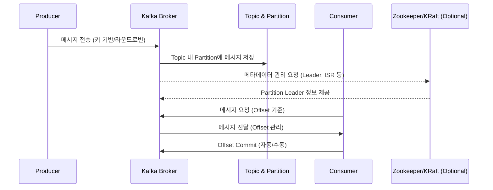
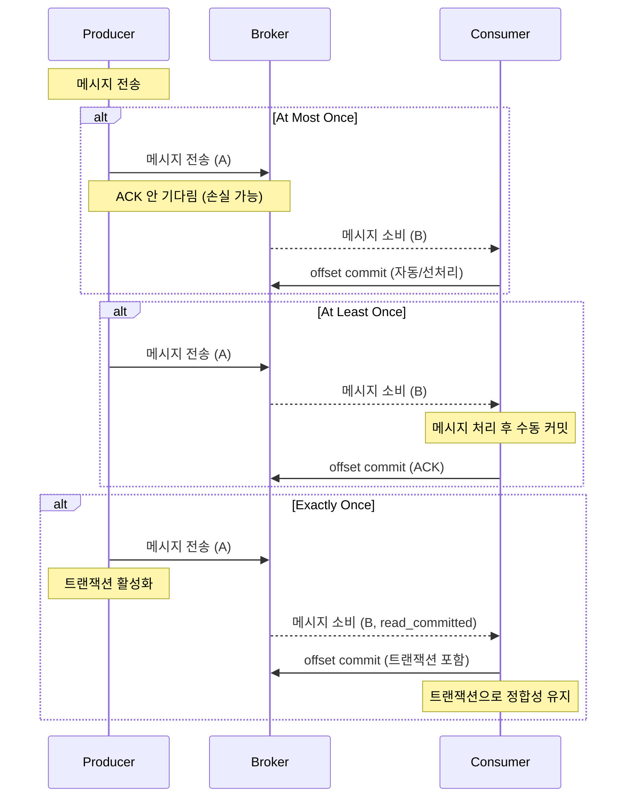

## Kafka란?

Kafka는 **대용량의 실시간 데이터 스트림 처리 및 메시지 브로커** 역할을 수행하는 **분산형 메시징 시스템**입니다. LinkedIn에서 개발되었으며, 이후 Apache Software Foundation의 오픈소스 프로젝트로 발전하였습니다.
Kafka는 기존 메시징 시스템(예: RabbitMQ, ActiveMQ)과는 달리, **높은 처리량, 내결함성, 확장성**을 위해 설계되었습니다.


### Kafka를 **어떤 경우에** 써야할까?

1️⃣ **대량의 데이터 처리**  
대량의 로그, 이벤트, 트랜잭션 데이터 등 실시간 데이터 스트림을 빠르게 처리할 때 사용.  
예: 실시간 분석, 모니터링, 사용자 행동 추적, IoT 데이터 수집

2️⃣ **비동기 통신 (Loose Coupling)**  
서비스 간 직접 호출 대신 Kafka로 메시지를 중계하여 서비스 간 결합도를 낮추고, 독립성을 확보할 때.  
예: 마이크로서비스 아키텍처(MSA)

3️⃣ **재시도 및 장애 복구 지원**  
메시지를 안정적으로 보관하고, 소비자가 장애가 나더라도 재처리 가능하게.

4️⃣ **순서 보장 및 고가용성**  
동일 Partition 내 메시지 순서 유지, 복제(replication)를 통해 고가용성을 제공.

---

### Kafka의 **장점**

- **확장성**
    - 분산 아키텍처 덕분에 브로커를 늘려도 처리량이 잘 늘어남.
    - → Partition 단위로 데이터 분산 처리.

- ✔ **내구성**
    - 디스크에 메시지를 Commit Log로 기록 + Replication으로 데이터 안전 보장.
    - → 장애 발생 시 데이터 손실 방지.

- ✔ **성능**
    - 디스크 기반인데도 효율적인 Sequential Write 덕분에 처리 속도가 빠름.
    - → SSD 없어도 고성능 가능.

- ✔ **유연한 소비 모델**
    - 하나의 메시지를 여러 Consumer Group이 독립적으로 소비 가능.
    - → 데이터 흐름을 다양한 애플리케이션에 동시에 연결 가능.

---

### Kafka의 **단점**

- **설정과 운영이 복잡함**
    - 분산 시스템 특성상 설정, 모니터링, 장애 처리까지 신경 쓸 게 많음.
    - → Zookeeper(또는 KRaft) 필요, Topic/Partition 설정 주의.

- **순서 보장 제한**
    - Partition 단위로만 순서를 보장하고, Partition 수를 늘리면 전체 순서는 깨짐.
    - → 특정 키 기준으로만 순서를 보장.

- **메시지 소모 시 처리 중복/재처리 가능성**
    - Offset 기반 처리라서, Consumer 장애 복구 시 마지막 처리된 메시지를 다시 처리할 수도 있음.
    - → Exactly-once 처리는 추가 로직 필요.

- **Latency(지연 시간)**
    - 분산 처리 + 디스크 기록 특성상 극한의 실시간(수 μs~ms)을 요구하는 경우는 부적합.
    - → 실시간 금융 트랜잭션에는 부적합할 수도.

---


## Kafka의 핵심 구성 요소


### **Broker**
- Kafka의 메시지를 저장하고, 클라이언트(Producer/Consumer) 요청을 처리하는 서버.
- 클러스터를 구성할 수 있으며, 각 Broker는 특정 Partition 데이터를 저장.
- Scale-out(수평 확장) 가능. 클러스터 내에서 데이터를 분산 저장하고 처리.

> 📌 Broker는 "데이터 저장소 + 처리 엔진" 역할을 하며, 특정 Partition 리더로 동작하기도 함. 안정성과 가용성을 위해 Replication을 지원.

---

### **Topic**

- 메시지가 구분되는 단위. 메시지를 보내고 받는 채널 역할.
- Producer는 특정 Topic에 메시지를 쓰고, Consumer는 특정 Topic에서 메시지를 읽음.
- Partition으로 나눠서 데이터를 병렬 처리 가능.

> 📌 Topic은 게시판처럼 여러 Partition으로 나뉘며, 각 Partition은 하나의 Append-Only 로그로 동작함.

---

### **Partition**

- Topic 내부에서 메시지를 나누어 저장하는 단위. 메시지는 Partition에 순서대로 기록됨(append-only).
- Partition을 늘리면 처리량을 늘릴 수 있고, Broker에 분산 저장 가능.
- 특정 Partition의 Leader가 존재하며, Follower가 데이터를 복제하여 안정성을 보장.

> 📌 Partition 수가 많아지면 Consumer 병렬성이 올라가지만, 메시지 순서 보장이 어려워질 수 있음.

---

### **Producer**

- Kafka에 데이터를 보내는 역할. 특정 Topic(그리고 Partition)을 지정해서 메시지를 전송.
- Load balancing(분산 처리) 전략: 키 기반 Partition, Round Robin 등.
- 메시지 전송 시 acks 설정(acks=0, 1, all)으로 전송 신뢰도 제어 가능.

> 📌 Producer는 전송 신뢰성과 성능의 균형을 고민해야 함. 예: acks=all은 데이터 유실 최소화, acks=1은 빠른 처리.

---

### **Consumer**

- Kafka에서 데이터를 읽어오는 역할. Consumer Group에 속해 병렬 소비 가능.
- 각 Partition을 한 Consumer가 읽도록 할당(Partition Assignment).
- Offset 관리로 어디까지 읽었는지 추적 가능.

> 📌 Consumer Group을 잘 설계하면 병렬 처리 효율성을 극대화 가능. Offset 관리 모드(auto/manual commit) 선택도 중요.

---

### **Consumer Group**

- 하나의 Consumer Group은 Topic의 Partition을 나눠서 읽음.
- Consumer Group 내에서는 같은 Partition을 두 Consumer가 읽지 않음(Load balancing).
- 여러 Consumer Group이 동일 Topic을 병렬로 독립적으로 읽을 수 있음.

> 📌 하나의 Topic을 다양한 서비스나 기능별로 독립 소비 가능.

---

### **Zookeeper (or KRaft 모드의 Controller)**

- Kafka의 메타데이터 관리 및 클러스터 상태를 관리하는 서비스.
- Broker 상태 감시, Partition Leader 선출, Controller 관리 등 역할.
- 최근에는 KRaft 모드(=Zookeeper 제거)로 단순화 추세.

> 📌 Zookeeper는 Kafka의 분산 시스템을 유지하기 위한 핵심인데, 복잡하다는 단점. KRaft로 단순화 중.

---

### **Offset**


- Consumer가 Topic 내 Partition에서 몇 번째 메시지를 읽었는지 나타내는 숫자.
- Consumer Group 별로 관리되며, Kafka 내부(__consumer_offsets)나 외부에 저장 가능.

> 📌 Offset을 잘못 관리하면 중복 소비나 데이터 유실 발생 가능. 주기적 Commit, Manual Commit 전략 필요.

---

### **기타 구성요소**

- **Replication:** Partition 데이터를 복제하여 안정성 확보 (Leader-Follower).
- **ISR(In-Sync Replica):** Leader와 동기화된 Follower Replica 목록.
- **Controller:** Kafka 클러스터의 Partition Leader 선출, 메타데이터 관리 담당.
- **Log Segment:** Partition 데이터를 물리적으로 저장하는 파일 단위.
- **Retention:** 메시지를 얼마나 보관할지 설정 가능 (시간/용량 기반).


## Kafka 전체 동작 흐름

>[!TIP]
>https://softwaremill.com/kafka-visualisation/
>카프카의 동작을 시각화해주는 사이트

### Kafka의 데이터 흐름 다이어그램



---

### 단계별 설명

#### **1. Producer → Broker**

- Producer는 **Topic 이름**과 **Partition(선택적)** 을 지정해서 메시지를 전송.
- 메시지는 **Key**를 기준으로 특정 Partition에 할당되거나, **Round Robin** 방식으로 균등하게 분산될 수 있음.
- 메시지 전송 시 **acks 설정(0, 1, all)**로 데이터 유실 방지 수준을 선택.
- 전송 후 Kafka Broker는 요청을 받아서 해당 Partition으로 메시지를 저장.

📌 **Insight:**
- Key에 따라 Partition 지정 시, 같은 Key는 같은 Partition에 저장되어 **순서 보장** 가능.
- acks=all이면 ISR 모두의 응답을 기다려야 하므로 느리지만 안전.

---

#### **2. Broker 내부 처리 (Partition 관리)**

- Broker는 메시지를 **Topic → Partition → Log**로 저장. Partition은 Append-Only 구조.
- Partition마다 **Leader Broker**가 존재하고, **Follower Broker**가 복제본 유지.
- 메시지가 Leader에 저장되면 ISR(In-Sync Replica)에도 복제 진행.

📌 **Insight:**
- Partition 복제 덕분에 Broker 장애에도 데이터 유실 없이 복구 가능.
- Partition의 Leader는 **Zookeeper/KRaft**가 선출하여 관리.

---

#### **3. Broker ↔ Zookeeper (혹은 KRaft)**

- Kafka 클러스터의 메타데이터(Partition, Leader, ISR 등)는 Zookeeper(혹은 KRaft Controller)가 관리.
- Broker가 Partition 정보를 Zookeeper에 등록하고, 장애 시 새로운 Leader 선출.

📌 **Insight:**
- 최근 Kafka는 Zookeeper를 제거하고 **KRaft(Kafka Raft)** 모드로 관리 단순화.

---

#### **4. Consumer → Broker**

- Consumer는 특정 **Topic**과 **Consumer Group**을 지정해서 메시지를 요청.
- Broker는 Partition 별 Offset(읽은 위치) 기준으로 메시지를 전달.
- Consumer Group 단위로 Partition을 할당받아, **하나의 Partition은 한 Consumer만 읽음**.


📌 **Insight:**
- Consumer는 **Offset Commit**(자동/수동)을 통해 어디까지 읽었는지 관리.
- Broker는 **__consumer_offsets**라는 내부 Topic에 Offset 기록.

---

#### **5. Offset 관리 및 재시작**

- Consumer 장애/재시작 시, 마지막 Commit한 Offset부터 메시지 소비 재개.
- Commit 방식에 따라 **at-least-once, at-most-once, exactly-once**를 구현 가능.

📌 **Insight:**
- Offset 관리 전략을 잘못 설정하면 데이터 중복 소비나 유실 발생.
- 보통 **enable.auto.commit=false + manual commit**으로 안정성 확보.

---


## Kafka Topic, Partition, Consumer, Consumer Group의 연결 관계


### 🔍 1️⃣ Topic과 Partition의 관계

- **하나의 Topic**은 여러 개의 **Partition**으로 나뉩니다.
- Partition은 물리적 저장 단위로 메시지를 순서대로 저장하며, 메시지 순서는 Partition 단위로 보장됩니다.


```
Topic ──> Partition0
      └─> Partition1
      └─> Partition2
```

---

### 🔍 2️⃣ Consumer Group과 Consumer의 관계

- **하나의 Consumer Group**은 여러 **Consumer** 인스턴스(애플리케이션 인스턴스 또는 스레드)로 구성됩니다.
- Group 내의 Consumer들은 **Partition을 나누어 읽습니다**. 즉, 하나의 Partition은 한 Consumer만 읽습니다.
- Consumer Group ID는 Kafka가 어떤 Consumer가 어떤 Partition의 메시지를 어디까지 읽었는지(Offset)를 관리하는 기준입니다.


```
Consumer Group A ──> Consumer A1, Consumer A2, Consumer A3
```

---

### 🔍 3️⃣ Partition과 Consumer의 연결 관계

- **Partition은 한 시점에 오직 한 Consumer에게만 할당됩니다.**
- 하지만 하나의 Consumer는 여러 Partition을 읽을 수 있습니다.  
  (예: Partition 개수 > Consumer 개수)
- 반대로 Consumer 수가 Partition 수보다 많으면 일부 Consumer는 유휴 상태가 됩니다.


## Kafka Topic, Partition, Consumer, Consumer Group 연결 관계와 설계 이유


### 🔍 1️⃣ Kafka의 연결 구조는 이렇게 되어야만 한다

---

### 🚩 **Topic → Partition**

- 하나의 Topic은 물리적으로 분산 저장이 가능해야 합니다.
- Partition을 여러 개로 나누면 **데이터를 여러 브로커에 분산 저장**할 수 있어 **부하 분산 및 확장성**을 확보합니다.
- Partition 단위로 메시지의 순서를 보장하므로, **순서 보장(Sequential Consumption)**이 가능합니다.


---

### 🚩 **Partition → Consumer (Consumer Group 내)**

- 한 Partition을 **여러 Consumer가 동시에 읽게 하면 메시지 순서가 깨질 수 있습니다**.  
  👉 Partition은 메시지 순서가 보장되는 단위이므로, Kafka는 Partition 당 하나의 Consumer만 읽게 제한합니다.
- Kafka는 **Offset(읽은 위치)을 Partition 단위로 관리**하기 때문에, Consumer가 바뀌면 순서와 위치 관리가 꼬일 수 있습니다.
- Consumer Group은 Partition을 Consumer에게 **균등 분배(Partition Assignment)**하여 병렬 처리를 가능하게 합니다.


---

### 🚩 **Consumer Group → Partition**

- Kafka는 **Consumer Group 단위로 메시지 전달을 보장**합니다.
- 같은 Group ID의 Consumer들은 하나의 논리적 소비자 역할을 하며, **Group 내에서 Partition을 분배**합니다.
- 서로 다른 Group은 독립적으로 동일한 Partition을 읽을 수 있습니다.  
  👉 여러 Group이 있으면, 동일 메시지가 각 Group에 전달됩니다(다중 구독).


---

### 🔄 한 Partition에 여러 Consumer가 연결될 수 없는 이유

- **Partition은 메시지 순서와 Offset 관리의 단위입니다.**
- 만약 한 Partition을 여러 Consumer가 읽는다면:
    - 각 Consumer가 읽는 위치(Offset)를 서로 다르게 유지할 수 없음.
    - 메시지 순서가 깨지고, 중복 처리나 누락 위험이 생김.
    - Kafka의 **at-least-once / exactly-once 처리** 보장이 어려워짐.
- **Consumer Group 내에서는 Partition 당 한 Consumer만 읽도록 제한**합니다.
- 대신 Consumer Group 수를 늘리면 동일 Partition을 여러 Group이 독립적으로 읽을 수 있습니다(브로드캐스트 느낌).


---

## 📌 Kafka 파티셔닝 전략의 종류

### 1️⃣ **Round-robin (Default)**

- **설명**:  
  프로듀서가 특정 키 없이 메시지를 보낼 경우, Kafka는 라운드로빈으로 메시지를 파티션에 분배해.
  즉, 파티션에 메시지를 순차적으로 분배하여 부하를 균등하게 나눔.

- **특징**:
    - 부하 균등 배분 가능
    - 키 기반 분산이 아니기 때문에 특정 파티션에 쏠림 방지
    - 메시지 순서는 파티션 단위로만 보장됨

- **장점**:
    - 처리량 분산이 잘 되어 처리 효율성 ↑
    - 키 지정 없이도 사용 가능

- **단점**:
    - 순서를 보장할 필요가 있는 경우에는 부적합
    - 컨슈머가 파티션 단위로 순서를 유지해야 함

- **사용 시점**:
    - 순서 보장이 중요하지 않고, 처리량 분산이 중요한 경우
    - 예: 로그 수집, 메트릭 데이터 전송


---

### 2️⃣ **Key-based (Hashing)**

- **설명**:  
  프로듀서가 메시지 키를 지정하면 Kafka는 해당 키의 해시값으로 파티션을 선택함.  
  같은 키는 항상 같은 파티션에 저장되므로 순서를 유지할 수 있음.

- **특징**:
    - 키별 메시지 순서 보장 (파티션 단위)
    - 특정 파티션에 데이터가 몰릴 가능성 (키의 분포에 따라)

- **장점**:
    - 특정 키별 데이터 처리 시 일관성 유지 가능
    - 순서를 보장해야 하는 데이터 처리에 유리

- **단점**:
    - 키 분포가 치우치면 특정 파티션 부하 발생
    - 키 해시 충돌 가능성

- **사용 시점**:
    - 사용자 ID, 주문 ID 등 키 단위로 메시지 순서 유지가 필요한 경우
    - 예: 유저별 결제 트랜잭션 처리


---

### 3️⃣ **Custom Partitioner**

- **설명**:  
  기본 해시 기반 대신, 사용자가 직접 파티셔너 로직을 구현하여 특정 조건에 맞게 파티션을 선택함.

- **특징**:
    - 사용자 정의 분배 로직 가능
    - 특정 파티션에 데이터 모으기/분산시키기 용이

- **장점**:
    - 비즈니스 로직에 맞는 유연한 파티셔닝 가능
    - 예를 들어 VIP 고객은 특정 파티션으로, 일반 고객은 랜덤 분산 등 구현 가능

- **단점**:
    - 구현 복잡성 ↑
    - 잘못 구현하면 부하 불균형이나 데이터 불일치 발생 가능

- **사용 시점**:
    - 특정 로직에 맞는 파티셔닝 필요할 때
    - 예: 이벤트 우선순위별 파티셔닝, 지역별 데이터 분배 등


---

### 4️⃣ **Sticky Partitioning (Kafka 2.4 이후)**

- **설명**:  
  키가 없는 메시지를 전송할 때, 하나의 파티션에 연속적으로 메시지를 전송하도록 sticky 방식으로 처리.  
  일정 시간 또는 배치 크기 단위로 파티션을 바꿔서 부하 분산을 유지.

- **특징**:
    - 작은 메시지 배치의 효율성을 높임 (네트워크 비용↓)
    - 라운드로빈보다 메시지 전송 최적화

- **장점**:
    - 높은 처리량 유지
    - 불필요한 네트워크 전송 최소화
    - 배치 전송 효율적 처리 가능

- **단점**:
    - 파티션 단위의 메시지 순서 유지 불가능 (키 없을 때)
    - 파티션 변경 주기에 따라 부하 분산 편차 가능

- **사용 시점**:
    - 키 없는 메시지 전송 + 처리량 최적화가 중요한 경우
    - 예: 트래픽 집계, 모니터링 로그


---

### 📌 Kafka 파티셔닝 전략 비교 표

|전략|특징|장점|단점|사용 시점|
|---|---|---|---|---|
|Round-robin|키 없이 라운드로빈 분배|부하 균등, 키 지정 없이 사용|순서 보장 불가|로그, 모니터링|
|Key-based|키 해시값 기반|순서 보장, 일관성 유지|키 분포 치우치면 부하 불균형|유저별, 주문별 트랜잭션|
|Custom Partitioner|사용자 정의 로직|비즈니스에 맞춘 유연한 파티셔닝|구현 복잡성, 잘못되면 부하 불균형|지역별, 우선순위별 데이터 처리|
|Sticky Partitioning|Kafka 2.4+ 연속 파티션|배치 효율적 처리, 처리량 최적화|순서 불가, 부하 분산 편차 가능|키 없는 메시지 처리 최적화|

---

### 📌 Kafka 파티셔닝 전략 선택 가이드

- **순서가 중요한 데이터**: Key-based (Hashing)
- **부하 균등 분산 + 순서 무관**: Round-robin, Sticky Partitioning
- **특정 로직에 따른 분배 필요**: Custom Partitioner
- **배치 전송 최적화**: Sticky Partitioning (Kafka 2.4+)


## Kafka Delivery Semantics 종류

---

### 📌 1️⃣ **At Most Once (최대 한 번)**

**특징**
- 메시지는 **최대 한 번** 전달됨.
- **중복 발생은 없음**, 하지만 메시지가 **손실될 가능성**은 있음.
- Consumer가 메시지를 처리하기 전에 커밋(offset commit)을 먼저 함

**장점**
- 중복 방지 (데이터 무결성이 중요할 때)
- 처리 속도가 빠름 (오버헤드 적음)

**단점**
- 메시지 손실 가능 (중요한 데이터라면 부적합)

**Spring Boot + Kotlin 구현**
- Consumer에서 `enable.auto.commit=true` (자동 커밋)
- 커밋 오프셋은 처리와 무관하게 자동으로 주기적으로 커밋

```kotlin
@Bean
fun consumerFactory(): ConsumerFactory<String, String> {
    val props = mapOf(
        ConsumerConfig.BOOTSTRAP_SERVERS_CONFIG to "localhost:9092",
        ConsumerConfig.GROUP_ID_CONFIG to "group1",
        ConsumerConfig.KEY_DESERIALIZER_CLASS_CONFIG to StringDeserializer::class.java,
        ConsumerConfig.VALUE_DESERIALIZER_CLASS_CONFIG to StringDeserializer::class.java,
        ConsumerConfig.ENABLE_AUTO_COMMIT_CONFIG to true
    )
    return DefaultKafkaConsumerFactory(props)
}
```

**사용 사례**
- 로그 데이터 수집 (몇 개 빠져도 큰 문제 없는 경우)
- 모니터링용 지표 전송 (정확성이 100% 필수 아님)

---

### 📌 2️⃣ **At Least Once (최소 한 번)**

**특징**
- 메시지는 **최소 한 번** 전달됨.
- 중복 가능성은 있지만, **손실은 없음**.
- 메시지 처리 후 offset을 커밋(수동 커밋).

**장점**
- 데이터 손실 방지
- 높은 신뢰성

**단점**
- 중복 발생 가능 (idempotent 처리 필요)
- 처리 비용 증가 (커밋 오버헤드)


**Spring Boot + Kotlin 구현**
- `enable.auto.commit=false` 로 설정하고, 메시지 처리 후 `acknowledge.acknowledge()` 호출.
- Spring Kafka의 `@KafkaListener`에서 `AckMode.MANUAL` 사용.

```kotlin
@KafkaListener(topics = ["example-topic"], containerFactory = "kafkaListenerContainerFactory")
fun consume(record: ConsumerRecord<String, String>, acknowledgment: Acknowledgment) {
    // 메시지 처리 로직
    println("Consumed message: ${record.value()}")
    // 처리 후 커밋
    acknowledgment.acknowledge()
}

@Bean
fun kafkaListenerContainerFactory(): ConcurrentKafkaListenerContainerFactory<String, String> {
    val factory = ConcurrentKafkaListenerContainerFactory<String, String>()
    factory.consumerFactory = consumerFactory()
    factory.containerProperties.ackMode = ContainerProperties.AckMode.MANUAL
    return factory
}
```

**사용 사례**
- 금융 거래 처리 (중복 제거 로직 필요)
- 주문 처리 시스템 (주문 중복 체크 필요)

---

### 📌 3️⃣ **Exactly Once (정확히 한 번)**

**특징**
- 메시지는 **정확히 한 번**만 처리됨.
- Kafka의 Transactional API를 사용하여 **Producer, Broker, Consumer**까지 정합성을 유지.
- Consumer 측에서도 `read_committed` 설정으로 **커밋된 메시지만 소비**.

**장점**
- 데이터 무결성과 일관성 보장
- 중복 및 손실 모두 방지

**단점**
- 처리 비용 큼 (트랜잭션 관리)
- 구성 복잡
- Kafka 0.11 이상 필요

**Spring Boot + Kotlin 구현**  
1️⃣ Producer에 트랜잭션 활성화 (`transactional.id` 설정)  
2️⃣ Consumer에 `isolation.level=read_committed` 설정

```kotlin
@Bean
fun producerFactory(): ProducerFactory<String, String> {
    val props = mapOf(
        ProducerConfig.BOOTSTRAP_SERVERS_CONFIG to "localhost:9092",
        ProducerConfig.KEY_SERIALIZER_CLASS_CONFIG to StringSerializer::class.java,
        ProducerConfig.VALUE_SERIALIZER_CLASS_CONFIG to StringSerializer::class.java,
        ProducerConfig.TRANSACTIONAL_ID_CONFIG to "txn-id-1"
    )
    return DefaultKafkaProducerFactory(props)
}

@Bean
fun kafkaTemplate(): KafkaTemplate<String, String> {
    val template = KafkaTemplate(producerFactory())
    template.setTransactionIdPrefix("txn-")
    return template
}

// 메시지 전송 시 트랜잭션 처리
fun sendTransactionalMessage(message: String) {
    kafkaTemplate().executeInTransaction { kafkaTemplate ->
        kafkaTemplate.send("example-topic", message)
    }
}

@Bean
fun consumerFactory(): ConsumerFactory<String, String> {
    val props = mapOf(
        ConsumerConfig.BOOTSTRAP_SERVERS_CONFIG to "localhost:9092",
        ConsumerConfig.GROUP_ID_CONFIG to "group1",
        ConsumerConfig.KEY_DESERIALIZER_CLASS_CONFIG to StringDeserializer::class.java,
        ConsumerConfig.VALUE_DESERIALIZER_CLASS_CONFIG to StringDeserializer::class.java,
        ConsumerConfig.ISOLATION_LEVEL_CONFIG to "read_committed"
    )
    return DefaultKafkaConsumerFactory(props)
}
```

**사용 사례**
- 금융 트랜잭션 시스템 (정합성 필수)
- 재고 관리 (수량 차감과 이벤트 전송 정합성 유지)
- 송금/포인트 적립 시스템 (중복, 손실 모두 치명적)

---

### 📝 정리 표

|Semantics|중복 허용|손실 허용|특징/장점|단점/오버헤드|사용 사례|
|---|---|---|---|---|---|
|**At Most Once**|❌|✅|빠르고 단순|데이터 손실 가능|로그, 모니터링 데이터|
|**At Least Once**|✅|❌|신뢰성 높음|중복 처리 필요|금융/주문 처리, 데이터 파이프라인|
|**Exactly Once**|❌|❌|완전한 정합성|처리 비용, 복잡성|트랜잭션 처리, 재고관리|

### 📦 Kafka Delivery Semantics 전체 정리

---

#### 📌 1️⃣ 전체 개념 다이어그램


---


## Kafka 리밸런싱


### 🧐 어떤 경우에 리밸런싱이 발생할까?

Kafka에서 리밸런싱은 **Consumer Group** 레벨에서 발생하는 이벤트입니다.

- **Consumer Group 내 Consumer의 수가 변할 때**  
  ➡️ 새로운 Consumer가 Group에 들어오거나, 기존 Consumer가 나갈 때

- **Partition 개수가 변경될 때**  
  ➡️ 토픽에 Partition을 추가하거나 제거할 때

- **Consumer 장애/네트워크 문제로 인한 세션 종료 시**  
  ➡️ Kafka는 heartbeat를 기반으로 Consumer의 alive 상태를 감지하기 때문

- **Consumer가 주기적으로 heartbeat를 보내지 못할 때**  
  ➡️ Consumer의 실패로 간주하고 rebalance 시작


---

### 🤔 왜 리밸런싱을 해야 할까?

Kafka는 **Partition-Consumer 매핑**을 유지해야 합니다. 각 Partition은 Consumer Group 내 **단 하나의 Consumer**만 처리할 수 있기 때문입니다. 리밸런싱의 목적은

- **새로운 Consumer가 참여하면 작업을 분산 처리하도록 재조정**

- **Consumer가 나가면 남은 Consumer가 orphan된 Partition을 처리하도록 재조정**

- **Partition 수가 변경되면 재배분 필요**

- **장애 시 데이터 처리의 연속성 보장**


즉, 리밸런싱은 **Partition 할당의 일관성과 안정성**을 유지하기 위해 필수적입니다.

---

### 🛠️ 내부적으로 어떻게 동작하는지?


Kafka의 **리밸런싱 프로토콜**을 살펴보면,

#### 1️⃣ Coordinator 탐색
- Consumer는 Group Coordinator를 찾기 위해 `FindCoordinator` 요청을 보냄
- Coordinator는 특정 Broker가 담당하고 있습니다.


#### 2️⃣ Join Group
- Consumer는 `JoinGroup` 요청을 Coordinator에 보냄.
- 각 Consumer는 `group.id`와 `member.id`를 포함해서 참여 요청.


#### 3️⃣ Leader 선출
- Coordinator는 하나의 Consumer를 Leader로 선출합니다.
- Leader는 Group의 구성원 정보를 받고, **Partition Assignment**를 계산.


#### 4️⃣ Partition Assignment
- Leader는 **Round Robin, Range, Sticky 등**의 알고리즘으로 Partition을 나눕니다.
- Assignment 결과를 Coordinator에 전달.


#### 5️⃣ Sync Group
- Coordinator는 모든 Consumer에 `SyncGroup` 응답으로 할당 결과 전달.
- 각 Consumer는 Assigned Partition을 받아 실제 처리 시작.


>[!NOTE]
>💡 **리밸런싱 중에는 Consumer가 데이터를 처리하지 못함.**
>	즉, 처리 중단시간(downtime)이 발생할 수 있다는게 포인트!


---

### ⚠️ 리밸런싱 시 발생할 수 있는 문제점과 해결법

|문제점|설명|해결법|
|---|---|---|
|**Downtime (데이터 처리 중단)**|Rebalance 동안 Partition 할당이 비어있어서 데이터 처리가 멈춤|- `max.poll.interval.ms`와 `session.timeout.ms`를 적절히 조정- Kafka 2.4+ 부터 `Incremental Cooperative Rebalancing` 도입|
|**Thundering Herd**|Consumer가 동시에 Join & Sync를 요청해서 부하 발생|- `Rebalance Protocol` 개선 (cooperative rebalancing)- Consumer의 Join을 지연 처리|
|**Assignment 불안정**|Round Robin, Range 알고리즘으로 할당이 자주 바뀜|- `Sticky Assignor` 사용 (할당을 최대한 유지)|
|**Partition Skew**|특정 Consumer가 많은 Partition을 가져가 부하 집중|- `Custom Partition Assignment` 구현|
|**Zombie Consumer 문제**|죽은 Consumer의 세션 종료가 늦어져 Partition을 점유|- `session.timeout.ms`를 낮추고, heartbeat 주기를 짧게|
|**Network Partition**|네트워크 문제로 Coordinator와 Consumer 간 단절 발생|- 네트워크 안정화 및 ZooKeeper/KRaft 안정화|

---

### Kafka의 **Incremental Cooperative Rebalancing** (Kafka 2.4+)

Kafka는 기존 리밸런싱 방식(Fully Stop-the-World)을 개선하기 위해 **점진적 협력 리밸런싱(Cooperative Rebalancing)**을 도입했습니다.

- 기존 방식: 리밸런싱 시작 시 모든 Consumer가 Partition을 포기하고 새로 할당받음. (전체 중단)
- 개선 방식: 변경된 Partition만 포기하고 나머지는 유지 (부분 중단)

이 방식 덕분에 **리밸런싱 시간과 중단 시간**이 크게 줄어들 수 있습니다.

---


## Kafka 설정값 및 튜닝

### 공통 설정
| 프로퍼티               | 역할           | 설정 가능 값                                                   | 기본값             | 내부 동작              |
| ------------------ | ------------ | --------------------------------------------------------- | --------------- | ------------------ |
| bootstrap-servers  | Kafka 브로커 주소 | host:port 목록                                              | -               | 클러스터 연결 및 메타데이터 조회 |
| client-id          | 클라이언트 식별자    | 문자열                                                       | null            | 브로커 로그/지표 구분       |
| client-dns-lookup  | DNS 조회 방식    | use_all_dns_ips, resolve_canonical_bootstrap_servers_only | use_all_dns_ips | 다중 IP 해석           |
| request.timeout.ms | 요청 타임아웃(ms)  | 정수(ms)                                                    | 30000           | 요청 실패 시 타임아웃 처리    ||

### Producer 설정

| 프로퍼티                  | 역할          | 설정 가능 값              | 기본값    | 내부 동작      |
| --------------------- | ----------- | -------------------- | ------ | ---------- |
| key/value-serializer  | 직렬화 방식      | 클래스명                 | -      | 메시지 직렬화    |
| acks                  | 응답 수준       | 0, 1, all            | 1      | 메시지 전송 안정성 |
| retries               | 재시도 횟수      | 정수                   | 무제한    | 실패 시 재시도   |
| enable.idempotence    | 멱등성         | true/false           | false  | 중복 방지      |
| batch.size/linger.ms  | 배치 전송 크기/시간 | bytes/ms             | 16KB/0 | 처리량 최적화    |
| compression.type      | 압축 방식       | none, gzip, snappy 등 | none   | 네트워크 최적화   |
| max.request.size      | 최대 요청 크기    | bytes                | 1MB    | 메시지 크기 제한  |
| buffer.memory         | 버퍼 메모리 크기   | bytes                | 32MB   | 전송 대기 버퍼   |
| transaction-id-prefix | 트랜잭션 ID 접두어 | 문자열                  | -      | 트랜잭션 구분    |
| delivery.timeout.ms   | 최대 전송 유효시간  | ms                   | 2분     | 실패 처리      |

### Consumer 설정

| 프로퍼티                        | 역할                | 설정 가능 값                          | 기본값              | 내부 동작                    |
| --------------------------- | ----------------- | -------------------------------- | ---------------- | ------------------------ |
| group-id                    | Consumer 그룹 ID    | 문자열                              | -                | Partition 할당 및 Offset 관리 |
| key/value-deserializer      | 역직렬화              | 클래스명                             | -                | 메시지 역직렬화                 |
| auto-offset-reset           | Offset 없을 때 위치    | earliest, latest, none           | latest           | Partition 시작점 결정         |
| enable-auto-commit          | 자동 커밋 여부          | true/false                       | true             | Offset 자동 커밋             |
| max.poll.records            | Poll 최대 메시지 수     | 정수                               | 500              | Poll 부하 조절               |
| max.poll.interval.ms        | Poll 간 최대 간격      | ms                               | 300000           | Poll 지연 감지               |
| session.timeout.ms          | Consumer 장애 감지 시간 | ms                               | 10000            | heartbeat 미수신 시 실패       |
| heartbeat.interval.ms       | heartbeat 주기      | ms                               | 3000             | Consumer 상태 유지           |
| fetch.min.bytes/max.wait.ms | Fetch 최소/대기       | bytes/ms                         | 1/500            | 데이터 수집 기준                |
| isolation.level             | 메시지 읽기 범위         | read_committed, read_uncommitted | read_uncommitted | 트랜잭션 처리                  |


### Listener 설정

| 프로퍼티                | 역할                   | 설정 가능 값                                 | 기본값   | 내부 동작           |
| ------------------- | -------------------- | --------------------------------------- | ----- | --------------- |
| ack-mode            | Offset 커밋 방식         | record, batch, manual, manual_immediate | batch | 커밋 타이밍 결정       |
| concurrency         | Consumer 동시 처리 스레드 수 | 정수                                      | 1     | Partition 병렬 처리 |
| idle-event-interval | Idle 이벤트 발생 간격       | ms                                      | 없음    | Poll 미수신 감지     |
| poll-timeout        | Poll 요청 대기 시간        | ms                                      | 3000  | Broker 응답 대기    |

---

### Kafka 주요 지표와 설정값 튜닝 관점

#### **Throughput (처리량)**

- **지표**:
    - `Bytes in per sec (Broker)`
    - `Bytes out per sec (Broker)`
    - `Records in per sec (Topic)`
    - `Records out per sec (Topic)`

- **연관 설정값**:
    - `num.partitions`: 파티션 수
    - `replication.factor`: 복제 계수
    - `socket.send.buffer.bytes`, `socket.receive.buffer.bytes`: 네트워크 버퍼 크기
    - `batch.size` (Producer), `linger.ms` (Producer)

- **어떻게 찾나**:
    - Throughput이 계속 병목 걸리면 **파티션 수 증가**, **Producer 배치 크기/지연 늘리기**
    - 네트워크 지표를 같이 보고 **소켓 버퍼 부족**이면 `socket.send.buffer.bytes` 늘리기
    - Consumer가 느리면 `fetch.min.bytes`, `fetch.max.wait.ms` 조정해


---

#### **Latency (지연)**

- **지표**:
    - `Request Latency (Broker)`
    - `Produce Latency`, `Fetch Latency` (Client)
    - `Consumer Lag (Consumer Group)`

- **연관 설정값**:
    - `acks` (Producer): 0, 1, all
    - `replica.lag.time.max.ms`: 복제 지연 허용치
    - `fetch.min.bytes`, `fetch.max.wait.ms` (Consumer)

- **어떻게 찾나**:
    - 지연이 길어지면 **acks=1 → 0 (성능 위주) or acks=all (신뢰성 위주)**
    - **replica.lag.time.max.ms** 넘는 슬레이브 복제 지연은 브로커 로그에서 확인하고 `replica.fetch.max.bytes` 늘리기
    - Consumer lag이 많으면 **파티션 늘리기**, Consumer 수 늘리기


---

#### **Disk I/O & Storage**

- **지표**:
    - `Log Flush Latency`, `Log Flush Rate`
    - `Disk usage`, `Log segment active`
    - OS-level: `iostat`, `disk utilization`

- **연관 설정값**:
    - `log.segment.bytes`: 세그먼트 크기
    - `log.retention.bytes`, `log.retention.ms`: 로그 보존
    - `num.io.threads`, `log.flush.interval.messages`

- **어떻게 찾나**:
    - 디스크 사용량 빠르게 증가 시 **retention 설정 조정**, 필요시 **압축 (compression.type)**
    - Log flush 지연 시 `log.flush.interval.ms/messages` 조정
    - I/O 병목이면 **num.io.threads** 늘리기


---

#### **메모리 & GC**

- **지표**:
    - JVM Heap Usage
    - GC Pause Time
    - Page Cache Hit Ratio (OS-level)

- **연관 설정값**:
    - `heap size (KAFKA_HEAP_OPTS)`
    - `compression.type`: 압축 타입 (lz4, snappy 등)

- **어떻게 찾나**:
    - Heap이 부족하면 **-Xmx 조정** (예: 8G → 16G)
    - GC가 너무 자주 돌면 Heap 늘리거나 **배치 크기/압축율 조정**


---

#### **네트워크 병목**

- **지표**:
    - Network Throughput (NIC-level)
    - `socket.request.max.bytes`, `socket.send.buffer.bytes`

- **연관 설정값**:
    - `socket.receive.buffer.bytes`, `socket.send.buffer.bytes`
    - `num.network.threads`

- **어떻게 찾나**:
    - Throughput 지표가 네트워크 카드 한계 근접하면 **Buffer 크기 늘리고 NIC 업그레이드**
    - Network thread 부족하면 **num.network.threads** 증가


---

#### **적정값을 찾기 위한 절차 정리**

1️⃣ **모니터링 세팅**: Prometheus + Grafana or Confluent Control Center로 위 지표들 실시간 확인  
2️⃣ **부하 테스트**: JMeter, k6, kafkacat 등으로 실제 workload와 유사한 트래픽 유입  
3️⃣ **지표 분석**: 병목(Throughput, Latency, Disk, GC 등)을 찾아내기  
4️⃣ **설정 조정 & 재테스트**: 하나씩 바꿔서 변화 확인 → 최적값 도출  
5️⃣ **Production 적용 후 지속 모니터링**: 장애 예방 및 scale-out 계획 수립

---

#### 참고할 모니터링 지표

- **Kafka Broker Metrics**: `kafka.server:type=BrokerTopicMetrics`
- **Producer Metrics**: `record-send-rate`, `request-latency-avg`
- **Consumer Metrics**: `records-consumed-rate`, `fetch-latency-avg`
- **OS-level**: `sar`, `iostat`, `vmstat`, `netstat`

---


## Kakfa 사용 시 주의할 점


###  Kafka 메시지 처리 시 문제 상황과 해결 방안

---

#### 메시지가 중복되는 상황

##### 상황
- **Producer 중복 전송**: 네트워크 오류, 재시도 로직으로 인해 같은 메시지가 중복 전송됨.
- **Consumer 중복 처리**: Consumer 측에서 이미 처리한 메시지를 다시 읽어 처리할 수 있음.

##### 원인
- Kafka 기본 동작은 **at-least-once** (최소 한 번 전달).
- 프로듀서 재시도 → 동일 메시지 여러 번 발행.
- Consumer가 처리 후 오프셋 커밋 전에 장애 발생 → 재시작 후 같은 메시지 재처리.

##### 해결 방법
- **Producer에서 enable.idempotence=true** (중복 메시지 전송 방지)
- **Transactional Producer 사용** (트랜잭션 단위 전송)
- **Consumer는 read_committed 사용** (트랜잭션 커밋된 메시지만 읽음)
- **DB 연동 시 트랜잭션 처리 (Kafka 오프셋과 DB 업데이트 묶기)**

---

#### 메시지가 유실되는 상황

##### 상황
- **at-most-once 동작**: 오프셋을 먼저 커밋한 뒤 메시지를 처리하다 실패하면, 해당 메시지를 잃어버림.
- **Consumer 장애 시 오프셋 관리 실패**: 처리 완료 전에 오프셋 커밋 → 메시지 유실.

##### 원인
- Kafka의 기본 오프셋 커밋은 Consumer 측에서 수동 or 자동 커밋.
- 자동 커밋 사용 시 처리 완료 전에 커밋 → 실패 시 메시지 유실.

##### 해결 방법
- **자동 커밋 비활성화 (`enable.auto.commit=false`)**
- **메시지 처리 후 오프셋 커밋 (수동 커밋)**
- **DB 연동 시 Kafka 오프셋과 DB 업데이트를 하나의 트랜잭션으로 처리**

---

### 3️⃣ Spring Boot + Kotlin 예제 코드 (정리된 해결법 적용)

```kotlin
@Configuration
class KafkaConfig {

    @Bean
    fun producerFactory(): ProducerFactory<String, String> {
        val props = mapOf(
            ProducerConfig.BOOTSTRAP_SERVERS_CONFIG to "localhost:9092",
            ProducerConfig.KEY_SERIALIZER_CLASS_CONFIG to StringSerializer::class.java,
            ProducerConfig.VALUE_SERIALIZER_CLASS_CONFIG to StringSerializer::class.java,
            ProducerConfig.ENABLE_IDEMPOTENCE_CONFIG to true,  // 중복 방지
            ProducerConfig.TRANSACTIONAL_ID_CONFIG to "tx-producer-1" // 트랜잭션 ID
        )
        return DefaultKafkaProducerFactory(props)
    }

    @Bean
    fun kafkaTemplate() = KafkaTemplate(producerFactory())

    @Bean
    fun kafkaTransactionManager(): KafkaTransactionManager<String, String> {
        return KafkaTransactionManager(producerFactory())
    }

    @Bean
    fun consumerFactory(): ConsumerFactory<String, String> {
        val props = mapOf(
            ConsumerConfig.BOOTSTRAP_SERVERS_CONFIG to "localhost:9092",
            ConsumerConfig.GROUP_ID_CONFIG to "group1",
            ConsumerConfig.KEY_DESERIALIZER_CLASS_CONFIG to StringDeserializer::class.java,
            ConsumerConfig.VALUE_DESERIALIZER_CLASS_CONFIG to StringDeserializer::class.java,
            ConsumerConfig.ENABLE_AUTO_COMMIT_CONFIG to false,  // 자동 커밋 비활성화
            ConsumerConfig.ISOLATION_LEVEL_CONFIG to "read_committed" // 커밋된 메시지만
        )
        return DefaultKafkaConsumerFactory(props)
    }

    @Bean
    fun listenerContainerFactory(): ConcurrentKafkaListenerContainerFactory<String, String> {
        val factory = ConcurrentKafkaListenerContainerFactory<String, String>()
        factory.consumerFactory = consumerFactory()
        factory.isAckMode = ContainerProperties.AckMode.MANUAL // 수동 커밋
        return factory
    }
}

@Service
class KafkaService(
    private val kafkaTemplate: KafkaTemplate<String, String>,
    private val jpaTransactionManager: PlatformTransactionManager
) {

    @KafkaListener(topics = ["test-topic"], groupId = "group1", containerFactory = "listenerContainerFactory")
    fun listen(message: String, ack: Acknowledgment) {
        // Kafka + DB 트랜잭션 묶기
        val txTemplate = TransactionTemplate(jpaTransactionManager)
        txTemplate.executeWithoutResult {
            println("Processing message: $message")
            // repository.save(...) 등 DB 처리

            // 메시지 처리 성공 시 오프셋 커밋
            ack.acknowledge()
        }
    }

    fun send(message: String) {
        kafkaTemplate.executeInTransaction { template ->
            template.send("test-topic", message)
        }
    }
}
```

---

### 추가 설명

✅ **중복 방지**
- `enable.idempotence=true` → 프로듀서에서 메시지를 중복 전송하지 않도록 보장 (idempotent producer).
- `transactional.id` 설정 → 같은 transactional.id를 가진 producer는 중복 없이 메시지를 전송 가능.

✅ **유실 방지**
- `enable.auto.commit=false` → 오프셋을 자동 커밋하지 않고, 메시지 처리 후 직접 커밋 (`ack.acknowledge()`).
- `TransactionTemplate`으로 DB 처리와 Kafka 오프셋 커밋을 묶음.

✅ **트랜잭션 정합성**
- Kafka 트랜잭션으로 메시지 전송을 하나의 단위로 처리.
- Consumer는 DB 트랜잭션과 Kafka 오프셋 커밋을 묶어 처리.


---

## 🧨 Kafka 사용 시 발생할 수 있는 문제들


###  1️⃣ 순서 보장 실패 (Out-of-Order Delivery)

- 파티션 수가 늘어나면서 순서를 보장할 수 없음.
- 동일 키의 메시지는 동일 파티션으로 가야 순서 보장.

#### ✅ 방지 방법
- **Partitioner 설정**: key 값으로 파티션 지정.
- 메시지를 보낼 때 key를 반드시 지정 (`ProducerRecord(key, value)`).


---

### 2️⃣ Consumer 그룹 리밸런싱 문제

- 컨슈머 그룹 내 컨슈머 수 변동 시 리밸런싱이 발생해 처리 지연 가능.
- 리밸런싱 중에는 컨슈머가 파티션을 할당받지 못해 메시지를 처리 못 함.


#### ✅ 방지 방법
- **session.timeout.ms, heartbeat.interval.ms**: 컨슈머 세션 타임아웃과 하트비트 주기를 적절히 조정.
- **max.poll.interval.ms**: poll() 호출 간 최대 간격을 충분히 크게 설정해 긴 처리 작업 중에도 리밸런싱 방지.
- 컨슈머의 **Concurrency (동시 처리)**를 Spring Kafka에서 조절.


---

### 3️⃣ 메시지 처리 속도 문제 (Backpressure)

- 프로듀서가 너무 많은 메시지를 보내거나, 컨슈머가 너무 느리면 lag 발생.
- 파티션에 메시지가 쌓여 처리 지연과 리소스 낭비 발생.

#### ✅ 방지 방법
- **Producer linger.ms, batch.size**: 배치 전송 최적화.
- **Consumer max.poll.records**: poll() 시 가져올 메시지 수 제한.
- 컨슈머 처리 속도를 올리거나 처리량에 따라 컨슈머 인스턴스 수를 늘림.


---

### 4️⃣ 브로커 장애 및 데이터 복제 문제

- 브로커 장애로 데이터 손실.
- ISR(In-Sync Replica) 불안정 시 데이터 불일치 가능.

#### ✅ 방지 방법
- **replication.factor**: 토픽 생성 시 복제 팩터 설정 (ex. 3).
- 브로커 클러스터의 안정성 유지 (Zookeeper/KRaft 설정, 모니터링).


---

### 🛠 Spring Boot Kafka 설정으로 대비하기

```yaml
spring:
  kafka:
    bootstrap-servers: broker1:9092,broker2:9092
    producer:
      acks: all
      retries: 10
      batch-size: 16384
      linger-ms: 1
      buffer-memory: 33554432
      enable-idempotence: true
    consumer:
      group-id: my-consumer-group
      auto-offset-reset: earliest
      enable-auto-commit: false
      max-poll-records: 100
      max-poll-interval-ms: 300000
      session-timeout-ms: 15000
      heartbeat-interval-ms: 3000
    listener:
      ack-mode: manual # 수동 커밋으로 처리 안정성 확보
      concurrency: 3   # 컨슈머 동시 처리 수
```

---

### 🎯 추가 Best Practice

- Kafka 브로커와 Zookeeper(KRaft 포함) 모니터링을 Prometheus + Grafana로 구축.
- Producer의 **record metadata (offset, partition)** 로깅으로 문제 디버깅.
- Consumer lag 모니터링 및 Alerting 시스템 구축.
- 토픽 별 **replication.factor**와 **min.insync.replicas** 설정을 통해 데이터 안정성 확보.
    


