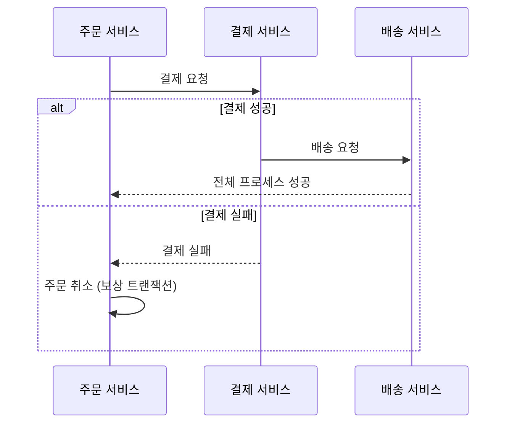
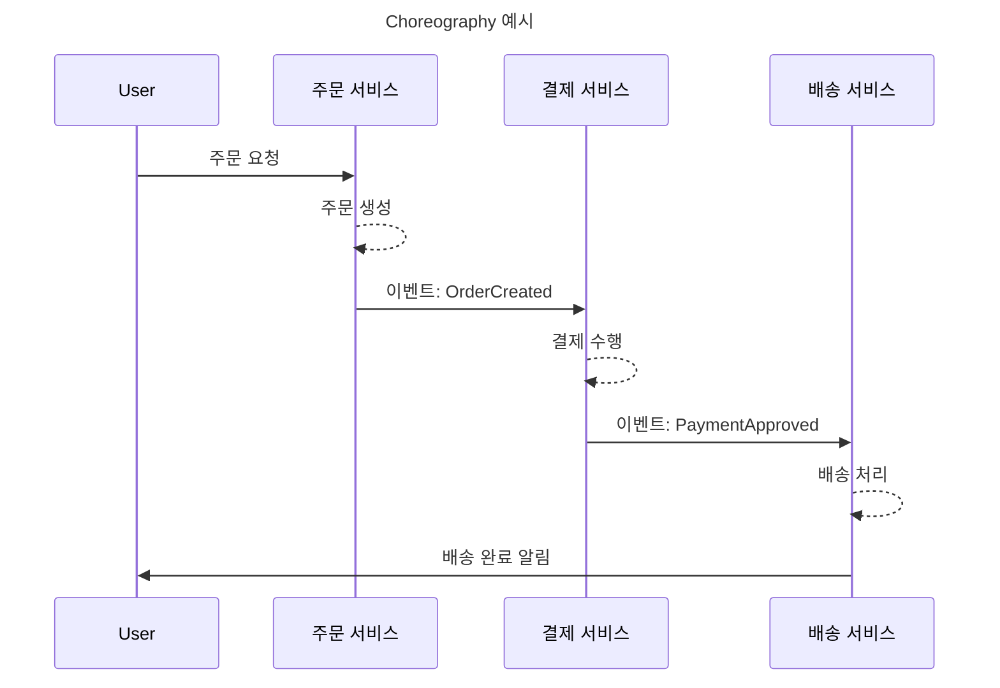
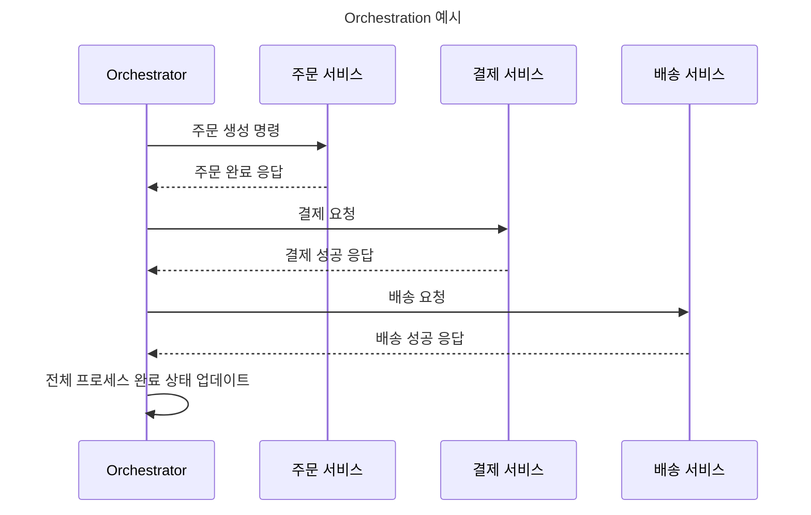
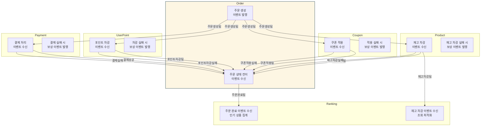
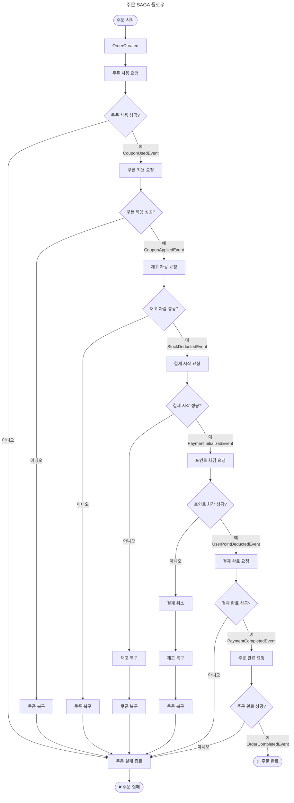
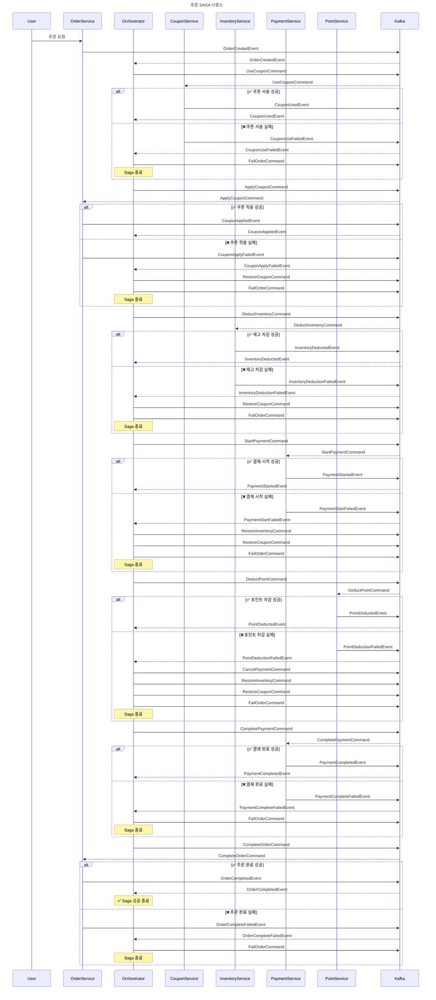

# **MSA 전환 설계 보고서**

## **1. MSA 전환의 배경 및 기대 효과**

트래픽이 증가하고 서비스가 커진 상황을 가정하여 시스템의 한계를 극복하고 더 유연하며 신속하게 대응하기 위 MSA의 전환을 고려한 설계를 진행합니다.

MSA로 전환할 경우 다음과 같은 장점을 얻을 수 있습니다.

- **독립적인 배포 단위:** 각 서비스를 독립적인 배포 단위로 나눌 수 있게 됩니다. 이는 **변경 주기가 다른 서비스를 서로 영향을 주지 않고 따로 배포**할 수 있게 해줍니다. 예를 들어, 주문 로직만 변경되었을 경우 주문 서비스만 배포하면 되므로, 전체 시스템의 안정성을 높이고 배포 리스크를 줄일 수 있습니다.
- **유연한 확장성:** 부하가 많이 걸리는 특정 서비스만 **작은 단위로 스케일 아웃(Scale Out)** 할 수 있습니다. 전체 시스템을 확장할 필요 없이 필요한 부분만 효율적으로 확장하여 비용을 절감하고 성능을 최적화할 수 있습니다.
- **기술 스택의 다양성 (Polyglot):** 각 서비스의 특성과 요구사항에 가장 적합한 기술 스택을 선택하여 적용할 수 있는 Polyglot 구조를 가져갈 수 있습니다. 이는 개발 생산성을 높이고 최신 기술을 도입하는 데 유리합니다.

이러한 장점들은 우리가 변화하는 비즈니스 요구사항에 빠르게 적응하고, 시스템의 안정성과 확장성을 동시에 확보할 수 있게 해줍니다.

---

## **2. MSA 전환 시 고려해야 할 문제**

하지만 MSA는 분명한 장점과 함께 복잡성을 동반합니다. MSA 전환 시 발생할 수 있는 몇 가지 단점은 다음과 같습니다. 이러한 문제들을 인지하고 대비하는 것이 중요합니다.

- **분산 시스템의 복잡성 증가:** 여러 서비스가 유기적으로 연결되면서 전체 시스템 구조가 복잡해집니다.
- **네트워크 오버헤드 증가:** 서비스 간 통신이 네트워크를 통해 이루어지면서 네트워크 호출에 따른 지연 및 오버헤드가 발생할 수 있습니다.
- **운영 및 모니터링 어려움:** 분산된 서비스들의 장애 추적, 성능 분석 등이 중앙 집중식 시스템에 비해 더 복잡해집니다.
- **개발 비용 증가:** 초기 설계 및 인프라 구축, 서비스 간 통신 메커니즘 구현 등에 더 많은 비용과 노력이 필요할 수 있습니다.
- **테스트 어려움:** 서비스 단위 테스트는 용이할 수 있지만, 서비스 간 연동 및 통합 테스트가 복잡해집니다.

이 중 가장 핵심적인 문제는 **데이터 일관성 보장** 문제입니다. MSA에서는 일반적으로 각 서비스마다 물리적인 DB를 분리하여 사용하기 때문에, 하나의 비즈니스 로직이 여러 서비스에 걸쳐 실행될 때 작업 단위의 원자성(Atomicity)을 보장하는 것이 어렵습니다. 즉, **전통적인 단일 DB 트랜잭션으로는 데이터 정합성을 유지할 수 없습니다**.

---

## **3. 분산 트랜잭션 문제 해결: Saga 패턴의 도입**

분산 환경에서 데이터 일관성 문제를 해결하기 위해 **분산 트랜잭션** 기법이 필요합니다. 물리적으로 DB가 분리된 MSA 환경에서는 2-Phase Commit(2PC)과 같은 방식은 적용하기 어렵고, **Saga 패턴**이 대안으로 제시됩니다.

Saga 패턴은 전체 프로세스의 ACID 속성을 보장하는 대신, **보상 트랜잭션(Compensating Transaction)**을 통해 실패 시 이미 성공한 작업들을 되돌려 데이터 일관성을 맞추는 방식입니다. 이는 **강력한 즉각적 일관성(Strong Consistency)**보다는 **최종 일관성(Eventually Consistency)**을 달성하는 방식으로 구현됩니다. Saga 패턴은 ACID의 대안 철학인 **BASE (Basically Available, Soft state, Eventually Consistent)** 원칙을 따릅니다.

예를 들어, '주문 -> 결제 -> 배송'으로 이어지는 비즈니스 프로세스에서 결제 단계가 실패했을 경우:

1. 주문 서비스에서 주문을 생성합니다.
2. 결제 서비스에 결제를 요청합니다.
3. 만약 결제가 실패하면, 결제 서비스는 결제 실패를 알리고, 주문 서비스는 이미 생성된 주문을 취소하는 **보상 트랜잭션**을 실행하여 전체 프로세스를 실패 상태로 되돌립니다.

Saga 패턴을 구현하는 방식에는 크게 두 가지 "Choreography와 Orchestration" 이 있습니다

### **3.1. Saga 구현 방식 (Choreography vs. Orchestration)**

- **Choreography (안무):** 중앙 집중식 컨트롤러 없이 각 마이크로서비스가 **이벤트를 발행하고, 다른 서비스들이 이를 구독하여 반응**함으로써 트랜잭션 흐름을 이어가는 방식입니다. 각 서비스는 어떤 이벤트에 반응할지 스스로 정의하고, 자신의 로컬 트랜잭션과 보상 트랜잭션을 자체적으로 관리합니다.
    - **장점:** 중앙 오케스트레이터가 없어 **유연하고 느슨하게 결합**됩니다. 확장성과 서비스 독립성이 뛰어납니다. 각 서비스가 자신의 책임을 명확히 가집니다.
    - **단점:** **전체 트랜잭션 흐름을 파악하기 어렵고 디버깅이 복잡**해질 수 있습니다. 보상 트랜잭션 처리 누락의 위험이 있습니다. 소스는 Choreography 방식의 주문 처리 흐름과 각 단계별 보상 트랜잭션을 상세히 보여주는 예시입니다.

- **Orchestration (오케스트라 지휘):** **중앙 오케스트레이터**가 존재하여 각 마이크로서비스의 작업을 **직접 호출하고 상태를 관리**하는 방식입니다. 오케스트레이터가 Saga의 전체 흐름과 상태를 알고 있으며, 각 서비스에 명시적으로 명령을 내리면 서비스는 해당 작업을 수행하고 결과를 응답합니다.
    - **장점:** **전체 흐름을 중앙에서 쉽게 제어**할 수 있습니다. 디버깅과 로깅이 용이하며, 실패 및 보상 전략을 명시적으로 구현하기 좋습니다.
    - **단점:** 오케스트레이터가 **단일 장애점(SPOF)**이 될 수 있습니다. 중앙 집중화로 인해 유연성이 Choreography 방식보다 낮을 수 있습니다. 오케스트레이터 코드가 복잡해지기 쉽습니다. 소스는 Orchestration 방식의 간단한 작동 흐름을 보여줍니다.

|항목|Choreography|Orchestration|
|---|---|---|
|제어 주체|각 마이크로서비스|중앙 Orchestrator|
|흐름 제어 방식|이벤트 발행 및 구독 (비동기)|명령 기반 호출 (동기/비동기 혼합)|
|결합도|느슨함|상대적으로 단단함|
|디버깅/추적성|어려움|비교적 쉬움|
|메시지 수|많음 (모든 서비스가 발행/구독)|적음 (중앙 집중)|
|장애 복구 복잡도|높음|낮음|
|적합한 시나리오|서비스 독립성 중요, 단순한 플로우|복잡한 상태 흐름 및 보상, 중앙 관리 필요|

### **3.2. 어떤 방식을 선택할 것인가?**

- **Orchestration 적합:** 주문 흐름처럼 정해진 순서대로 **강하게 제어**되어야 하거나, 보상 로직이 복잡하여 여러 단계를 연쇄적으로 복구해야 하거나, 트랜잭션 상태를 한 곳에서 관리해야 하거나, 디버깅/모니터링이 중요한 운영 시스템(PG 연동, 정산 등)인 경우에 더 적합할 수 있습니다.
- **Choreography 적합:** 각 서비스가 완전히 독립적이어서 특정 이벤트에 자율적으로 반응하는 것만으로 충분하거나, 기능이 단순하고 보상도 각 서비스 내에서 완료되는 수준이거나, 작은 팀에서 빠르게 서비스를 개발하고자 할 때 유리할 수 있습니다.

**강한 의존성, 복잡한 보상 트랜잭션, 그리고 상태 흐름 추적의 중요성**을 갖는 주문 프로세스의 특성 때문에 **Orchestration 방식**을 선택하는 것이 적합하다고 판단했습니다.

---

## **4. 도메인별 서비스 분리**

### **4.1. 도메인 분리 기준**
- 독립적인 스케일아웃 가능성: 부하에 따라 특정 서비스만 독립적으로 확장해야 하는가?
- 서비스 간 결합의 정도: 서비스 간 결합이 강하면 오히려 분리 시 네트워크 비용만 증가할 수 있습니다.
- 기능 변경의 빈도 및 파급성: 자주 함께 변경되는 기능은 같은 서비스에 두어 변경의 파급 효과를 줄입니다.
- 의존성의 방향: 서비스가 단순히 다른 서비스의 데이터를 참조하는지, 아니면 상태 변경을 요구하는지에 따라 분리를 고려할 수 있습니다.
- 팀 단위 / 작업 단위: 서로 다른 팀이나 조직의 요구에 따라 변경되는 부분은 분리하여 유지보수와 테스트를 용이하게 합니다.
- 기술적 요구사항 (성능, 확장성, 장애 격리): 특정 도메인이 특별한 성능 요구사항을 갖거나, 장애 발생 시 다른 서비스에 영향을 미치지 않도록 격리가 필요한 경우 분리를 고려합니다.

|기준|설명|
|---|---|
|💥 변경 파급 범위|자주 변경되는 기능과 그렇지 않은 기능을 분리하여 배포 영향 최소화|
|🔗 결합도|강하게 결합된 기능은 하나의 서비스로, 약한 결합은 분리하여 네트워크 비용 절감|
|🔄 확장성 요구|개별적으로 트래픽이 몰리는 기능을 독립적으로 확장 가능하도록 분리|
|🧑‍💻 조직 구조|팀 단위로 기능을 독립적으로 개발/운영할 수 있도록 분리|
|⚙️ 기능 독립성|상태 관리, 외부 연동 등 별도의 복잡성을 갖는 기능은 독립된 서비스로 분리|

### **4.2. 도메인 분리 예시 및 이유**

- **Order (주문)**: 전체 프로세스의 중심 허브 역할을 하며, 워크플로우 조율 책임을 가집니다.
- **Product (상품)**: 상품 정보 및 재고 관리를 담당하며, 다른 도메인에서 많이 참조하지만 도메인 규칙은 독립적입니다. 조회 비중이 높아 별도의 DB와 read-only replica 활용이 가능합니다.
- **Payment (결제)**: 결제 처리 및 외부 PG 연동을 담당하며, 시스템 규모 증가 시 연동 지연/장애로부터 격리가 필요합니다.
- **UserPoint (포인트)**: 포인트 적립/차감 및 상태 추적을 담당하며, 로직 및 정책의 독립적인 복잡성이 클 수 있습니다.
- **Coupon (쿠폰)**: 쿠폰 관리 및 할인 정책을 담당하며, 정책 복잡도 및 선착순 쿠폰과 같은 독립적인 확장 가능성을 고려합니다.
- **Ranking (랭킹)**: 인기 상품 등 읽기 최적화 데이터를 제공하며, 이벤트 기반 비동기 집계 및 쓰기와 분리된 조회 특성을 가집니다.

---

## **5. 분리된 서비스와 SAGA 패턴의 적용**

### **5.1. 주문 Saga 프로세스 설명**

주문 처리 과정에서의 Saga 패턴을 기반으로 한 **Orchestration 방식**의 전체 흐름을  
Activity Diagram과 Sequence Diagram을 바탕으로 설명합니다.
각 단계에서는 **Kafka를 통한 이벤트 기반 비동기 메시징**을 활용하며,  
**성공/실패 분기** 및 **보상 트랜잭션 흐름**을 명확히 설계했습니다.

#### **5.1.1. 전체 설계 철학**

- 결제 관련 작업은 **보상 트랜잭션이 복잡**하고, 일반적으로 외부 PG사와의 연동을 포함하므로 **가장 마지막 단계에 배치**
- 반대로, **쿠폰 및 재고는 자체 도메인 내에서 복원이 가능**하고 트랜잭션 비용이 낮으므로 **초기 단계에 처리**
- 전체 흐름은 **Orchestrator**가 중앙에서 제어하며, 각 도메인 서비스는 Kafka 메시지를 통해 비동기적으로 명령/응답을 주고받음

#### **5.1.2. 단계별 상세 설명**

1. **주문 시작**

- **User → OrderService**
- `OrderService`는 주문 정보를 생성하고 `OrderCreatedEvent`를 Kafka에 발행
- **Orchestrator**는 해당 이벤트를 수신하고 전체 Saga 흐름을 시작

2. **쿠폰 사용 (CouponService)**

- Orchestrator → Kafka: `UseCouponCommand`
- CouponService는 해당 쿠폰의 상태를 "사용 중"으로 변경하고 `CouponUsedEvent`를 발행
- 실패 시: `CouponUseFailedEvent` 발생 → 주문 실패로 Saga 종료

✅ **보상 용이**: 쿠폰은 상태만 변경하므로, 실패하거나 보상이 필요한 경우 `RestoreCouponCommand`로 쉽게 복원 가능

3. **쿠폰 적용 (OrderService)**

- Orchestrator → Kafka: `ApplyCouponCommand`
- OrderService는 쿠폰을 실제 주문에 반영하고 `CouponAppliedEvent`를 발행
- 실패 시: `CouponApplyFailedEvent` → `RestoreCouponCommand` + 주문 실패

✅ **도메인 책임 분리**: 쿠폰 적용은 할인금액 계산과 연관되며 **주문 도메인에서 수행**

4. **재고 차감 (InventoryService)**

- Orchestrator → Kafka: `DeductInventoryCommand`
- InventoryService는 재고를 차감하고 `InventoryDeductedEvent` 발행
- 실패 시: `InventoryDeductionFailedEvent` → 쿠폰 복원 + 주문 실패

✅ **보상 용이**: `RestoreInventoryCommand`로 수량 복원 가능 (단, 재고가 없어진 후 복구는 정책 필요)

5. **결제 시작 (PaymentService)**

- Orchestrator → Kafka: `StartPaymentCommand`
- PaymentService는 외부 PG와 결제 세션을 연동하고 `PaymentStartedEvent` 발행
- 실패 시: 이전 단계 보상 (재고/쿠폰 복구) 후 주문 실패

⚠️ **보상 복잡도 증가 지점**: 외부 시스템 연동으로 인해 실패 시 내부적으로 취소 처리 필요  
📝 이 단계 이후는 **추후 별도의 흐름으로 분리하는 것도 고려 가능**

6. **포인트 차감 (PointService)**

- Orchestrator → Kafka: `DeductPointCommand`
- PointService는 사용자 포인트를 차감하고 `PointDeductedEvent` 발행
- 실패 시:
    - `PointDeductionFailedEvent`
    - 결제 취소 (`CancelPaymentCommand`)
    - 재고 복구, 쿠폰 복구 → 주문 실패

⚠️ **결제 시작 이후의 첫 보상 지점**

7. **결제 완료 (PaymentService)**

- Orchestrator → Kafka: `CompletePaymentCommand`
- PaymentService는 결제를 승인하고 `PaymentCompletedEvent` 발행
- 실패 시: 주문 실패 (결제 취소는 이미 이전 단계에서 수행됨)

8. **주문 완료 (OrderService)**

- Orchestrator → Kafka: `CompleteOrderCommand`
- OrderService는 주문 상태를 완료로 변경하고 `OrderCompletedEvent` 발행
- 실패 시: `OrderCompleteFailedEvent` → 주문 실패로 마무리

## 흐름 요약표

|순서|단계|Command|Event|도메인|보상 용이도|
|---|---|---|---|---|---|
|1|쿠폰 사용|UseCouponCommand|CouponUsedEvent|CouponService|높음|
|2|쿠폰 적용|ApplyCouponCommand|CouponAppliedEvent|OrderService|중|
|3|재고 차감|DeductInventoryCommand|InventoryDeductedEvent|InventoryService|높음|
|4|결제 시작|StartPaymentCommand|PaymentStartedEvent|PaymentService|낮음 (외부 연동)|
|5|포인트 차감|DeductPointCommand|PointDeductedEvent|PointService|중|
|6|결제 완료|CompletePaymentCommand|PaymentCompletedEvent|PaymentService|낮음|
|7|주문 완료|CompleteOrderCommand|OrderCompletedEvent|OrderService|중|

---

## **6. MSA 및 Saga 패턴 적용 시 주의사항 및 보완 방안**

Saga 패턴을 포함한 이벤트 기반 MSA 시스템을 성공적으로 운영하기 위해서는 몇 가지 추가적으로 고려해야 할 점이 있습니다. 이에 대한 문제점과 보완 방안은 아래와 같습니다.

- **보상 트랜잭션 누락 문제:** Saga의 핵심인 보상 트랜잭션이 누락될 경우 데이터 불일치가 발생합니다. **Saga 설계 초기 단계부터 각 단계별 보상 로직을 정의하고 개발**하는 것이 중요합니다. 결제, 배송 등 **되돌리기 어려운 외부 연동**이 포함된 작업은 별도의 플로우로 분리하여 신중하게 처리해야 합니다.
- **트랜잭션과 이벤트 전파 불일치 문제:** DB에 데이터 변경을 커밋하는 로컬 트랜잭션과 이 변경사항을 외부에 알리는 이벤트 전송 사이에 불일치가 발생할 수 있습니다. 즉, DB 커밋은 성공했지만 이벤트 발행이 실패하거나, 이벤트 발행은 성공했지만 DB 커밋이 실패하는 경우 데이터 정합성이 깨집니다. 이를 해결하기 위해 **Transactional Outbox Pattern**을 사용합니다. 이 패턴은 **도메인 데이터 변경사항과 이벤트를 로컬 DB 트랜잭션 내에서 함께 커밋**하고, 별도의 프로세스(poller)가 DB의 Outbox 테이블을 감지하여 이벤트를 나중에 발행하는 방식입니다.
- **Kafka 메시지 재처리 & 중복 처리:** Kafka와 같은 메시지 브로커를 사용할 때, 네트워크 문제 등으로 인해 컨슈머가 동일한 메시지를 여러 번 전달받아 중복 처리할 수 있습니다. 이는 특히 Saga에서 보상 트랜잭션이 여러 번 실행되는 문제를 야기할 수 있습니다. 이를 방지하기 위해 다음과 같은 조치가 필요합니다.
    - **멱등성(Idempotency) 보장:** 동일한 메시지를 여러 번 처리하더라도 결과가 동일하도록 설계해야 합니다. 주문 ID나 Saga ID 등을 활용하여 중복 요청을 검사하고 무시하는 로직을 적용합니다.
    - **Consumer 수준 중복 검사 및 상태 저장:** 컨슈머가 이미 처리한 메시지인지 확인하기 위해 상태를 저장하고 관리합니다.
    - **Kafka 설정 활용:** `enable.idempotence=true` 및 `acks=all` 등의 설정을 통해 프로듀서 수준에서 메시지 중복을 줄일 수 있습니다.

---

## **7. 결론**

MSA로의 전환은 독립적인 배포, 유연한 확장, 기술 스택 선택의 자유 등 분명한 이점을 제공합니다. 하지만 분산 시스템의 복잡성 증가와 데이터 일관성 문제를 수반합니다.

이러한 문제에 대한 구체적인 해결 방안으로 Saga 패턴의 도입이 필요하며, 이를 구현하는 두 가지 방식(Choreography, Orchestration)의 장단점 및 선택 기준을 명확히 제시하였습니다. 특히, 복잡한 비즈니스 흐름과 중요한 상태 관리가 필요한 주문의 경우 **Orchestration 방식**이 더 적합하다는 결론을 내렸습니다.

또한, Saga 패턴 및 이벤트 기반 시스템에서 발생할 수 있는 실질적인 문제점(보상 트랜잭션 누락, 트랜잭션-이벤트 불일치, 메시지 중복 처리)에 대해서도 Transactional Outbox 패턴 및 멱등성 확보 전략 등 구체적인 기술적 보완 방안을 제시하였습니다.

---
